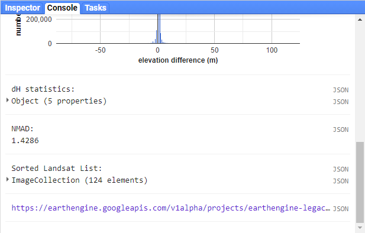

creating an animation
=======================

In the last part of the practical, we'll gather all of the cloud-free Landsat images over Mt St Helens, and make an animated gif
showing the changes over time. Because we're using all of the different Landsat sensors (MSS, TM, ETM+, and OLI), we'll use a
near-infrared false colour composite (near-infrared/red/green) for consistency.

.. note::
    As of 1 February 2022, Collection 2 MSS scenes are not available in GEE, so the following combines the Collection 1 MSS scenes
    with the Collection 2 TM, ETM+, and OLI scenes.

To be able to run the code in this section, uncomment the whole section (remove the ``/*`` from line 211 and the ``*/`` from line 301).
We'll walk through what each block does in turn before running the code.

The first lines in this section set the visualization parameters for the MSS scenes and the other sensors:

.. code-block:: javascript

    // set visualization parameters for the MSS scenes
    var mssVisParams = {
      bands: ['B6', 'B5', 'B4'], // select bands 6, 5, and 4
      min: 10, // set the minimum display value for each band
      max: 120, // set the maximum display value for each band
      gamma: 1.5 // set the gamma adjustment to help brighten the images
    };

    // set visualization parameters for all of the other sensors
    var srVisParams = {
      bands: ['SR_B4', 'SR_B3', 'SR_B2'], // select bands 4, 3, and 2
      min: 7000, // set the minimum display value for each band
      max: 20000, // set the maximum display value for each band
      gamma: 1.25 // set the gamma adjustment to help brighten the images
    };

When we create the animated gif at the end of the script, this will tell the computer how to display each frame of the output gif. The
next lines will select all cloud-free MSS scenes that have an acceptable geometric accuracy for our purposes (<25 m error) :

.. code-block:: javascript

    var mss = ee.ImageCollection("LANDSAT/LM01/C01/T1")
      .merge(ee.ImageCollection("LANDSAT/LM01/C01/T2"))
      .merge(ee.ImageCollection("LANDSAT/LM02/C01/T1"))
      .merge(ee.ImageCollection("LANDSAT/LM02/C01/T2"))
      .merge(ee.ImageCollection("LANDSAT/LM03/C01/T1"))
      .merge(ee.ImageCollection("LANDSAT/LM03/C01/T2"))
      .filterMetadata('CLOUD_COVER', 'equals', 0) // select only cloud-free images
      .filter(ee.Filter.or(
        ee.Filter.eq('DATA_TYPE', 'L1TP'),
        ee.Filter.eq('DATA_TYPE', 'L1GT'))) // only use L1TP and L1GT images
      .filterMetadata('GEOMETRIC_RMSE_MODEL', 'less_than', 25) // remove any large distortions
      .filterMetadata('WRS_ROW', 'equals', 28) // select only WRS row 28 images
      .filterBounds(boundary).select(['B[4-6]']); // select bands 4, 5, and 6.

The next block of lines will repeat this for Landsat 5 TM and Landsat 7 ETM+ scenes:

.. code-block:: javascript

    // get Landsat TM5 scenes
    var lt05 = mosaicByDate(ee.ImageCollection("LANDSAT/LT05/C02/T1_L2")
      .filterMetadata('CLOUD_COVER', 'equals', 0) // select only cloud-free images
      .filter(ee.Filter.eq('WRS_PATH', 46)) // select only WRS path 46 images
      .filter(ee.Filter.eq('WRS_ROW', 28)) // select only WRS row 28 images
      .filterBounds(boundary) // make sure to only select images within our boundary
      .select(['SR_B[2-4]']), // select bands 4, 3, 2
    'LT05');

    // get Landsat 7 ETM+ scenes
    var le07 = mosaicByDate(ee.ImageCollection("LANDSAT/LE07/C02/T1_L2")
      .filterMetadata('CLOUD_COVER', 'equals', 0) // select only cloud-free images
      .filter(ee.Filter.eq('WRS_PATH', 46)) // select only WRS path 46 images
      .filter(ee.Filter.eq('WRS_ROW', 28)) // select only WRS row 28 images
      .filterBounds(boundary) // make sure to only select images within our boundary
      .select(['SR_B[2-4]']), // select bands 4, 3, 2
    'LE07'); 

After that, we select only the cloud-free Landsat 8 images:

.. code-block:: javascript

    lc08.filterMetadata('CLOUD_COVER', 'equals', 0);

Once we have lists for each of these sensors, we'll merge the results and sort them:

.. code-block:: javascript

    // sort the MSS scenes by acquisition time.
    var mssSorted = mss.sort('system:time_start');

    // merge and sort the other Landsat scenes.
    var landsatSorted = lt05
      .merge(le07)
      .merge(mosaicByDate(lc08.select(['SR_B3', 'SR_B4', 'SR_B5'], 
                                      ['SR_B2', 'SR_B3', 'SR_B4']), // rename bands to match older sensors
                          'LC08'))
      .sort('system:time_start');

After we have the images sorted, we can create the visualization images and merge the two collections into one:

.. code-block:: javascript

    // make RGB images to display for each of the MSS scenes
    var mssVis = mssSorted.map(function(img){
      return img.visualize(mssVisParams).clip(boundary);
    });

    // make RGB images to display for each of the other sensors
    var landsatVis = landsatSorted.map(function(img){
      return img.visualize(srVisParams).clip(gifBoundary);
    });

    // now, merge the MSS and other sensors.
    var visAll = mssVis.merge(landsatVis);

Finally, we'll set the parameters for the animated gif and create a link to trigger processing for the gif. This will make a gif that is
scaled so that the longest dimension is 425 pixels. The images will be cropped to the gifBoundary polygon defined at the top of
the script, and displayed using a pseudo-Mercator projection (EPSG:3857), which is the same one used by Google Maps.

.. code-block:: javascript

    var gifParams = {
      'region': gifBoundary,
      'dimensions': 425,
      'crs': 'EPSG:3857',
      'framesPerSecond': 3
    };

    // print a URL to start processing the gif.
    print(visAll.getVideoThumbURL(gifParams));

At this time, you can run the script one final time. In the **Console**, you should see a link at the bottom:

Click this link to create the gif. Once it finishes processing and loads the gif, you can download the gif by right-clicking the image
and clicking **Save**. 

Watch the gif – what changes do you see? You should notice a number of different things happen, including the
initial 1980 eruption, subsequent eruptions, seasonal snow cover, and even the `SLC failure <https://www.usgs.gov/landsat-missions/landsat-7>`__
of the Landsat 7 ETM+ sensor. 

By the end of the gif, you should see that a great deal of vegetation has started to recover. 
In next week's practical, we'll work on additional analyses using GEE, including change analysis and plotting time series of values.

