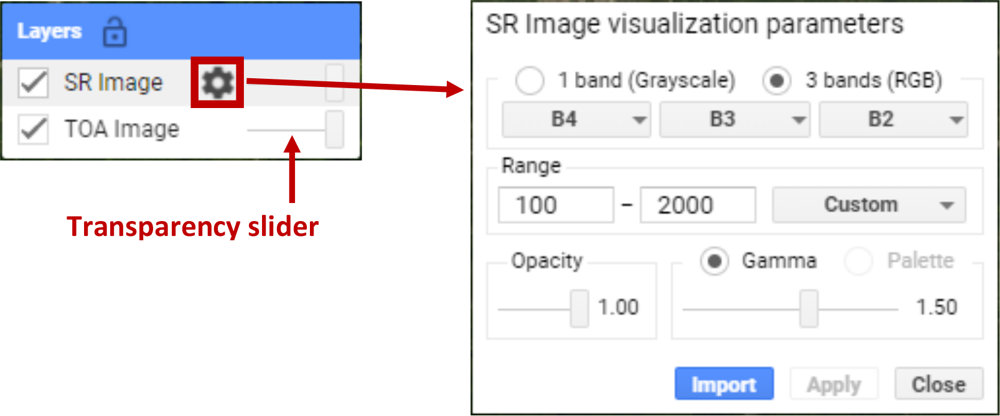

getting started
================

.. raw:: html

    

.. role:: green

This tutorial is designed to get you started looking at satellite images using Google Earth Engine. 
By the end of the tutorial, you will be able to:

- add images to the map and change the display properties
- use the `print()` function to view image metadata
- use the inspector tool to examine pixel values
- export data to google drive

To begin, point your browser to https://code.earthengine.google.com. If you are not already logged in, log in using your GEE account. You should see something like this:

.. image:: ../../../img/egm702/week3/annotated_window.png
    :width: 600
    :align: center
    :alt: the GEE console with annotations

The **Code editor** is where you can write your script to load data and process your results; the **Map** is where you can view images and other datasets, and
the **Console** is where you can see outputs, charts, and other things that you print out.

To see the sample script for this tutorial, follow this link.

landsat
---------

For this example, we're using a Landsat 8 image showing the `Malaspina Glacier <https://en.wikipedia.org/wiki/Malaspina_Glacier>`__ (Sít' Tlein)
and surrounding area in Alaska (USA) and Canada.

The sensor carried by Landsat 8 is the Operational Land Imager/Thermal InfraRed Sensor (OLI/TIRS). The table below shows the
wavelength ranges for the different bands of the sensor(s), their resolutions, and their names:

+------------+----------+---------------------+-------------------------+--------------------+
| **sensor** | **band** | **wavelength (µm)** | **name**                | **resolution (m)** |
+------------+----------+---------------------+-------------------------+--------------------+
| oli        | 1        | 0.43 -- 0.45        | coastal aerosol         | 30                 |      
+------------+----------+---------------------+-------------------------+--------------------+
|            | 2        | 0.45 -- 0.51        | blue                    | 30                 |
+------------+----------+---------------------+-------------------------+--------------------+
|            | 3        | 0.53 -- 0.59        | green                   | 30                 |
+------------+----------+---------------------+-------------------------+--------------------+
|            | 4        | 0.64 -- 0.67        | red                     | 30                 |
+------------+----------+---------------------+-------------------------+--------------------+
|            | 5        | 0.85 -- 0.88        | near infrared           | 30                 |
+------------+----------+---------------------+-------------------------+--------------------+
|            | 6        | 1.57 -- 1.65        | shortwave infrared 1    | 30                 |
+------------+----------+---------------------+-------------------------+--------------------+
|            | 7        | 2.11 -- 2.29        | shortwave infrared 2    | 30                 |
+------------+----------+---------------------+-------------------------+--------------------+
|            | 8        | 0.50 -- 0.68        | panchromatic            | 15                 |
+------------+----------+---------------------+-------------------------+--------------------+
|            | 9        | 1.36 -- 1.38        | cirrus                  | 30                 |
+------------+----------+---------------------+-------------------------+--------------------+
| tirs       | 10       | 10.6 -- 11.19       | thermal infrared 1      | 100                |
+------------+----------+---------------------+-------------------------+--------------------+
|            | 11       | 11.5 -- 12.51       | thermal infrared 2      | 100                |
+------------+----------+---------------------+-------------------------+--------------------+

For information about the band designations for the other Landsat sensors, see this page from the USGS: https://www.usgs.gov/faqs/what-are-band-designations-landsat-satellites

adding images to the map
-------------------------

If we know the GEE **id** of the image we want to use, we can add it directly to the script by **declaring** it as a **variable**, using ``ee.Image()``:

.. code-block:: javascript

   var img = ee.Image("LANDSAT/LC08/C02/T1/LC08_062018_20190821");

.. note:: 

    The Earth Engine **id** of Landsat images is not the same as the USGS **granule id** - if you know the USGS id of the image you
    want, you'll need to "translate" it to the GEE catalog.

    As an example, the image we're using here has a GEE **id** of:
    
        | dataset/**sensor**/C**collection**/**tier**/**sensor**\_\ **PPPRRR_YYYYMMDD**
        | LANDSAT/LC08/C02/T1/LC08_062018_20190821

    and a USGS granule id of:
    
        | **sensor**\_level\_\ **PPPRRR_YYYYMMDD**\_processed\_\ **collection**\_\ **tier**
        | LC08_L1TP_062018_20190821_20200827_02_T1

Now, we can use the ``img`` variable in our script, and add it to the **Map** window:

.. code-block:: javascript

    // add the image to the map as a true-color composite
    Map.addLayer(img.select('B[2-4]').multiply(0.00002).add(-0.1),
      {bands: ['B4', 'B3', 'B2'], min: 0.02, max: 0.5, gamma: 1.2},
      'Sample Image', true);

There's quite a bit happening here. First, we're using ``Map.addLayer()`` 
(`click here for the documentation <https://developers.google.com/earth-engine/apidocs/map-addlayer>`__) 
to add the image to the **Map**. ``Map.addLayer()`` has the following **syntax**:

.. code-block:: javascript

    Map.addLayer(eeObject, visParams, name, shown, opacity)

where ``eeObject`` is the **object** that we want to add to the **Map**, ``visParams`` tells GEE how to display the
object, ``name`` is the name we want to use for the layer, ``shown`` tells GEE to display the image (``true``) or not
(``false``), and ``opacity`` is the opacity of the layer ranging from 0--1.

So, the object that we're adding to the map is:

.. code-block:: javascript

    img.select('B[1-9]').multiply(0.00002).add(-0.1)

This **selects** bands ``B2``, ``B3``, and ``B4`` from ``img``, then multiplies each band by ``0.00002`` and adds ``-0.1``
to convert from the raw DN values to `top-of-atmosphere (TOA) reflectance <https://www.usgs.gov/landsat-missions/using-usgs-landsat-level-1-data-product>`__
(in other words, the reflectance measured by the sensor, which includes the atmospheric signal).

Next, the ``visParams`` that we're adding is:

.. code-block:: javascript

    {bands: ['B4', 'B3', 'B2'], min: 0.02, max: 0.5, gamma: 1.2}

tells the map to display bands 4, 3, and 2 as an RGB (making this a `natural color <https://gisgeography.com/landsat-8-bands-combinations>`__ composite).
We also set the ``min``\ (imum) display value to 0.02, and the ``max``\ (imum) display value to 0.5. We also apply 
a gamma correction to help brighten the image somewhat.

Finally, we give the layer a ``name`` ('Sample Image'), and tell GEE to display the image.

The next part of this script:

.. code-block:: javascript

    // center the map on the image, at a zoom level of 8
    Map.centerObject(img, 8);

    // set the map background to the satellite layer
    Map.setOptions('SATELLITE');

uses ``Map.centerObject()`` (`documentation <https://developers.google.com/earth-engine/apidocs/map-centerobject>`__) to center the **Map**
on the image at a zoom level of 8, and uses ``Map.setOption()`` (`documentation <https://developers.google.com/earth-engine/apidocs/map-setoptions>`__
to set the basemap to use satellite imagery, rather than the default basemap.

Once you run the script (click **Run**, or press **CTRL + Enter**), you should see the following output:

**script run**

changing display parameters
-----------------------------

In addition to setting the display parameters for the layer in the script, we can also change the display parameters after the script
is finished running. 

When you mouse over the **Layers** button in the upper right of the **Map** panel, you should see a single layer (Sample Image).
If you click on the gear icon, you can open the visualization parameters for each image and adjust them - for example, by applying
a 98% stretch instead of a custom range:

To change the bands that are displayed, you can select the different bands to make an RGB combination from the dropdown menus; you can also
choose to display the image as a single-band (grayscale) image.

You can also adjust the transparency slider for the different layers displayed here, and by checking/unchecking the box next to the layer
name, you can make either image visible/invisible.

Finally, you can use the **Import** button to save the current settings as an import that you can use in the script - we'll talk a bit more
about imports in a later tutorial. 

In order to apply any changes, click on the **Apply** button, then **Close** to close the visualization settings window.

the print function
-------------------

The script also contains the following line:

.. code-block:: javascript

    // print information about the image
    print(img);

This will **print** the information about the image to the **Console**. If you expand the list (click on the small arrow), you should
be able to see the following:

**console expanded**

You can expand the **bands** list to see the different bands available in the image, while the **properties** object contains
all of the different metadata for the image. In later tutorials, we'll actually use this metadata for selecting and processing
images; for now, it's enough to look at it and get familiar with it.

the inspector tool
-------------------

Now that we've added an image to the **Map**, we can zoom around the map (scroll in/out) to examine it further:

**zoomed**

You can use the **Inspector** tab to look at different pixel or feature values for the layers in the map by clicking on the map.
Click 

Look at the glacier, look at the water, compare the reflectance values

exporting data
---------------

At the very end of the script, I've included the following:

.. code-block:: javascript

    // export the image to Drive
    Export.image.toDrive({image: img,
      description: 'Sample Image',
      scale: 30,
      region: img.geometry(),
      crs: 'epsg:32608',
      maxPixels: 1e12
    });

This calls ``Export.image.toDrive()`` (`documentation <https://developers.google.com/earth-engine/apidocs/export-image-todrive>`__),
which creates a **Task** that you can run to save the image to your Google Drive.

If you click on the **Tasks** tab, you should see

