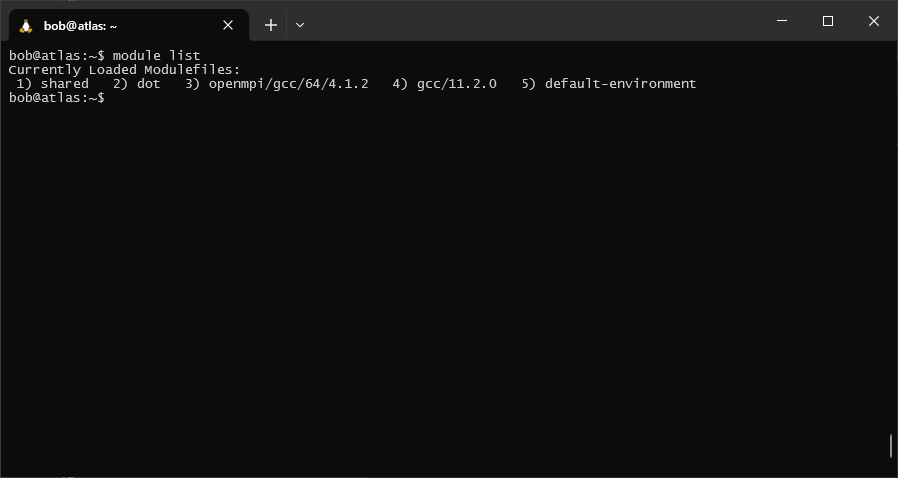
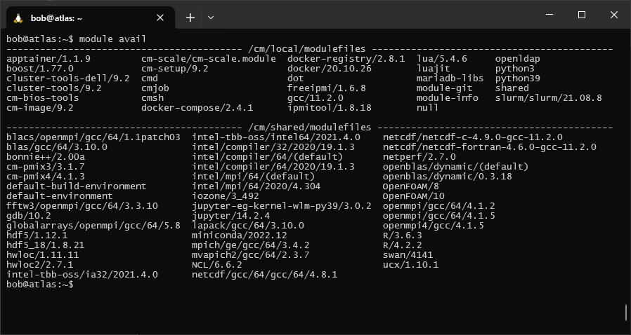
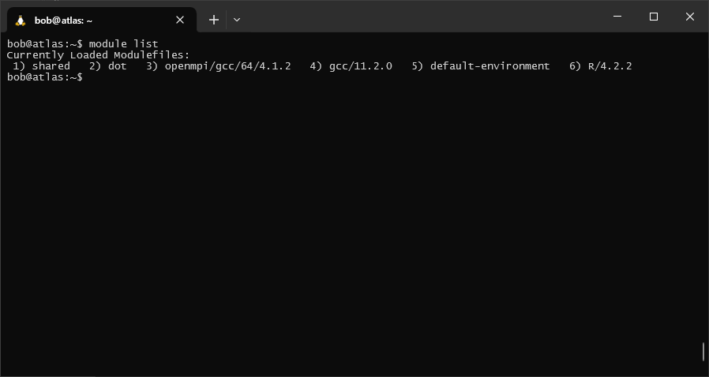
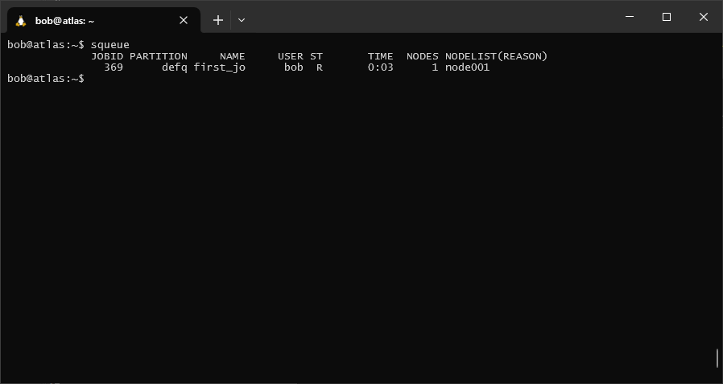

atlas
=======

``atlas`` is the newer HPC cluster in the School, with 6 nodes (5 compute nodes + 1 head node). The compute nodes each
have 64 CPUs (64 cores/1 thread per core) and 512 GB RAM each. The operating system is RedHat Enterprise Linux
(RHEL) 8.8, which uses the ``bash`` shell by default.

modules
---------

The first thing to note when you log in on ``atlas`` is that many programs are not automatically added to your path. We
can check this using ``which``, a program that tells us the location of the program/executable script that appears
first in our path - if that program/file is not available, ``which`` exits with an error:

.. code-block:: sh

    which R

You should see something like the following:

.. code-block:: text

    /usr/bin/which: no R in (<PATH>)

This is because typically, HPCs have a large number of users, each with different software needs. These different
software packages in turn have their own dependencies - rather than accidentally installing an incompatible version of
a program (and thereby breaking a different program), many HPCs use the Environment Modules (``modules``) package to
help keep things from breaking.

To see what modules you currently have loaded, you can use the following command:

.. code-block:: sh

    module list

|br| This should show that you have 5 or so modules loaded - you may see something slightly different.

To see a list of all of the available modules, use the ``avail`` option:

.. code-block:: sh

    module avail

|br| If we look at the options for ``R``, we can see that there are actually two versions available: ``R/4.2.2`` and
``R/3.6.3``.

When there are multiple options like this, leaving off the version name will load the default (in this case, version
4.2.2). We can also specify which version. Let's load the default version of ``R`` using ``module load``:

.. code-block:: sh

    module load R

"Under the hood"\ [1]_, ``module`` is changing environment variables, such as ``PATH``, to enable you to run these
different programs/commands without having to type the full path to the executable file.

We should now be able to see that ``R`` is available in our ``PATH``:

.. code-block:: sh

    which R

This time, you should see something like this:

.. code-block:: text

    /cm/shared/apps/spack/20220812/opt/spack/linux-rhel8-zen2/gcc-11.2.0/r-4.2.2-5ukijy6vj7hmi6xcvlqmlsb3pi3itn23/bin/R

and, we can see that ``R/4.2.2`` has been added to our list of loaded modules:

.. code-block:: sh

    module list

|br| Finally, if we want to unload a module, we can use the ``unload`` option:

.. code-block:: sh

    module unload R

.. note::

    If you want to change versions of a module, it is better to first ``unload``, then ``load`` - this way, the changes
    made to your ``PATH`` and other environment variables by loading the first version are undone, before being re-done
    when you call ``module load`` again.

slurm
------

The HPC scheduler used on ``atlas`` is the **Simple Linux Utility for Resource Management** (SLURM).\ [2]_ To submit
jobs to the scheduler, you can either write a **batch script**, which contains all of the information needed by the
scheduler to run the job: the resources required, the commands or programs to run the job, etc.

Alternatively, you can also submit jobs using command-line options - for example, if you have a python script,
``script.py``, that defines the job you want to run:

.. code-block:: sh

    sbatch <sbatch arguments> script.py -f <command-line arguments for script.py>

This enables you to submit jobs using scripts written in any language, without needing to write an additional wrapper
script. For this exercise, we will stick to writing and submitting a batch script.

A list of basic commands used for Slurm are below - remember to use ``man``, ``help``, or an internet search for more
information about optional arguments to these commands:

.. csv-table::
    :header: "command", "purpose"

    "``sbatch``", "submitting a job"
    "``squeue``", "check information about jobs in the queue"
    "``scancel JOBID``", "cancel {JOBID}"
    "``sstat --jobs=JOBID``", "analyze the currently running {JOBID}"

For more complete information about Slurm, see `the online documentation <https://slurm.schedmd.com/documentation.html>`__.

example job
----------------

Now, let's get some practice submitting a job and monitoring the output. Make sure that you are still logged in to the
cluster, and that you have loaded the ``slurm`` module:

.. code-block:: sh

    module load slurm

Next, use ``nano`` to create a new script, ``first_job.sh`` in your home directory:

.. code-block:: sh

    nano first_job.sh

Then, copy and paste the code below into the file, then save and exit:

.. code-block:: sh

    #!/usr/bin/bash
    ### put the job name here - this will help you identify it
    #SBATCH --job-name=first_job

    # Define, how many nodes you need. Here, we ask for 1 node.
    # Each node has 64 cores.
    #SBATCH --nodes=1

    ### time needed to execute, in days-hours:minutes:seconds
    #SBATCH --time=00:01:20

    # How much memory you need.
    # --mem will define memory per node and
    # --mem-per-cpu will define memory per CPU/core. Choose one of those.
    ##SBATCH --mem=UNLIMITED

    ### run the following commands
    echo "This script is running on: "$HOSTNAME
    echo "This script was submitted by: "$USER
    sleep 60

This incredibly dull script does the following things:

- prints the name of the ``node`` that the job is running on (``$HOSTNAME``)
- prints the name of the user that submitted the job (``$USER``)
- waits 60 seconds

... and that's it. Submit the script using ``sbatch``:

.. code-block:: sh

    sbatch first_job.sh

After pressing **Enter**, you should see a message like the following:

.. code-block:: text

    Submitted batch job 369

The script should run for just long enough that we can use ``squeue`` to check whether it's running:

.. code-block:: sh

    squeue

|br| In each row of the table, you can see the job id(s) for any jobs that have been submitted, the name of the job,
the name of the user that submitted the job, the status of the job (``ST``), the number of nodes being used, and the
name(s) of the nodes being used.

The *status* of the job will typically be one of the following values:

- ``PD``: the job is currently queued to run
- ``R``: the job is currently running
- ``CD``: the job is completed
- ``CG``: the job is finishing, with some still-active processes
- ``F``: the job exited with an error

A full list of status codes can be found in the `documentation <https://slurm.schedmd.com/squeue.html#lbAG>`__.

specifying resources
---------------------

In the example script above, we used a special kind of comment to pass information to the job scheduler. Each of these lines
in the script began like this:

.. code-block:: sh

    #SBATCH

For example, to give the job a name, we used the ``--job-name`` argument:

.. code-block:: sh

    #SBATCH --job-name=first_job

The different options to use with ``#SBATCH`` are the same as the command-line options and arguments for ``sbatch`` -
to see a complete list, check the ``man`` page or see the online
`documentation <https://slurm.schedmd.com/sbatch.html>`__.

the slurm environment
------------------------

By default, when you submit a job using ``sbatch``, the script runs in the same environment that you submitted the job
from. This means that:

- the default working directory is the same as the directory you submitted the job from. Any relative
  paths used in your script will be relative to that directory.
- any environment variables (e.g., ``PATH``) will be the same as they are when you submit the job. This means that you
  need to remember to run commands like ``module load`` before submitting your script; alternatively, you could also
  include these commands in the script itself.

sample script
---------------

An example batch script is shown in the box below. Feel free to copy and adjust the script for your own use - just
remember that it will only work on a system that uses Slurm.

.. code-block:: sh

    #!/usr/bin/bash
    ### put the job name here - this will help you identify it
    #SBATCH --job-name=NAME

    # Define, how many nodes you need. Here, we ask for 1 node
    # and 2 cores.
    # Each node has 64 cores.
    #SBATCH -N 1 -n 2

    ### time needed to execute, in days-hours:minutes:seconds
    #SBATCH --time=00:01:20

    # How much memory you need.
    # --mem will define memory per node and
    # --mem-per-cpu will define memory per CPU/core. Choose one of those.
    ##SBATCH --mem=UNLIMITED

    ### run the following commands

notes
------

.. [1] or "bonnet", depending on your native flavor of English

.. [2] yes, this is an intentional reference to Slurm, the most popular carbonated beverage in the universe.