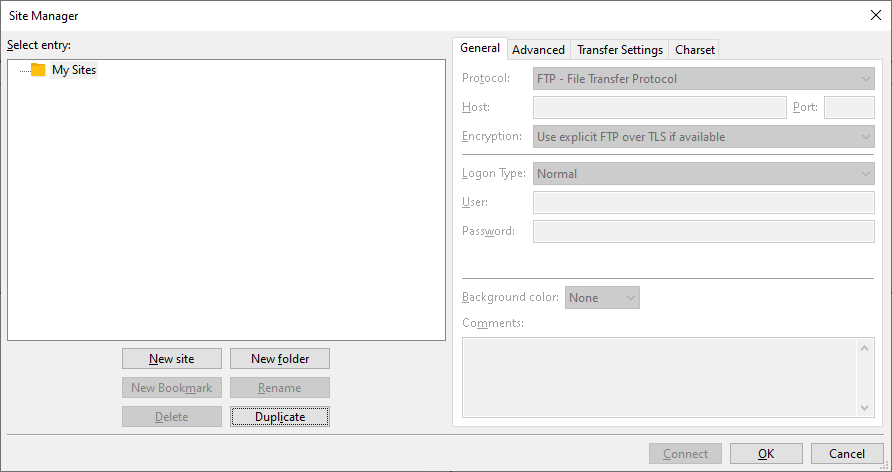
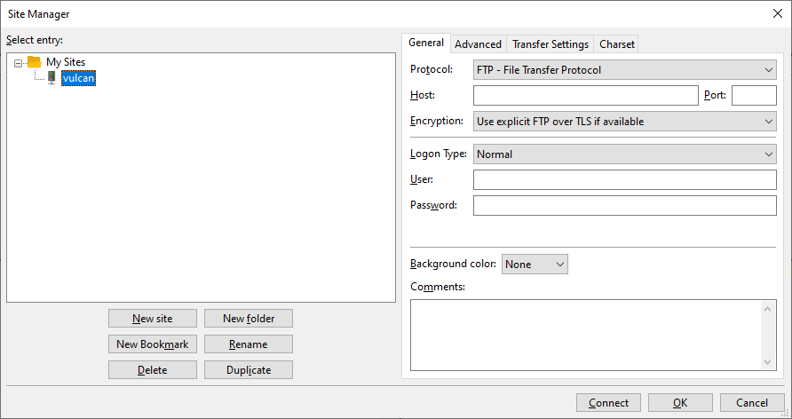

transferring data
===================

Now that we have seen how we can run jobs on the HPC cluster, let's see how we can transfer data from our desktop to
the cluster.

Note that of the methods detailed below, only one (the webmin interface) is available off-campus due to security
concerns. If you need to transfer large amounts of data to/from the cluster, you will need to be on-campus.

filezilla (on-campus only)
---------------------------

Files can be copied to/from ``vulcan`` using `FileZilla <https://filezilla-project.org/>`__, a free FTP ("file transfer
protocol") software.

To set up a connection to ``vulcan``, open **Site Manager** from the **File Menu**:

|br| Select **New site**:

|br| Name the connection something sensible, such as "vulcan". Next, add the address for ``vulcan`` under **Host**, and
be sure to select **Require implicit FTP over TLS**. Keep **Logon Type** as normal, then enter your username and
password.

Finally, click **Connect** to open a connection to ``vulcan``.

Once you are connected, you will be able to transfer files between your local computer and ``vulcan`` using the
available options. For more information about using FileZilla to transfer files, see
`the wiki <https://wiki.filezilla-project.org/Using>`__.

scp (on-campus only)
---------------------

To copy files to/from either ``atlas`` or ``vulcan`` while on campus, we can also use ``scp`` ("secure copy") to copy
files over an SSH connection between two computers.

to a remote server
...................

To copy files to a remote location, the basic form of the command looks like this:

.. code-block:: sh

    scp file user@host:/path/to/remote

After entering your password, this will copy ``file`` to the location ``/path/to/remote`` on ``host``.

.. tip::

    Remember that you can also use **wildcard expressions** to copy more than one file at a time.

.. note::

    Without the leading ``/``, ``path/to/remote`` is defined relative to ``user``'s home directory.

Just like with ``cp``, directories are omitted if we do not explicitly use the ``-r`` option:

.. code-block:: sh

    scp -r directory user@host:/path/to/remote

from a remote server
.....................

To copy files *from* the remote server, use the following basic form:

.. code-block:: sh

    scp user@host:/path/to/remote /path/to/local

To copy an entire directory, remember to include the ``-r`` option:

.. code-block:: sh

    scp -r user@host:/path/to/remote/directory /path/to/local

web interface
--------------

From off-campus, files can be uploaded/downloaded to the HPC cluster using the webmin interface. After logging in, use
the menu on the left-hand side of the screen to select **Upload and Download** under the **Tools** option.

.. warning::

    This connection can be very slow, and if the transfer is interrupted the entire file will need to be
    uploaded/downloaded again. If you need to transfer large files, it is easier to be on campus.
