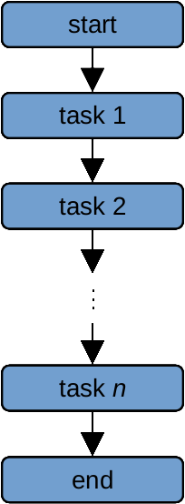
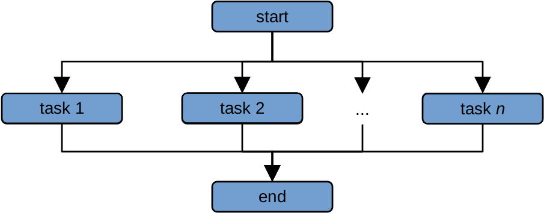
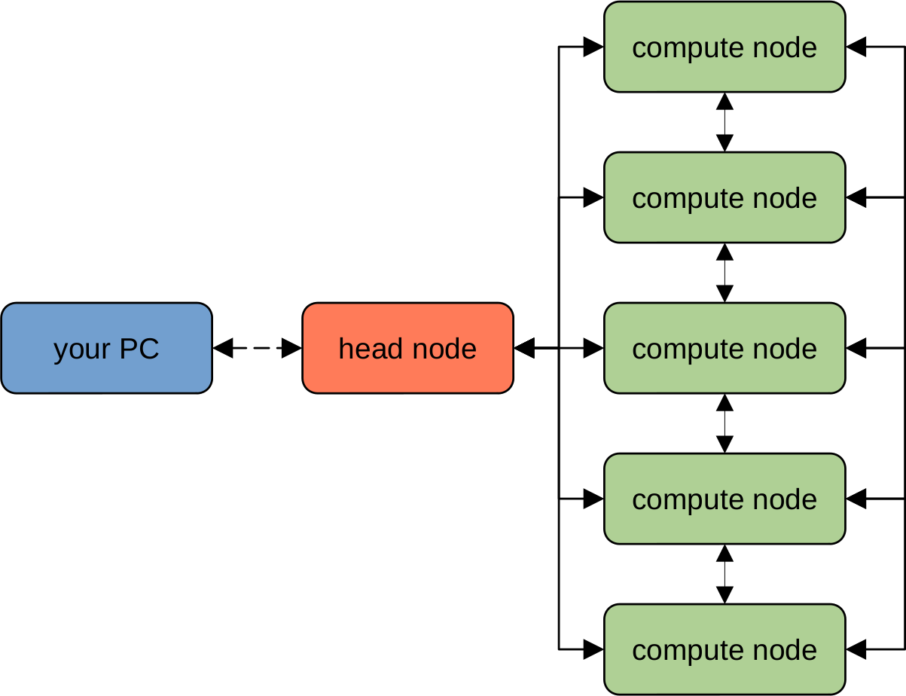
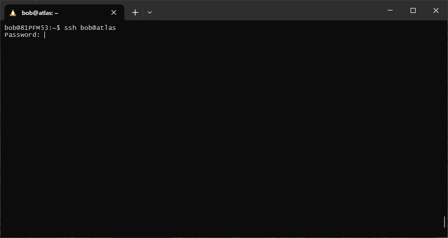
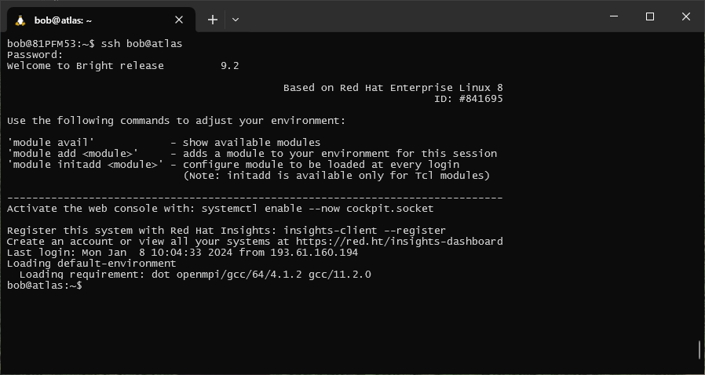

high performance computing
===========================

.. toctree::
   :glob:
   :hidden:
   :maxdepth: 1

   atlas
   data_transfer
   vulcan

Now that we have had an introduction to the Unix shell, we'll learn about high performance computing (HPC) and see how
we can apply what we've learned about using the shell to work on the School's HPC systems, ``atlas`` and ``vulcan``.

what is an hpc system?
-----------------------

There are two main ideas that we need to cover to understand high-performance computing:

- parallel computing
- clusters and nodes

serial vs parallel computing
..............................

To help understand why HPC systems are so powerful (and potentially useful), let's consider the following task. We want
to calculate the average annual temperature measured by an individual weather station over a 10 year period, using daily
observations from 1000 different weather stations.

With *serial* computing, our computer would work on each of these computations in "serial" - that is, as a series,
processing each station after another:

|br| The amount of time it takes to do two computations is approximately twice the amount of time it takes the computer
to do a single computation - so, if it takes our computer 1 minute to perform one computation, it will take ~2 minutes
to perform 2 computations, and ~1000 minutes to perform 1000 computations\ [1]_.

If we instead have two processors to use, we could divide the list of 1000 computations into two lists of 500
computations, and give a list to each processor. We have now reduced the amount of time it would take from ~1000 seconds
to ~500 seconds. This is the idea behind *parallel* computing - we distribute the workload among many different
processors, each of which work on a task (or set of tasks) simultaneously:

|br| Because each computation is run *at the same time* by a different processor, this drastically reduces the amount
of time it takes to perform the computations.

By increasing the number of processors that we use from one to a few hundred, like what we have available on both
``atlas`` and ``vulcan``, we can greatly reduce the amount of time it takes to perform complex calculations - for
example, we can increasing the resolution of our modelling grids, or increase the number of images that we can process
at a single time.

.. note::

    Some problems are "embarrassingly parallel", meaning that it takes no effort at all to separate a workflow into
    parallel tasks. Not every task can be parallelized, though - we can call these types of problems
    "inherently sequential". Additionally, not all software is set up to take advantage of parallel computing - so,
    when considering whether or not an HPC can help you with a task, it's worth asking whether that task can be
    parallelized, and the amount of effort that would be required to parallelize it.

supercomputers and clusters
.............................

Nowadays, an HPC system typically comprises many different computers ("nodes"), forming a "cluster" of connected
computers that can behave like a single, large computer.

Any type of computer can technically be turned into a cluster - for example, researchers have managed to create clusters
using video game consoles such as the `PlayStation 2 <https://web.archive.org/web/20041120084657/http://arrakis.ncsa.uiuc.edu/ps2/>`__,
`PlayStation 3 <https://web.archive.org/web/20101209141211/http://www.wpafb.af.mil/news/story.asp?id=123231285>`__,
and XBox, among others.

An HPC cluster will typically have the following structure:

|br| The "head" node is typically a computer that is used to connect to the HPC cluster, file management, and launching
jobs, while the actual computation is done using combinations of the various "compute" nodes. Each of the various nodes
(both "head" and "compute") are networked together using high-speed connections, enabling the system to be treated as
a single physical machine.

.. warning::

    The "head" node should only ever be used for moving/copying files and submitting jobs - it is **not** to be used
    for computationally intense tasks. Similar to standing in the middle of an entryway to a busy train station,
    computing on the head node makes it difficult for other users to connect to the HPC.

    If you attempt to use the head node for computation, chances are that your job will be "killed" (terminated), and
    you may get a sternly worded letter from your local sysadmin.

submitting jobs
-----------------

Unlike your personal workstation or laptop, you typically can't just log into an HPC system and run whatever programs
you want right away. This is because HPC systems are typically used by many users, each with different needs. Instead,
you submit a request to an **HPC scheduler**. Like the maître d' at a restaurant, the HPC scheduler takes into account
the available resources (i.e., the number and size of tables available), existing reservations, and the resources
required by particular job (i.e., the number of guests in the party), before allowing your job to be run.

Your request typically needs to include information about the resources that you require for your job. Typically, this
means:

- number of processors (or number of nodes)
- amount of memory
- length of time

When the resources needed for your job are available, the scheduler will start running your job. If there are many
different job requests ahead of yours in the **queue**, you may have to wait until those other jobs have finished before
yours is allowed to begin. Just like with a large party at a busy restaurant, if you show up and request a lot of
resources, you may be forced to wait longer than users who don't need as much.

.. note::

    HPC schedulers are typically quite strict about resource management - your job will typically only be allocated
    the resources requested, and if your job exceeds the requested run time, it will be terminated whether or not it
    has actually completed.

    It is important, therefore, to be accurate about the resources that you require - you want to request an amount of
    time that is longer than the amount of time that you will require, but not so much longer that it means you have to
    wait for many resources to be free for a long period of time.

In the next exercises, we will look at two different HPC schedulers used on each of the School's HPC systems,
and explain how to write a job script that can be used to submit and run jobs on the HPCs.

connecting to the hpc
-----------------------

using ssh
..........

If you are on campus, you can connect to either of the HPC systems using ``ssh`` ("secure shell"). This program allows
you to set up a secure connection between two computers, enabling you to remotely log in to another computer and
execute commands, exactly the same as if you were physically sitting at the machine:\ [2]_

.. code-block:: sh

    ssh user@host

When you enter this command (remembering to replace ``user`` with your own username, and ``host`` with the address
of the machine you are trying to access), you will be prompted for your password:

.. note::

    As you type in your password, note that the cursor will not move - this is a long-standing security measure on
    Unix-like systems, so remember to type slowly and carefully.

If you have typed in your password correctly, when you hit **Enter** a second time, you should see the prompt change,
and a connection message displayed:

|br| You can now use the shell on the remote host in the same way that you used the shell on your local computer.

using the webmin
.................

If you are not on campus, you can still connect to either of the HPC systems using the webmin interface. You will need
to point your browser to ``host/webmin`` (replacing ``host`` with the address of the machine you want to connect to):

|br| Enter your username, press **Continue**, then enter your password to finish logging in.

Once you have logged in, you can use the menu items along the left-hand side of the screen to upload/download files,
view the processes that are currently running, and submit commands to execute using a simple command shell.

notes
------

.. [1] this is a gross oversimplification, for illustrative purposes only.

.. [2] `PuTTY <https://putty.org/>`__ is a standalone SSH client for Windows, which you can also use to connect to the
       HPC systems while on campus. However, since you have already installed either WSL or git bash, you do not need
       any additional software to connect using ``ssh``, as it typically comes pre-installed with most Linux systems
       (or git bash).
