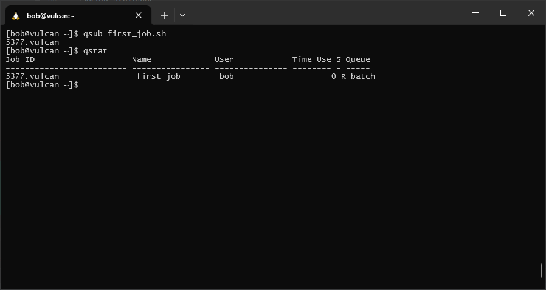
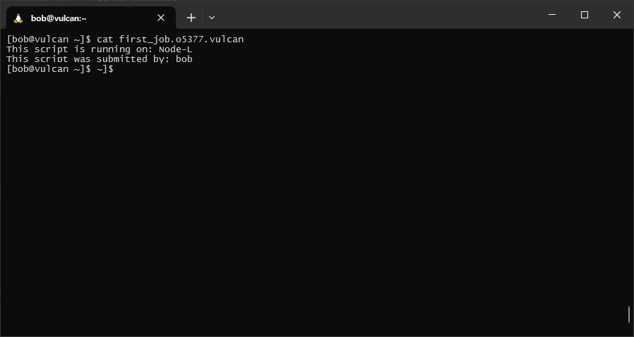

vulcan
========

``vulcan`` is the older HPC in the School, with 15 nodes (14 compute nodes + 1 head node). 12 of the compute nodes have
16 CPUs and 96-128 GB RAM each, and two of the nodes have 64 CPUs with 512 GB RAM each. The operating system is
CentOS Linux 7.9.2009, which uses the ``bash`` shell by default.

torque
-------

The job scheduler on vulcan is PBS Torque, an open-source implementation of the original "portable batch system"
developed by NASA, Lawrence Livermore National Laboratory (LLNL), and MRJ Technology Solutions.

A list of basic commands used by Torque are below - remember to use ``man``, ``help``, or an internet search for more
information about optional arguments:

.. csv-table::
    :header: "command", "purpose"

    "``qsub``", "submitting a job"
    "``qstat -u USER``", "getting the current status of {USER}'s jobs"
    "``qdel JOBID``", "cancel {JOBID}"

Just as we did on ``atlas``, we'll create a dummy job script, then look at how we can use each of these commands in
turn.

Start by using ``nano`` to create a new file, ``first_job.sh``, then paste the following script, save, and exit:

.. code-block:: sh

    #!/usr/bin/bash
    ### put the job name here - this will help you identify it
    #PBS -N first_job

    ### tell PBS where to print the output and error logs:
    #PBS -o ${PBS_JOBNAME}.o${PBS_JOBID}
    #PBS -e ${PBS_JOBNAME}.e${PBS_JOBID}

    ### time needed to execute, in HH:MM:SS
    #PBS -l walltime=00:01:20

    ### specify the resources required
    # PBS -l nodes=1:ppn=1

    ### run the following commands
    echo "This script is running on: "$HOSTNAME
    echo "This script was submitted by: "$USER
    sleep 60

Like with Slurm, we use a special kind of comment to pass information to the job scheduler. Each of these lines begins
like this:

.. code-block:: sh

    #PBS

and includes additional information used by the scheduler. For a more complete guide to these options, see
`here <https://hpc-wiki.info/hpc/Torque#.23PBS_Usage>`__.

Next, we can submit our job using ``qsub``:

.. code-block:: sh

    qsub first_job.sh

Below this, you should see the job ID print to the terminal - it will look something like ``[[:digit:]]{4}.vulcan``.

To check that our job is running, we can use ``qstat``. Without any arguments, ``qstat`` prints the status of jobs
submitted by the current user (which should be you!):

.. code-block:: sh

    qstat

You should see something like the following:

|br| In each row of the table, you can see the job id(s) for any jobs that have been submitted, the name of the job,
the name of the user that submitted the job, the amount of time used (HH:MM:SS), the status of the job (``S``), and
which queue the job is running in.

The *status* of the job will typically be one of the following values:

- ``Q``: the job is currently queued to run
- ``R``: the job is currently running
- ``E``: the job is exiting with an error
- ``C``: the job is completed

To see the *output* of the job once it has completed, we can look at the file ``${PBS_JOBNAME}.o${PBS_JOBID}``:

|br| If the job produced any error messages, we can also check these by examining the file
``${PBS_JOBNAME}.e${PBS_JOBID}``.

specifying resources
---------------------

In the example above, we used the ``-l`` argument with ``PBS`` to specify both the total time needed for the job
(``walltime``), and how may nodes and processors per node (``nodes=1:ppn=1``) we needed for our job.

We can also use ``-l`` to specify a memory limit for each process. For example, to set a limit of 400MB, we can use
the following:

.. code-block:: sh

    #PBS -l mem=400MB

Instead of the "wall time" (the amount of time from the start of the job until it is completed), we can also specify
the CPU time needed:

.. code-block:: sh

    #PBS -cput=<limit>

Note that this is not the same as the wall time - it is the total time that is actively used by all of the processors
running the job. If you're not entirely sure how much CPU time you need, it's probably best to stick to wall time.

the torque environment
------------------------

By default, when you submit a job using ``qsub``, the script runs in the same environment **as when you first log in**.
This means that:

- the default working directory is your ``HOME`` directory. Any relative paths used in your script will be relative to
  that directory.
- any environment variables (e.g., ``PATH``) will be the same as they are when you first log in. This means that you
  need to remember to update variables within the script, or use the ``-V`` option with ``qsub`` to export environment
  variables to the job environment.

advanced: using /tmp effectively
---------------------------------

Unfortunately, the main storage disk used with ``vulcan`` (mounted at ``/mnt/DATA``) is not well-suited to read/write
intensive processing. If the software you are running does a lot of reading/writing to the disk, this can slow your jobs
to a halt.

Fortunately, we have a small workaround: the ``/tmp`` directory. On each node, there is a "small" (~350 GB) SSD drive
attached to each compute node, which can be used as **temporary** storage while running a job. The best way to do this
is by including the following steps in your script:

- use ``mkdir`` to create a new directory on ``/tmp``, unique to your particular job: ``mkdir /tmp/d${PBS_JOBID}``.
  Using the variable ``${PBS_JOBID}`` ensures that the directory is unique for each job.
- copy the necessary files to this temporary directory
- run the actual job
- copy the necessary files from the temporary directory
- remove the temporary directory

The easiest way to ensure that the directory is removed is by including the following code at the beginning of your
script (after the header):

.. code-block:: sh

    function clean_tmp {
        rm -rf /tmp/d${PBS_JOBID}
    }

    trap clean_tmp EXIT

This creates a *function*, ``clean_tmp``, that removes the directory ``/tmp/d${PBS_JOBID}``. The second block,
``trap clean_tmp EXIT``, ensures that before exiting for any reason, your script runs the ``clean_tmp`` function - in
other words, your script will automatically remove the temporary directory whenever it finishes, either successfully
or due to an error.

A full example using this workflow is shown in the sample script below. Feel free to copy and adjust the script for your
own use - just remember that it will only work on a system that uses the Torque HPC scheduler.

sample script
----------------

.. code-block:: sh

    #!/usr/bin/bash
    ### put the job name here - this will help you identify it
    #PBS -N name

    ### tell PBS where to print the output and error logs:
    #PBS -o ${PBS_JOBNAME}.o${PBS_JOBID}
    #PBS -e ${PBS_JOBNAME}.e${PBS_JOBID}

    ### time needed to execute, in HH:MM:SS
    #PBS -l walltime=HH:MM:SS

    ### specify the resources required
    # PBS -l nodes=XX:ppn=XX

    ### use trap to remove temporary directories
    function clean_tmp {
        rm -rf /tmp/d${PBS_JOBID}
    }

    trap clean_tmp EXIT

    ### run the following commands
    # set the directory where the data are kept
    datadir=path/to/data

    # create the temporary directory
    tmpdir=/tmp/d${PBS_JOBID}
    mkdir -p $tmpdir

    # copy files to the temporary directory
    cp -rv $datadir $tmpdir

    # copy files from the temporary directory
    cp -rv $tmpdir $datadir

