working with files
====================

Now that we have seen how we can navigate the file system and create new directories, let's take a closer look at
how we can create and manipulate files and directories from the shell.

text editors
-------------

We'll start by using a **text editor** to create a new text file.

.. note::

    A very important thing to note here is that "text" really does mean "text". A text editor only works with plain
    character data: no formatting, no images, no tables, no bells and/or whistles.\ [1]_

    Examples of common text editors available for Windows include **Notepad** (installed by default) and **Notepad++**.

    I recommend using **Notepad++** (available `here <https://notepad-plus-plus.org/>`__), because it offers many
    useful features beyond the basic level provided by **Notepad**. In a pinch, though, **Notepad** will still get
    the job done - there's probably a reason it's still bundled with Windows after over four decades.

nano
......

For this example, we'll be using (`nano <https://en.wikipedia.org/wiki/GNU_nano>`__), a free text editor that ships
with almost all bash terminal emulators.

**nano** is called directly from the command prompt. As with other programs we have looked at, we can use the ``--help``
flag to learn more about the options available:

.. code-block:: sh

    nano --help

As you can see from the output, we can call **nano** on its own, or by specifying a file name. Let's launch **nano** on
its own - we can specify a file name when we want to save the file:

.. code-block:: sh

    nano

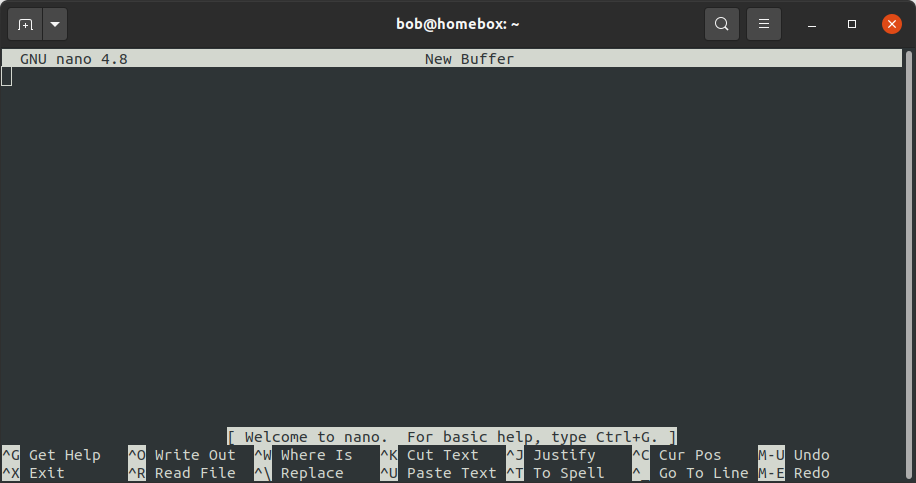

|br| In this file, we can add some important notes about using the shell so far - feel free to add your own:

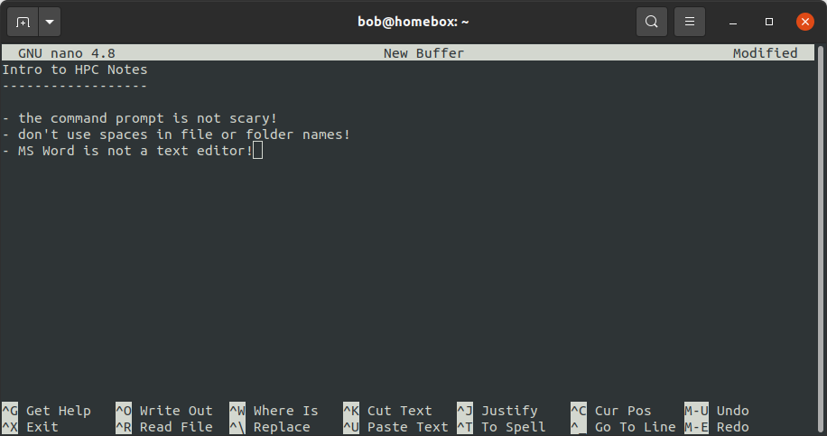

the ctrl button
................

After you have begun typing some notes, you should see the word **Modified** appear in the upper right-hand corner. This
indicates that you have unsaved changes to the file.

At the bottom of the screen, you should also notice that there are a number of commands available:

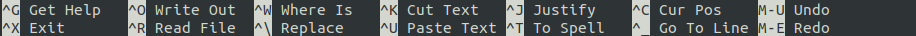

|br| For example, the command to "Write Out" (*save*) the file is ``^O``. The first character here, ``^``, is used to
indicate the **Ctrl** key. So, to save the file, we need to press both the **Ctrl** key and the **O** key at the same
time. When you do that, you should see the following:

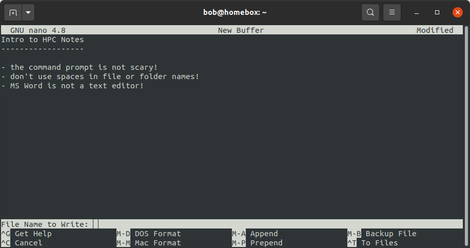

|br| Here, we have to tell **nano** what file name to use - let's go with **notes.txt**. Once you have typed in a
filename, press **Enter** to save the file. You should see something like the following:

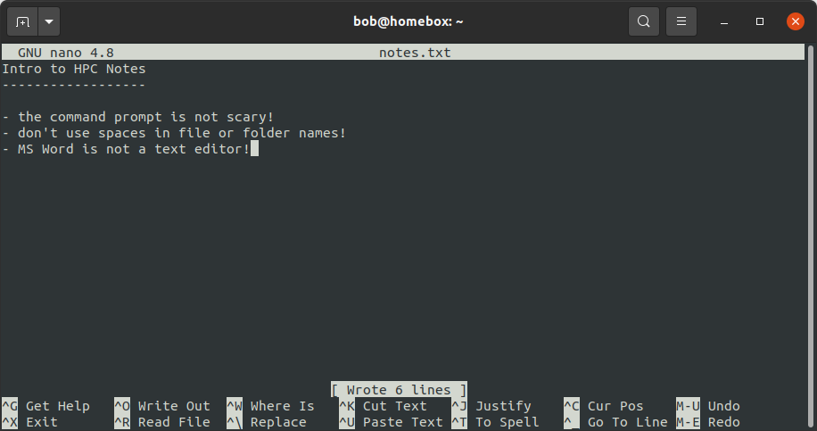

|br| This indicates that the program wrote 6 lines of text to the file - note that the file name (**notes.txt**) is now
displayed at the top center of the window.

In other contexts, you may also see **Ctrl** button combinations indicated as any of the following - for example, using
the ``^O`` example:

- ``^O``
- ``Control-O``
- ``Control+O``
- ``Ctrl-O``
- ``Ctrl+O``
- ``C-O``

Any of these indicate that you should press both the **Ctrl** button and the other button at the same time.

the "meta" key
...............

You should also see a few key combinations with the "meta" key, indicated by ``M`` - for example, the command to undo
changes is ``M-U``.

The "meta" key will most likely be different for different operating systems. For OSX, it is usually the ``Esc``
(**Escape**) key; for Windows and most Linux distributions, either the ``Esc`` key or the  ``Alt`` key can be used.

Try to undo your most recent changes using ``M-U``, then re-do them using ``M-E`` - you should see that the message
"Undid {change}" appears:

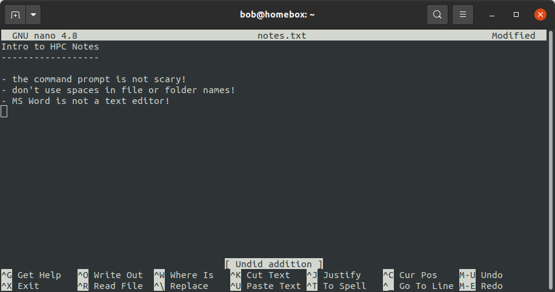

|br| followed by "Redid {change}":

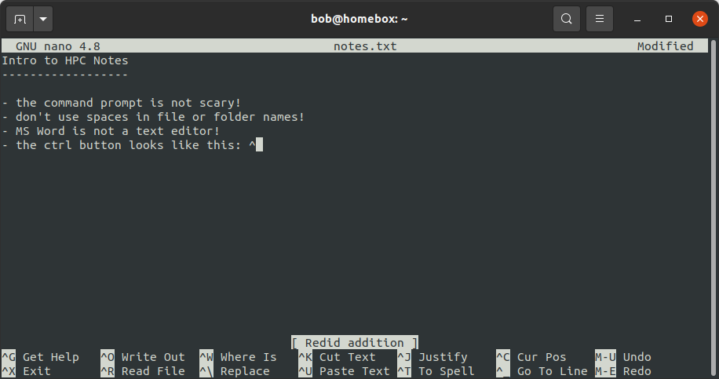

exiting
........

Finally, to exit the program, press both the **Ctrl** and **X** keys at the same time (i.e., ``^X``). Note that if you
have any unsaved changes to the file, you will be prompted to save them - you can choose to do so (``Y``), or to discard
those changes (``N``), or to cancel exiting the program (``^C``).

file permissions
-----------------

Now that we have created a file, let's have a look at who is allowed to do what with the file - that is, the
**permissions** that are set on the file.

From the shell, we can use the ``ls`` command, along with the ``-l`` option, to list more information about the files
in the current directory:

.. code-block:: sh

    ls -l

When you enter this command, you should see something like the following:

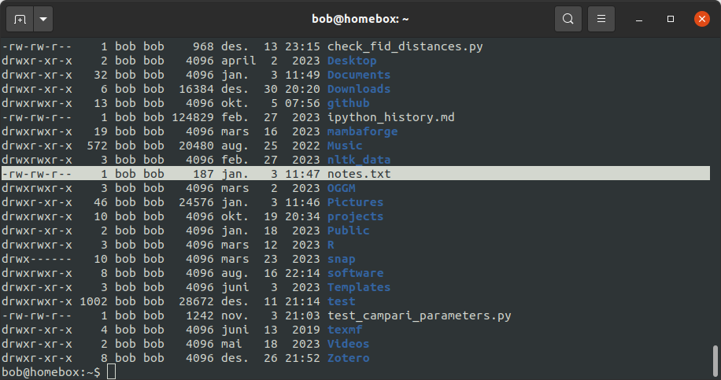

|br| Each file/directory in the current directory is listed on a separate line, along with additional details. In the
screenshot above, I've highlighted the line corresponding to the **notes.txt** file:

.. code-block:: text

    -rw-rw-r--    1 bob bob    187 jan.   3 11:47 notes.txt

Each block in the line tells us the following information:

- the file permissions (``-rw-rw-r--``);
- the number of links (names) for the file (``1``);
- the "owner" of the file (``bob``);
- the "group" of the file (``bob``);
- the file size in bytes (``187``);
- the date and time the file was last updated (``jan. 3 11:47``);
- and finally, the file name (``notes.txt``).

Some of these should be fairly self-explanatory (i.e., the file owner, size, last updated, and name). The permissions,
though, are probably a bit confusing.

The permissions block is 10 characters long - the first character in the permissions block indicates the type of file.
The most common types that you will find are most likely:

- ``d`` - for directories;
- ``l`` - for links;
- ``-`` - for other files.

The remaining nine characters are divided into three triplets that indicate the types of permissions for the file at
different levels: user (the "owner" of the file, represented by a ``u``), group (``g``), and other (``o``), displayed
in that order.

Files (and directories) have three different types of permissions: reading, writing, and execution:

.. csv-table::
    :header: "type", "explanation", "symbol", "octal"

    "**reading**", "reading the contents of files/directories", "``r``", 4
    "**writing**", "modifying the contents of files/directories", "``w``", 2
    "**execution**", "run a file as a program/enter or run commands in a directory", "``x``", 1

If a type of permission is granted for a given level, that symbol (``r``, ``w``, or ``x``) will be shown in the
permission block; if it is not, a dash (``-``) will be visible in its place.

For example, **notes.txt** has the following permissions set:

- the file owner (``bob``): ``rw-``, indicating that the user ``bob`` has both read and write permission for the file.
- the file group (``bob``): ``rw-``, indicating that members of the group ``bob`` have both read and write permission
  for the file;
- all other users: ``r--``, indicating that other users may only read, but not modify, the file.

In the next section, we'll see how we can change permissions for a file.

changing permissions
---------------------

To change or modify permissions for files and directories, we use the ``chmod`` command.

.. warning::

    As a general rule, it's best to avoid granting full permissions for a file or directory to all users, as it
    means that any user on the computer has the ability to modify (or delete!) the file/directory.

using characters
.................

The basic structure of the ``chmod`` command is:

.. code-block:: text

    chmod who=permissions file

For example, to change **notes.txt** so that "other" users (``o``) can read and modify the file, we would use the
following:

.. code-block:: text

    chmod o=rw notes.txt

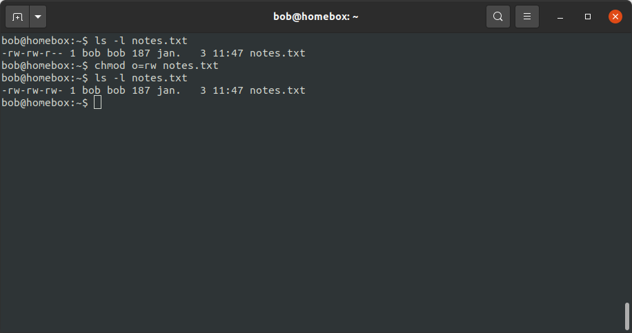

|br| In the screenshot above, we can see how this has changed the permissions block using ``ls -l``. Before running
``chmod``, the output of ``ls -l`` was:

.. code-block:: text

    -rw-rw-r-- 1 bob bob 187 jan.   3 11:47 notes.txt

indicating that "other" users could read (but not write) the file.

After running ``chmod``, the output is:

.. code-block:: text

    -rw-rw-rw- 1 bob bob 187 jan.   3 11:47 notes.txt

indicating that other users now have read and write permissions for the file.

Note that by setting permissions in this way, we have to be sure that we include **all** of the permissions we want for
a given level - if we leave one out, it won't be set. For example, this:

.. code-block:: text

    chmod o=w notes.txt

will change the "other" permissions to be write-only:

|br| For this reason, we can add to (or remove from) the existing permissions using ``+`` (or ``-``).

For example, we could add write permissions for other users like this:

.. code-block:: sh

    chmod o+w notes.txt

|br| and we can remove write permissions like this:

.. code-block:: sh

    chmod o-w notes.txt

|br| We can also specify multiple levels at a time - for example, to remove write permissions for everyone but the file
owner, we could use the following command:

.. code-block:: text

    chmod u=rw,g-w,o-w notes.txt

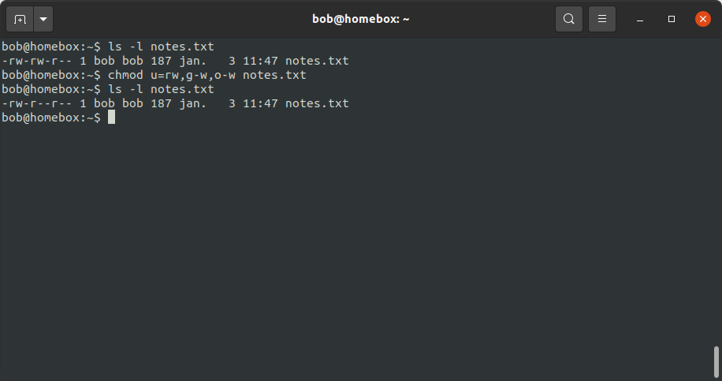

|br| And finally, if we want to set the same permissions for all levels, we can use ``a``:

.. code-block:: text

    chmod a=rw notes.txt

using numbers
..............

In addition to the symbolic representation (``r``, ``w``, and ``x``), we can use the octal representation to set the
permissions for a file.

To help explain this, let's view a single permission block as a series of binary switches, with "1" indicating that the
permission is given, and "0" indicating that the permission is absent:

.. code-block:: text

    rwx -> 111
    rw- -> 110
    r-x -> 101
    r-- -> 100

... and so on.

In binary notation, the number ``111`` is equal to 7 - and so, the octal value (and the decimal value) corresponding to
``rwx`` permissions is 7 (= 4 + 2 + 1, the sum of the octal values for each permission type). Similarly, the binary
value ``110`` is equal to 6, and the octal value for ``rw-`` is 6 (= 4 + 2 + 0)

By representing each level of permission as a single octal value (one each for user, group, and other), we have a
convenient way of representing a given permission setting. For example, let's look at the original permission setting
of **notes.txt** again:

.. code-block:: text

    -rw-rw-r--    1 bob bob    187 jan.   3 11:47 notes.txt

Here, the ``u`` level permissions (``rw-``) corresponds to an octal value of 6, the ``g`` level permissions (``rw-``)
correspond to an octal value of 6, and the ``o`` level permissions (``r--``) correspond to an octal value of 4. This
means that we can represent this permission setting as the octal value 664.

In fact, if you enter the following command:

.. code-block:: sh

    chmod 664 notes.txt

you should notice that the permissions do not change:

|br| Note that we are only able to set permissions for all levels using the octal representation - we can't add/remove
permissions using ``+`` or ``-``, and we can't specify levels using ``u``, ``g``, or ``o``.

moving files (and directories)
-------------------------------

Now that we've seen how we can view and edit permissions, we'll look at a few other useful commands for manipulating
files and directories from the shell.

We'll begin with ``mv``, which is used to move (or rename) files and directories.

moving
.......

To move a file (or multiple files) to a different directory, we use the following command:

.. code-block:: text

    mv file [file2 ...] directory

.. note::

    If we have more than two arguments to ``mv``, the final argument **must** be an existing directory - if it is not,
    ``mv`` will exit with an error.

For example, let's say that we wanted to move **notes.txt** to the **Documents** directory:

.. code-block:: text

    mv notes.txt Documents

Run this command, then use ``ls`` to confirm that the file (a) is no longer in the current working directory, and (b)
is in the **Documents** directory.

.. warning::

    Note that if ``directory`` does not already exist, ``mv`` will simply rename the file to the "directory" name given,
    so be sure to pay attention to your directory names!

renaming
.........

As noted above, we can also use ``mv`` to rename existing files:

.. code-block:: sh

    mv file1 file2

.. warning::

    Note that if ``file2`` already exists, it will be silently replaced (i.e., there will be no warning) by the contents
    of ``file1`` -- remember to be very cautious when using this command!

    To avoid this, you can also use the ``-i`` option, which will prompt you to confirm whether you want to replace an
    existing file:

    .. image:: img/replacing.png
        :width: 600
        :align: center
        :alt: using the -i option to avoid overwriting existing files

We can also use ``mv`` to rename directories:

.. code-block:: sh

    mv directory1 directory2

.. note::

    If ``directory2`` already exists, ``directory1`` will be moved into ``directory2``.

copying files
---------------

To *copy* files, we use the ``cp`` command - for example, to copy ``file1`` to ``file2``, use the
following command:

.. code-block:: sh

    cp file1 file2

.. warning::

    As with ``mv``, if ``file2`` already exists, it will be silently replaced by the contents of ``file1``. To avoid
    this, you can use the ``-i`` option, which will prompt you to confirm whether you want to replace the existing
    file.

We can also use ``cp`` to copy file(s) into a directory:

.. code-block:: sh

    cp file [file2 ...] directory

This will copy the contents of ``file`` to ``directory/file`` (and ``file2`` to ``directory/file2``, and so on).

copying directories
--------------------

To copy entire directories, we can't simply use ``cp``:

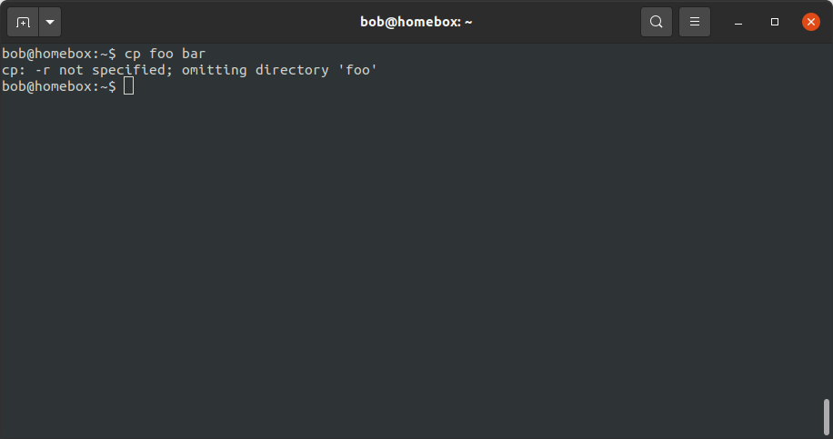

|br| Instead, we need to use the ``-r`` (for "recursive") option:

.. code-block:: sh

    cp -r directory1 directory2

.. note::

    If ``directory2`` does not exist, it will be created with this command (and filled with the contents of
    ``directory1``). If it exists, ``directory1`` will be copied into the existing directory ``directory2``.

wildcards
-----------

What if we want to manipulate many files at once, without having to explicitly type them all out? We can do this by
using **wildcards**: special characters that allow us to specify groups of filenames based on a pattern of characters.

The main wildcards that you will use are listed below:

.. csv-table::
    :header: "wildcard", "meaning"

    "``*``", "any number of characters"
    "``?``", "any single character"
    "``[characters]``", "any character that is a member of the set ``characters``"
    "``[!characters]``", "any character that is not a member of the set ``characters``"

Sets of characters can either be expressed:

- explicitly (i.e., ``[abc]`` would match a, b, or c);
- as a range (i.e., ``[0-5]`` would match numbers 0, 1, 2, 3, 4, or 5);

or by using
`POSIX <https://en.wikibooks.org/wiki/Regular_Expressions/POSIX_Basic_Regular_Expressions#Character_classes>`__
character classes, such as the following:

.. csv-table::
    :header: "POSIX class", "meaning"

    "``[:alnum:]``", "any alphanumeric character"
    "``[:alpha:]``", "any alphabetic character"
    "``[:digit:]``", "any numeric character"
    "``[:upper:]``", "any uppercase alphabetic character"
    "``[:lower:]``", "any lowercase alphabetic character"

We can also combine different wildcards to create more complicated wildcard expressions. The table below shows a few
different examples of patterns and what file(s) they would match:

.. csv-table::
    :header: "pattern", "matches"

    "``*``", "all filenames"
    "``*.txt``", "any filename that ends with the characters ``.txt``"
    "``Box1[0-2]``", "any filename that starts with ``Box1`` and ends in ``0``, ``1``, or ``2``"
    "``Box?``", "any filename that starts with ``Box`` followed by exactly one character"
    "``Box[[:digit:]]``", "any filename that starts with ``Box`` followed by exactly one digit"
    "``[![:lower:]]*``", "any filename that does not start with a lowercase alphabetic character"

Any command that can accept filename arguments (i.e., ``ls``, ``mv``, ``cp``) can be used with wildcard arguments. Most
of the time, the shell will "expand" the wildcard expression (create a list of filenames matching the wildcard) *before*
it runs the command, meaning that the command only sees the list of filenames matching the wildcard, rather than the
wildcard expression itself.

symbolic links
---------------

Copying creates a new file (or directory) on the disk, which means that it increases the amount of disk space used. We
can also create a **symbolic link** (**symlink**) to create a file (or directory) that points to some other file or
directory in the filesystem.

To do this, we use the ``ln`` command, along with the ``-s`` option\ [2]_:

.. code-block:: sh

    ln -s original link

We can then use that link as we would any other file or folder:

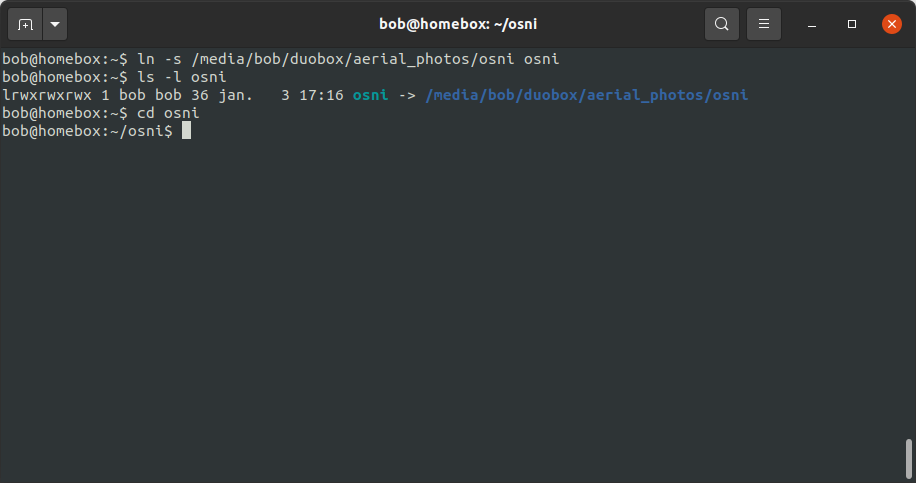

|br| In the output of ``ls -l`` above, you can see that the link is displayed differently to other folders, both in
color, but also by indicating what file or directory the link points to.

removing files
---------------

.. warning::

    In the Unix shell, there is no "recycle bin" to recover deleted files/folders - once you use ``rm`` to remove
    something, it's gone.

    Be sure to use this command with caution!

To delete (*remove*) files, we use the ``rm`` command:

.. code-block:: sh

    rm file

As with copying, in order to remove a directory, we need to use the ``-r`` option:

.. code-block:: sh

    rm -r directory

notes
------

.. [1] This is not to say that text editors cannot *display* text using particular styles, such as
       `syntax highlighting <https://en.wikipedia.org/wiki/Syntax_highlighting>`__. In fact, most text editors can be
       configured for syntax highlighting, which is especially useful for editing scripts.

.. [2] Without the ``-s`` option, ``ln`` creates a **hard link** rather than a symbolic link. In effect, a hard link
       creates a new file in the filesystem with a link to the same space on the disk. A symbolic link is a file that
       links to a different name in the filesystem, similar to a shortcut in Windows.
