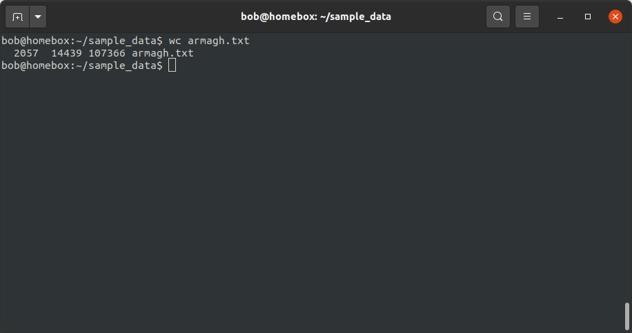
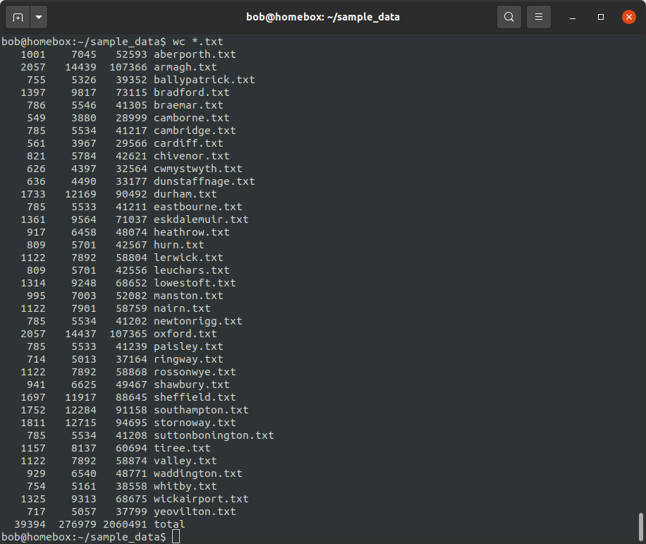
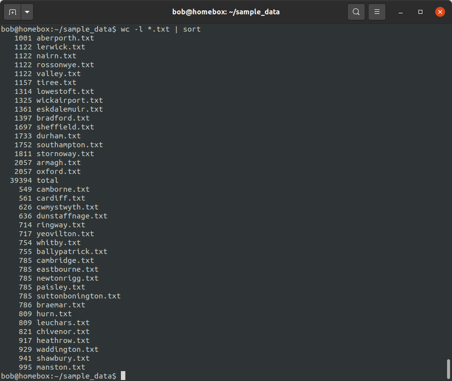
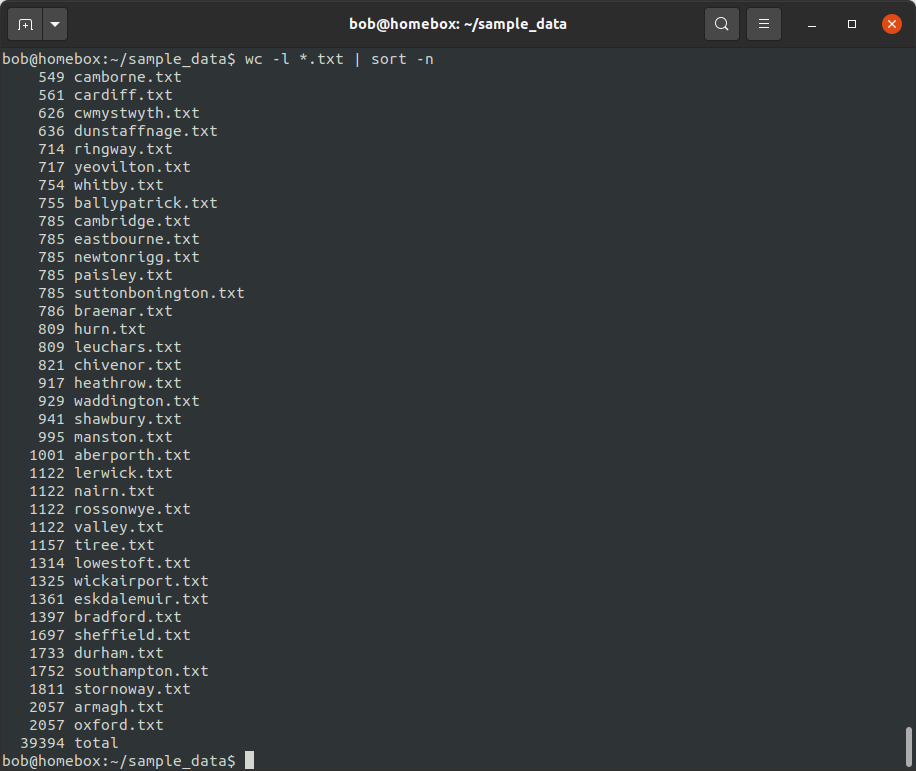
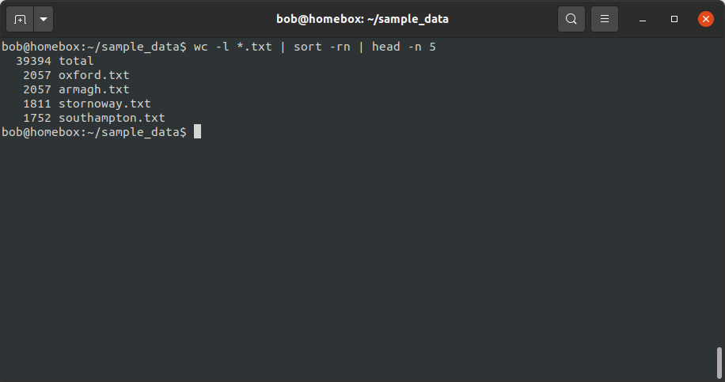
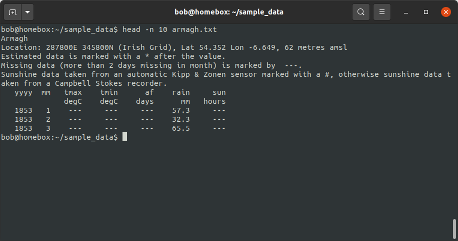
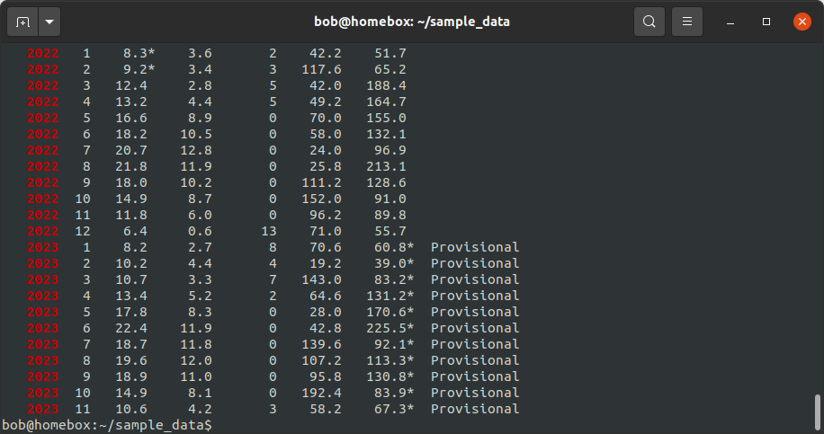
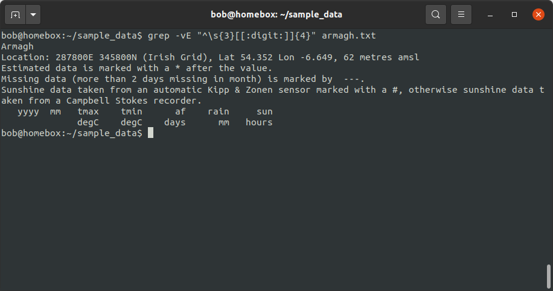
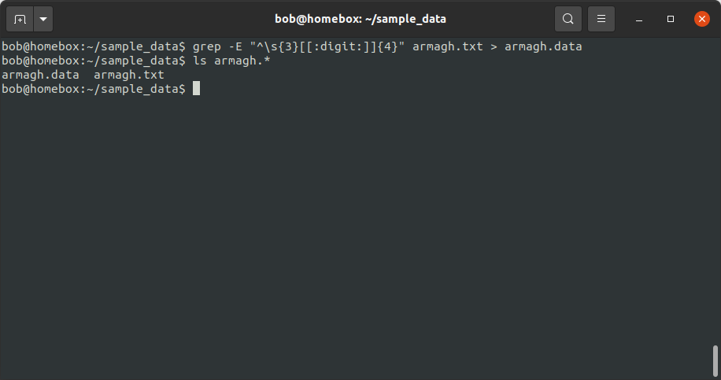
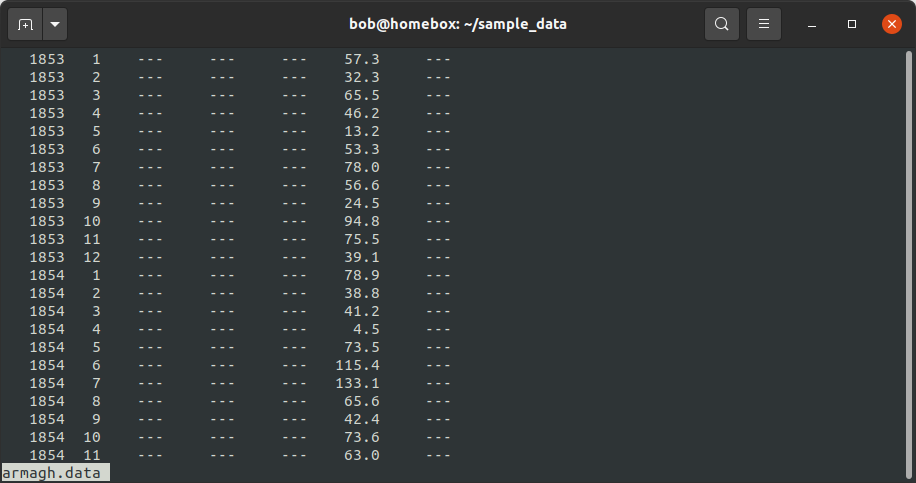

input/output
==============

In this exercise, we're going to use a collection of historic meteorological observations,
downloaded from the `UK Met
Office <https://www.metoffice.gov.uk/research/climate/maps-and-data/historic-station-data>`__.

Our goal is to figure out which station has the most observations, using a combination of different shell programs and
techniques.

To follow along, make sure to first
`download <https://drive.google.com/file/d/1vIUezydekYo7DHmep5-qqn2jnuaVLS8W/view?usp=sharing>`__ the data file.

sample data
------------

Once you have downloaded the file, use the shell to navigate to the directory containing the file, then use the
following command to extract the contents of the file:

.. code-block:: sh

    tar xvzf sample_data.tar.gz

This uses the ``tar`` (from "tape archive") command to unzip (the ``z`` option) and extract (``x``) the files
contained in the archive. The ``v`` option ("verbose") means that as each file is extracted, its name is printed to the
screen, while the ``f`` option tells ``tar`` to read from the filename given.

You should see that this creates a new directory, ``sample_data``, which contains the files we'll use for the rest of
this exercise - use ``cd`` to move to this directory.

We'll start by looking at ``wc`` ("word count"), which counts the number of lines, words, and characters in a file.
Navigate to where you have saved the ``sample_data`` folder, then use ``ls`` to show the contents of the directory.
You should have 37 ``.data`` files, corresponding to 37 different Historic Met Station datasets.

Let's start by looking at the ``wc`` output for a single file, **armagh.txt**:

.. code-block:: sh

    wc armagh.txt

|br| From this, we see that **armagh.txt** has 2057 lines, 14439 "words", and 107366 characters. If we are only
interested in the number of lines in the file (assuming that 1 line = 1 observation), we can use the ``-l`` option:

.. code-block:: sh

    wc -l armagh.txt

pipes and filters
-------------------

We can also use a **wildcard expression** to pass all of the filenames matching a given pattern to ``wc``:

.. code-block:: sh

    wc -l *.txt

|br| With multiple files, ``wc`` prints information for each file (in alphabetical order), along with the total for all
of the files. So, we're part of the way to our answer: we now have an idea of how many lines are in each file. Next, we
need some way of figuring out which of these values is the largest.

One way that we can do this is by using a **filter** (a command that takes some input, does some operation, and outputs
the results). Some commonly used filters include:

.. csv-table::
    :header: "command", "function"

    "``sort``", "sorts input"
    "``uniq``", "removes duplicated lines from sorted inputs"
    "``grep``", "outputs lines that match a specified pattern (more on this later)"
    "``fmt``", "formats input text"
    "``head``", "outputs the first few lines of input"
    "``tail``", "outputs the last few lines of input"
    "``tr``", "translates characters (e.g., upper to lowercase and vice-versa)"
    "``sed``", "'stream editor', for more sophisticated text translation"
    "``awk``", "a programming language designed for constructing complex text filters"

To sort the output of the ``wc`` command, then, we can use the ``sort`` command. To do this, we need to pass the output
of ``wc`` to ``sort``, using a **pipe** (``|``). This tells the shell that we want to use the output of the command on
the left as input to the command on the right:

.. code-block:: sh

    wc -l *.txt | sort

|br| By default, ``sort`` sorts a line in ascending order, *alphabetically*. This means that ``1001`` comes before
``549`` (because ``1`` comes before ``5``), even though 549 < 1001.

To force ``sort`` to sort values numerically (such that 549 comes before 1001), we need to use the ``-n`` option:

.. code-block:: sh

    wc -l *.txt | sort -n

|br| This gives us the number of lines in each file, sorted in *ascending* order - we can see that Camborne has the
fewest lines (549), while Armagh and Oxford have the most lines (2057). We can also use the ``-r`` option to sort
in *descending* order:

.. code-block:: sh

    wc -l *.txt | sort -rn

We don't have to stop here - we can use more than one ``|`` to continue passing the output of one command to another.
For example, we can pass the output of ``sort`` to ``head``, to view the top 5 stations:

.. code-block:: sh

    wc -l *.txt | sort -rn | head -n 5

|br| Now, you'll notice that we need some way of removing the total from the output. Can you think of a way to do this,
using the techniques introduced above?

grep and regular expressions
-----------------------------

First, let's take a closer look at our files. To see the first few lines of a file, we can use the ``head`` command:

.. code-block:: sh

    head -n 10 armagh.txt

|br| This output shows us that not every line of the file corresponds to an observation - in fact, in this example, the
observations don't actually start until the 8th line of the file. We could simply use the number of lines in each file
and subtract the number of header lines, but we don't necessarily know that each file has the same number of header
lines.\ [1]_

So, we'll need to find another way to get the information we're looking for.

Look again at the output of ``head`` on **armagh.txt**, and pay attention to the first line that shows us an
observation:

.. code-block:: text

       1853   1    ---     ---     ---    57.3     ---

This line begins with three spaces, followed by four digits (representing the year). In fact, all lines with
observations follow this pattern.

To search for patterns in text files, we can use ``grep``. This incredibly powerful program uses
`regular expressions <https://en.wikipedia.org/wiki/Regular_expression>`__ to find text matching a pattern. For example,
the pattern of "a line that begins with three spaces followed by four digits" can be represented using the following
pattern, which makes use of some of the wildcards we introduced previously:

.. code-block:: text

    ^\s{3}[[:digit:]]{4}"

Starting from the left:

- ``^`` means to match the empty string at the *beginning* of a line - this way, we won't accidentally find four digits
  in the middle of a line
- ``\s`` means to match a space character
- ``{n}`` means "match exactly *n* of the previous item" - so ``\s{3}`` means "match exactly three spaces"
- ``[[:digit:]]{4}`` means "match exactly 4 numeric characters"

We can then call ``grep`` using the ``-E`` option (for extended regular expressions), to show all lines in the file
that contain at least one match for our pattern:

.. code-block:: sh

    grep -E "^\s{3}[[:digit:]]{4}" armagh.txt

|br| Note that your output may look different - for example, it may not highlight the matching text on each line.

We can also use the ``-v`` option to "invert" the matching - now, ``grep`` will only print those lines that do **not**
match the pattern:

.. code-block:: sh

    grep -vE "^\s{3}[[:digit:]]{4}" armagh.txt

|br| We will make use of both of these commands to help us split the original ``.txt`` files into two separate files.

Using ``grep`` only shows us how many lines match (or don't match) the pattern, but we want to easily count the number
of lines that match the pattern, so we need at least one more step to reach this part of our goal.

redirecting output
-------------------

Now that we have seen how we can use the **pipe** operator to pass the output of a command to another command, let's
see how we can **redirect** the output of a command from the screen to a file, using ``>``. Similar to ``|``, ``>``
tells the shell to take the output of the command on the left and write it to the file on the right.

For example, if we wanted to split our data files into two parts, a header and the observations, we could start by
redirecting the output of ``grep`` to a new file, **armagh.data**:

.. code-block:: sh

    grep -E "^\s{3}[[:digit:]]{4}" armagh.txt > armagh.data

|br| You should notice two things here: first, the output of ``grep`` is no longer printed to the screen, because it
has instead been "printed" to the file **armagh.data**; second, using ``ls``, you should see that there is a new file
in this directory. To check that the correct lines have been printed, use the ``less`` command to see the contents of
the file:

.. code-block:: sh

    less armagh.data

|br| Once you are happy that the observations have been printed to the file correctly, press ``q`` to close ``less``.

In the same way, we can also use ``grep`` with the ``-v`` option to split the header lines into a separate file:

.. code-block:: sh

    grep -vE "^\s{3}[[:digit:]]{4}" armagh.txt > armagh.head

As before, you can use ``ls`` to check that this new file has been created, and use ``less`` to view the contents of
the file.

.. tip::

    When using ``command > file``, ``file`` is overwritten with whatever the output of ``command`` is. If we want to
    **append** the output of ``command`` to an existing file, we use ``>>``:

    .. code-block:: text

        command >> file

    If ``file`` does not already exist, it will be created.

reading input
--------------

In addition to redirecting the output of a command to a file, we can also redirect input from a file to a command
using ``<``:

.. code-block:: text

    command < file

For example, if we wanted to get a sorted list of all of the txt files in a directory\ [2]_, we could first redirect the
output of ``ls`` to a file:

.. code-block:: sh

    ls *.txt > file_list.txt

Then use ``<`` and sort to see a sorted list of the files:

.. code-block:: sh

    sort < file_list.txt

We can also redirect this output to a new file, using ``>``:

.. code-block:: sh

    sort < file_list.txt > sorted_files.txt

.. note::

    The order doesn't matter here - we could also write:

    .. code-block:: sh

        sort > sorted_files.txt < file_list.txt

    and we would get the same result - the important thing is that the ``>`` and ``<`` operators come *after* all of the
    other options and arguments to the command (in the case, ``sort``).

next steps
-----------

We're still only part of the way to our goal, however - we have seen how we can split the original files into **.data**
and **.head** files using ``grep`` and ``>``, and how we can use ``wc``, ``|``, and ``sort`` to figure out which files
have the most lines.

There's another piece missing: we need to split multiple files. In the next lesson, we'll look at how to do this, and
how we can combine all of these different commands into a single program (a "script") so that we can repeat this
process whenever we update or add to our data.

notes
------

.. [1] spoiler: they don't.

.. [2] note that this is just for illustration, since by default ``ls`` will sort file names alphabetically.