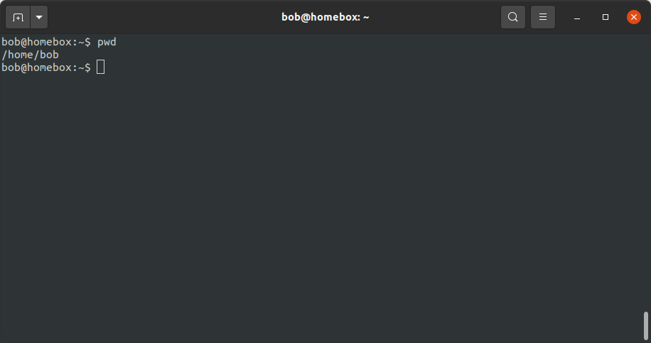
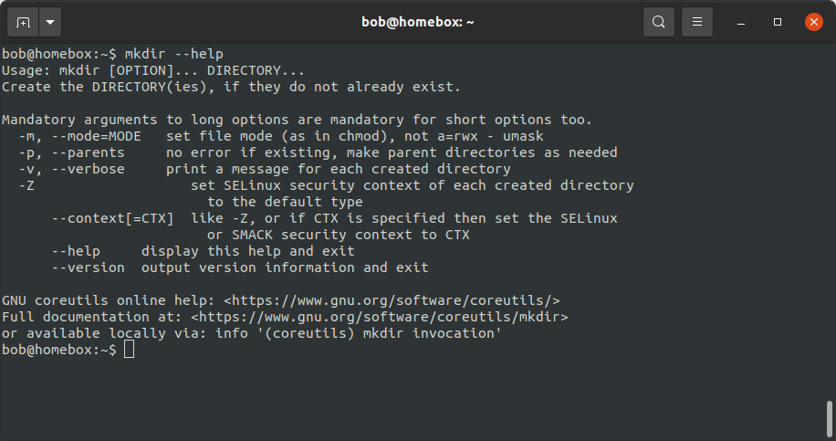
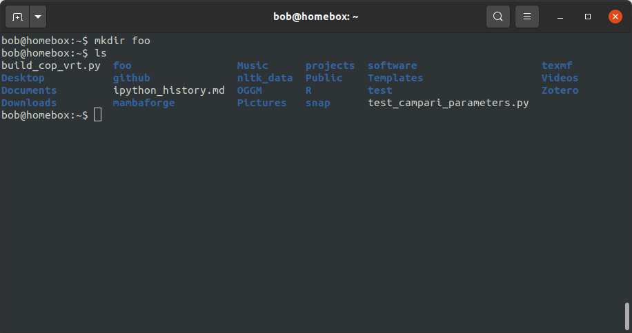
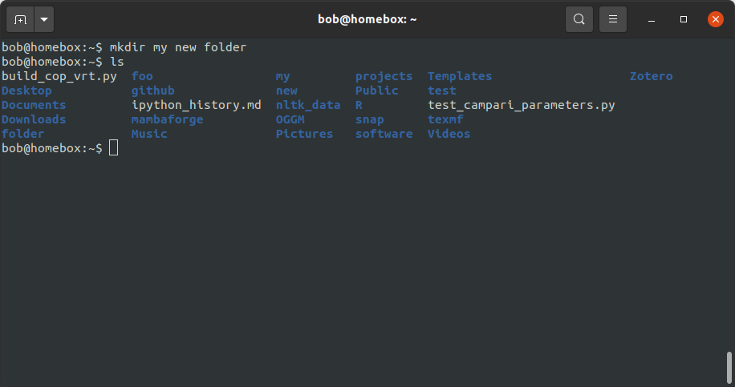

navigating on the command line
===============================

Now that we've had chance to use the shell a bit, let's see how we can use it to interact with, and navigate, the
filesystem.

the filesystem
---------------

We should probably start, however, by discussing what "the filesystem" actually means. In effect, it's how the operating
system stores and retrieves data. Most operating systems have a **hierarchical directory structure** - that is, the
filesystem is organized

Most Unix-based systems have a directory structure that looks something like this:

**fs diagram**

|br| The topmost (**root**) directory is ``/``, and all other files and directories on the computer are organized as
sub-directories of this root directory.

The Windows filesystem is similar, but with one major difference: on Windows, different storage devices have their own
"tree" (e.g., ``C:\``, ``D:\``, and so on). On Unix-like systems, there is a single "tree", and each storage device is
**mounted** (attached) to the tree at a different location.

where am i?
------------

When we are working in the shell, we are always in a single directory: the **current working directory**. To find out
what that directory is, we can use the ``pwd`` ("print working directory") command:

.. code-block:: bash

    pwd

|br| Most of the time, when you first log in or open a terminal, you will be in your **home** directory:

.. code-block:: text

    /home/<your username>

Every user account is given a home directory - very often, this is the only directory where "regular"
(non-administrator) users are able to write files. Don't worry, we'll look more at permissions and how to manage them
later.

navigating the filesystem
---------------------------

To change the working directory in the shell, we use the ``cd`` ("change directory") command, along with the
**pathname** of the directory we want to move to. For example, to change from our home directory to ``Documents``, we
would type:

.. code-block:: bash

    cd Documents

By itself (i.e., without including a pathname), ``cd`` will return us to our home directory. If you type the following:

.. code-block:: bash

    cd

you should see that you are returned to your home directory (feel free to check this using ``pwd``).

pathnames
-----------

When working with pathnames, there are two ways that we can specify them: as **absolute** pathnames, or as **relative**
pathnames.

absolute pathnames
...................

**Absolute** pathnames start with the **root** directory (remember, on Unix-like filesystems, this is ``/``) and follow
the tree through every branch until it reaches the specified file or directory. For example, the absolute path to
my ``Documents`` folder is:

.. code-block:: text

    /home/bob/Documents

That is, we start at the root directory (``/``), then move to the ``home`` directory, then the directory corresponding
to my username (``bob``), then the ``Documents`` directory.

Using an absolute pathname, then, we can navigate from the ``Documents`` directory back to our home directory by
specifying the absolute pathname to our home directory:

.. code-block:: bash

    cd /home/bob

relative pathnames
...................

**Relative pathnames**, on the other hand, start in the current working directory. This brings us to two important
notations that are used to represent relative positions in the file tree: `.` and `..`.

In a relative pathname, `.` refers to the directory itself, and `..` refers to the **parent** directory (the directory
immediately above it in the hierarchy).

So, if we are in the ``Documents`` folder and we want to go back to our home folder using a relative pathname, we can
do so by specifying the pathname to our home directory, relative to the ``Documents`` directory:

.. code-block:: bash

    cd ..

As before, you should see that this has returned you to your home directory, which you can check using ``pwd``.

creating a new directory
-------------------------

Now that we know a bit more about how to navigate the filesystem from the command line, we can create a new directory,
using the ``mkdir`` command.

Before you jump straight in, though, we'll use the ``--help`` option to show information about how to use the command:

.. code-block:: bash

    mkdir --help

|br| Here, as before, we see that we have (optional) options - remember that the square brackets indicate that these
are not required for the program to run. We also have a *required* input, DIRECTORY, indicated by the lack of square
brackets. This makes sense, as we can't exactly tell the computer to create a new directory without also telling it
what to call the directory.

So, let's use ``mkdir`` to create a new directory called "foo":

.. code-block:: bash

    mkdir foo

Now, use ``ls`` to list the contents of the current directory - you should see your new directory, foo, listed along
with the previous contents:

file and path names
---------------------

Before we move on to using the shell to work with files, we'll focus on a few different rules for file and directory
names.

- To start with, filenames (like commands) are **case sensitive** - this means that ``Foo`` and ``foo`` are separate
  files/directories.
- Filenames that begin with a period (``.``) are **hidden** - we will look at this more a bit later, but in practice
  this means that by default, ``ls`` will not actually list these files.
- Unlike Windows, Unix-like systems have no concept of a file extension: you can name files any way that you like,
  because the operating system has other ways of identifying the file type. That said, some applications may still use
  file extensions to identify/work with files, so it can still be a good idea to use them.
- File and directory names **cannot** include ``/`` - as we have seen, this character is used for delimiting
  directories in the filesystem, which means it can't show up in the middle of a filename.
- As a general rule, it's a good idea to only use alphanumeric characters (letters and numbers), periods (``.``),
  dashes (``-``), and underscores (``_``) in file and directory names.

By far the most important rule for file and directory names in Unix-like systems, though, is this one\ [1]_:

|br| Remember: spaces are used as delimiters between parts of a command. For example, try the following command:

.. code-block:: bash

    mkdir my new folder

You might think that this will create a new directory, "my new folder", in the current working directory, right?
Not quite - we can see what actually happens using ``ls``:

|br| As you can see, this command has created three new directories: **my**, **new**, and **folder**. Because
``mkdir`` allows for multiple inputs, it sees each "word" in the directory name as a separate directory. In the long
run, it is safer and much less unpredictable to use underscores or dashes to represent spaces.

notes
-----

.. [1] Strictly speaking, it is possible to use spaces in file and directory names. That said, it makes things far more
       difficult to manage, because you always have to be on the lookout for rogue spaces entering your commands
       unnoticed. As with capes, it is better to be safe than sorry.
