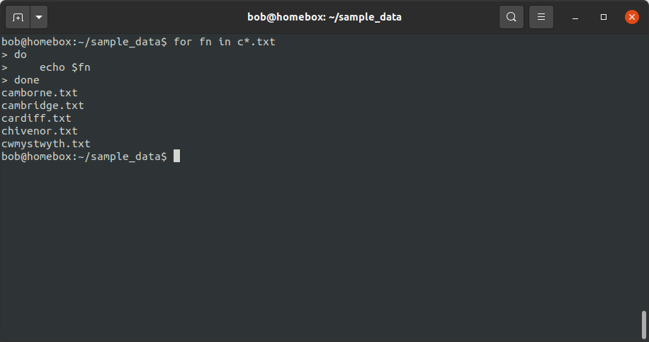
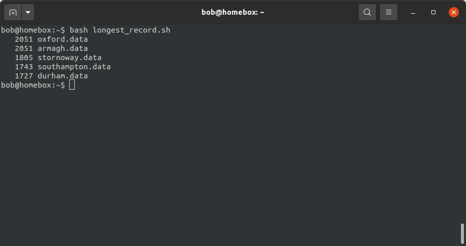

shell scripts
==============

In this exercise, we will continue working on our task of figuring out which weather station(s) have the most
observations, using data downloaded from the `UK Met
Office <https://www.metoffice.gov.uk/research/climate/maps-and-data/historic-station-data>`__.

In the previous lesson, we saw how we can use various shell commands to:

- extract **.tar** files
- see the number of lines, "words", and characters in a text file
- use pipes (``|``) to combine commands
- use grep and regular expressions for pattern matching
- redirect command outputs to a file

So, we have most of the pieces in place in place to be able to write a program (a **script**) that will do all of these
tasks for us, without having to run each command individually. Specifically, we want our program to:

- extract the data from a **.tar.gz** file
- split each file into separate header (**.head**) and data (**.data**) files
- remove the original files (but leave the **.head** and **.data** files)
- count the number of observations in each **.data** file
- print the top 5 stations, excluding the total

variables
----------

First, we'll learn about **variables** - a name that stores some value. The value can be a string (characters), an
integer, a floating point (decimal) number, a filename, a shell command, or some other thing that the computer can use.

To see an example of an **environment variable** (something used by the system), enter the following at the command
prompt:

.. code-block:: sh

    echo $HOME

This will print the value of the environment variable ``HOME`` to the terminal. You should hopefully see that this
prints ``/home/$USER``, where ``USER`` is the environment variable corresponding to your username.

We can also create and use our own variables, both in the shell and within scripts. To do this, we use ``=`` (the
"assignment operator"):

.. code-block:: text

    name=value

.. note::

    There are **no** spaces between ``name``, ``=``, and ``value``.

bash variable names have the following rules:

- the name **must** start with an alphabetical character (``a-z``, ``A-Z``) or an underscore (``_``).
- the name may only contain alphanumeric characters (``a-z``, ``A-Z``, ``0-9``) or an underscore (``_``) - all other
  punctuation has some kind of special meaning.

.. note::

    As you can see above, when we are creating ("assigning") a variable, we don't use the ``$`` character - we only use
    this when it comes time to do something with the variable.

    This is because ``$`` is not part of the variable name, it is used by the shell to indicate that the value of the
    variable should be inserted in place of the name.

string manipulation
--------------------

Another piece that we need is to be able to manipulate text variables. In the previous exercise, when we split
**armagh.txt** into **armagh.data** and **armagh.head**, we had to explicitly type out the filenames.

Here, because we're going to be working with a number of variable values corresponding to different filenames, we want
to avoid having to do this.

To start, let's assign a new variable, ``fn``, and give it the value ``armagh.txt``:

.. code-block:: sh

    fn=armagh.txt

You can check that this has worked by viewing the value of ``fn`` using ``echo``:

.. code-block:: sh

    echo $fn

To manipulate the value of this string (text) in the shell, we use curly brackets (``{`` and ``}``).

To start, we can use ``#`` inside of the curly brackets to get the length of the string stored in ``fn``:

.. code-block:: sh

    echo ${#fn}

This should print ``10`` to the screen (assuming that the value of ``fn`` is still ``armagh.txt``, that is).

Now, if, if we want to extract characters from ``fn``, we can specify the position to start from, along with the length
of the substring we want to extract, using the following syntax:

.. code-block:: sh

    ${name:start:length}

So, to print the first three letters of ``fn`` ("arm"):

.. code-block:: sh

    echo ${fn:0:3}

If we omit ``length``, we print the entire string beginning at ``start`` - for example, to print (**agh.txt**), we could
use the following:

.. code-block:: sh

    echo ${fn:3}

Now, we could use character extraction to get the name of the station (``armagh``), but there's a small problem: the
stations will all have different names, with different lengths.

Rather than something more complicated (for example, taking the length of the filename and subtracting 4 to remove
**.txt**), we can instead use pattern matching to remove a matched substring with the ``%`` operator:

.. code-block:: sh

    echo ${fn%.*}

This should print ``armagh`` to the screen. The way this works is that the shell matches the pattern after ``%``,
starting from the end of the string. It then removes the shortest substring that matches the pattern. So, ``%.*``
means that bash finds the shortest substring that matches the pattern ``.*`` (in this case, ``.txt``, and removes it
from the string.

.. note::

    If we want to remove the longest substring, we use ``%%`` instead.

If we want to be sure to *only* match the extension ``.txt``, we can use that pattern instead:

.. code-block:: sh

    name=${fn%.txt}

If, instead of starting from the end of the string, we want to start from the beginning, we use ``#``:

.. code-block:: sh

    echo ${fn#*.}

Here, bash will match the shortest substring of all of the characters before a ``.``, and remove them from the string.
In this case, that leaves us with ``txt``.

.. note::

    If we want to match the longest substring, we use ``##`` instead.

In this way, we can use ``%`` (or ``%%``) to remove the extension from a filename, or use ``#`` (or ``##``) to extract
the extension.

for loops
-----------

In the previous exercise, we saw how we can use ``grep`` and ``>`` to split a single file into a header (**.head**) and
data (**.data**) file. We have now seen how we can use string manipulation to remove the extension from a filename,
which means we can use shell variables to automatically create a new file with a different extension.

But, we have more than one (37, in fact) file - we really don't want to have to type a command for each of our 37 files!

Fortunately, we can use a ``for`` **loop** to repeat a command (or set of commands). In the bash shell, a ``for`` loop
has the following basic structure:

.. code-block:: sh

    for thing in things
    do
        # add your commands here
    done

.. note::

    You can see that the text after the ``#`` in the code block above is highlighted differently - this is because
    ``#`` is used to indicate a **comment** - text that the shell ignores, but that can be read by humans.

    Using comments in your scripts is a great way to help other people (especially future you!) understand what the
    code is actually doing (or is meant to be doing).

    When typing commands at the prompt, we don't typically need to include comments; when we write shell scripts,
    however, it's **always** a good idea to include comments to help make your code more understandable. Future you
    (and, potentially, other users) will thank present you for including them.

The beginning of the loop is indicated using ``for``, and the list of commands for the shell to execute is bookended
by ``do`` (at the beginning) and ``done`` (at the end).

The shell will then repeat these commands for each item (``thing`` in the pseudo-code above) in an array (``things``).

On each pass through the loop, the **variable** ``thing`` takes on the value of the next item in the list. To help
illustrate this, we'll loop through all of the filenames that begin with a ``c``, and use ``echo`` to print the
filename to the screen:

.. note::

    As you type in the code below, notice how the shell prompt changes from ``$`` to ``>``, then back. This is done to
    remind us that we haven't finished typing the full command, since the loop isn't finished until we have typed
    ``done``.

    We could also type this on a single line, using a semicolon ``;`` to separate the commands.

.. code-block:: sh

    for fn in c*.txt
    do
        echo $fn
    done

|br| On the first pass through the loop, the **variable** ``fn`` has the **value** ``camborne.txt``, as this is the
first value in the list when the **wildcard expression** ``c*.txt`` is expanded. On the second pass, ``fn`` has the
value ``cambridge.txt``, and so on.

putting it all together
------------------------

Now, finally, we are able to write a (series of) commands that will split each **.txt** file:

.. code-block:: sh

    for fn in *.txt
    do
        name=${fn%.txt}
        grep -E "^\s{3}[[:digit:]]{4}" $fn > $name.data
        grep -vE "^\s{3}[[:digit:]]{4}" $fn > $name.head
    done

When this loop has finished running, you should now have 37 **.head** files and 37 **.data** files.

We're very nearly finished - all we need to do now is manipulate the output of ``wc`` as we did before to get the top
5 stations, but this time using the **.data** files instead of the **.txt** files.

.. note::

    Have a look at the output of ``wc *.head`` - do you notice any differences between the files? Are there any files
    that stand out? Why did this happen, and can you think of a way to fix it?

Now we have a rough idea of how to do each of the steps we need to include in our script:

- extracting the files from the **.tar.gz** file
- use a ``for`` loop to split each file into **.head** and **.data**
- use a combination of ``wc``, ``sort``, and ``head`` to list the top 5 stations in descending order
- remove the original data files

To actually write the script, we need to open a **text editor** and type out the commands, in order:

.. code-block:: sh

    tar xzf sample_data.tar.gz

    cd sample_data/

    for fn in *.txt
    do
        name=${fn%.txt}
        grep -E "^\s{3}[[:digit:]]{4}" $fn > $name.data
        grep -vE "^\s{3}[[:digit:]]{4}" $fn > $name.head
    done

    wc -l *.data | sort -rn | grep -v "total" | head -n 5

    rm *.txt

Go ahead and do this now, then **Save** the script to the same directory as your **.tar.gz** file with the name
**longest_record.sh**. Remember to include comments that help you understand what the script is meant to be doing at
different steps!

running the script
-------------------

Now that we have a script (**longest_record.sh**), we can run the script using ``bash``:

.. code-block:: sh

    bash longest_record.sh

You should see that the top 5 stations in terms of length are printed to the terminal:

command-line arguments
-----------------------

To make our script more usable, though, we don't necessarily want to specify the name of the **.tar.gz** file to
extract - we want to be able to run this script on *any* **.tar.gz** file that contains similar data files, without
having to edit the script each time we want to run it on a different file.

For this, we can make use of **command line arguments** - these are variables that are defined on the command line when
we "call" the script that the shell then passes to the script when it runs.

For example, we could replace this line:

.. code-block:: sh

    tar xvf sample_data.tar.gz

with this:

.. code-block:: sh

    tar xvf "$1"

.. note::

    We are enclosing ``$1`` with double quotes to help protect against users who do not follow the
    :ref:`most important rule <no spaces>` for file and directory names.

Inside of the script, ``1`` is a special variable that takes the value of the first argument on the command line. So,
if we wanted to run our script on a different file, we could now run the script like this:

.. code-block:: sh

    bash longest_record.sh new_file.tar.gz

Perhaps we would also like to be able to specify how many records to show - in this case, we could replace this line:

.. code-block:: sh

    wc -l *.data | sort -rn | grep -v "total" | head -n 5

with this:

.. code-block:: sh

    wc -l *.data | sort -rn | grep -v "total" | head -n $2

Then, we would run our script from the command line like this:

.. code-block:: sh

    bash longest_record.sh sample_data.tar.gz 10

And we should see the top 10 records returned.

Finally, at the top of the script, it's probably a good idea to include a few comments about how to use the script, and
what it is used for:

.. code-block:: sh

    # script: longest_record.sh
    # author: bob
    # purpose: unpack a .tar.gz file, split .txt files into header and data files,
    #   then print the top <num> longest records
    # usage: longest_record.sh <tarfile> <num records>

.. note::

    There are other, much fancier ways to add flexibility to shell scripts, and even print usage/help information to
    the terminal. For now, though, this is probably enough for our purposes.

    If you are interested in learning more, a great place to start is Part 4 of *The Linux Command Line* by W. Shotts,
    a free book that you can find (legitimately!)
    `here <https://netix.dl.sourceforge.net/project/linuxcommand/TLCL/19.01/TLCL-19.01.pdf>`__.

    You can also have a look at William's `website <https://linuxcommand.org/lc3_writing_shell_scripts.php>`__, which
    has a great tutorial for shell scripting, along with more information about the Linux command line.

optional: making an executable
--------------------------------

At this point, we're done: we have written a shell script that does the tasks that we wanted it to do, and we have made
that script more flexible by using command-line arguments. We have also checked that the script runs by executing it
using the bash shell.

We could, however, go slightly further and turn our script into an executable file. This way, we could call our script
by simply typing the path to the filename at the terminal, omitting ``bash``:

.. code-block:: sh

    /home/bob/scripts/longest_record.sh sample_data.tar.gz 10

To do this, we need to do two things. The first thing is that we need to add a
`shebang <https://en.wikipedia.org/wiki/Shebang_%28Unix%29>`__ to the top of the script, which will tell the shell how
to interpret the script\ [1]_:

.. code-block:: sh

    #!/usr/bin/bash

This way, when we call the script from the shell, it is interpreted using ``bash``, instead of another interpreter.

Finally, we need to use ``chmod`` to change the permissions of our script in order to make it executable:

.. code-block:: sh

    chmod +x longest_record.sh

.. warning::

    Remember that this will make the script executable at all levels: user, group, and "other". If you want to restrict
    your script so that only the user and group may run it, you should modify the ``chmod`` command accordingly:

    .. code-block:: sh

        chmod u+x,g+x longest_record.sh

Now, we can run the script by typing the path to the file:

.. code-block:: sh

    /your/path/here/longest_record.sh sample_data.tar.gz 10

the PATH variable
------------------

As we have seen, we can "execute" (*run*) any script/program on our computer by typing the path to the corresponding
file, (so long as we have the proper permission to do so).

For example, let's say we have a script, ``analysis.sh``, in the following folder:

.. code-block:: text

    /home/bob/scripts/analysis.sh

We can run this script anywhere on our computer by typing this filename at the command prompt.

When we type a command at the command prompt, the shell is executing a program that is stored somewhere on the
filesystem. For example, type the following to see where the ``ls`` program is located on your computer:

.. code-block:: sh

    which ls

you should see something like:

.. code-block:: text

    /usr/bin/ls

When we type a command name, the shell searches through a list of directories (the **filepath**, stored in the
``PATH`` environment variable), looking for an executable file named ``ls``. When it finds that file, it
executes it.

To see what directories are included in your ``PATH`` variable, you can type the following:

.. code-block:: sh

    echo $PATH

You should see a colon-delimited list of directories - these are the directories that the shell will search through
when you type a command name.

We can also change our ``PATH`` variable to include other directories, which would enable us to run this script by
typing ``analysis.sh`` directly, without including the full path.

To do this, we can add ``/home/bob/scripts/`` to our ``PATH`` variable, either by *appending* it to ``PATH`` by
using a colon ``:`` to indicate the start of a different file system location:

.. code-block:: sh

    PATH=$PATH:/home/bob/scripts/

or by *prepending* it to the beginning of the ``PATH`` variable:

.. code-block:: sh

    PATH=/home/bob/scripts/:$PATH

.. note::

    The shell searches through the directories in ``PATH`` in order, meaning that directories at the beginning
    are searched first. If there are two (or more) versions of a program in the path, the one in the earliest
    directory searched will be the one that the shell runs.

If you want to add directories to your ``PATH`` variable, you **MUST** prepend (or append) them. To "permanently"
add a directory to your path, you can include the following line in your ``.bashrc`` file, which should be located
in your home directory:

.. code-block:: sh

    export PATH=/home/bob/scripts/:$PATH

The ``export`` command will make this updated value of ``PATH`` available to other programs. The commands in
the ``.bashrc`` file are executed whenever you start a new shell session, which means that this new value of ``PATH``
will be used every time you begin a new shell session (for example, when you log into the HPC server).

.. warning::

    With all of that in mind, **NEVER EVER** try to set the ``PATH`` variable directly, like this:

    .. code-block:: sh

        export PATH=/home/bob/scripts # this is really bad, don't do it!

    **THIS WILL BREAK YOUR SHELL SESSION**, because it will overwrite the ``PATH`` variable with a single directory,
    which most likely contains exactly **none** of the programs needed to actually use the shell!

notes
------

.. [1] There are actually `a number of different places <https://stackoverflow.com/questions/10376206/what-is-the-preferred-bash-shebang>`__
       where different operating systems install ``bash``, and there are different arguments for/against the "correct"
       shebang to use here. Because you are likely going to be writing scripts for your own use, rather than
       developing and distributing software to many users, the best option is likely to use the output of ``which bash``
       from your terminal - in my case, this is ``/usr/bin/bash``.
