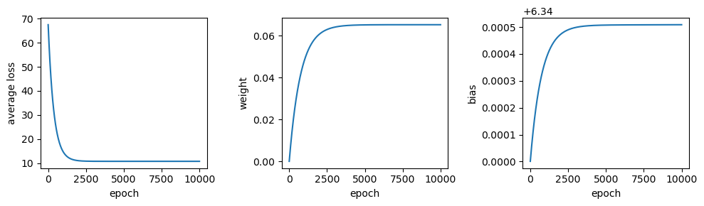

what is machine learning?
==========================

.. note::

    This is a **non-interactive** version of the exercise. If you want to run through the steps yourself and see the
    outputs, you'll need to do one of the following:

    - follow the setup steps and work through the notebook on your own computer
    - open the workshop materials on `binder <https://mybinder.org/v2/gh/iamdonovan/ml-crash-course/HEAD>`__ and work
      through them online

In this exercise, we’ll get a look into some of the basics of machine
learning, including:

-  training a model
-  loss and loss functions
-  learning rates and epochs
-  scaling data

To illustrate these, we’ll use a simple model that we’ve seen plenty of
times before: a linear model with a single variable (feature). Using
machine learning for this sort of problem is largely overkill, but it is
useful to help illustrate some of the points with a familiar example.

data
----

The data used in this exercise are the historic meteorological
observations from the `Armagh
Observatory <https://www.metoffice.gov.uk/weather/learn-about/how-forecasts-are-made/observations/recording-observations-for-over-100-years>`__,
downloaded from the `UK Met
Office <https://www.metoffice.gov.uk/research/climate/maps-and-data/historic-station-data>`__.

To make the data slightly easier to work with, I have done the
following: - Removed the header on lines 1-5 - Replaced multiple spaces
with a single space, and replaced single spaces with a comma (``,``) -
Removed ``---`` to indicate no data, leaving these fields blank -
Removed ``*`` indicating provisional/estimated values - Removed the 2023
data - Renamed the file ``armaghdata.csv``.

If you wish to use your own data (and there are loads of stations
available!), please feel free. ## importing libraries

Before getting started, we will import the libraries (packages) that we
will use in the exercise:

-  `sklearn <https://scikit-learn.org/>`__, for fitting a linear model
   to our data;
-  `pandas <https://pandas.pydata.org/>`__, for reading the data from a
   file;
-  `numpy <https://numpy.org/>`__, for working with arrays;
-  `matplotlib <https://matplotlib.org/>`__, for making plots.

Remember that to do this, we use the ``import`` statement, followed by
the name of the package. We can also use ``from`` to import part of a
package, and we can *alias* the package name using ``as``:

.. code:: ipython3

    %matplotlib inline
    from sklearn import linear_model
    import pandas as pd
    import numpy as np
    import matplotlib.pyplot as plt

Next, let’s read in the first dataset that we will use for the exercise,
using ``pd.read_csv()``:

.. code:: ipython3

    data = pd.read_csv('data/armaghdata.csv') # read the data

For this exercise, we’re going to look at the relationship between
monthly hours of sun and the monthly maximum temperature. Before we
begin with linear regression, we can use the\ ``.plot.scatter()`` method
`documentation <https://pandas.pydata.org/pandas-docs/stable/reference/api/pandas.DataFrame.plot.scatter.html>`__
with our **DataFrame** to show a scatter plot of these two variables:

.. code:: ipython3

    data.plot.scatter('sun', 'tmax')

.. image:: regression_files/regression_5_1.png

From this plot, we can see that there is an *approximately* linear
relationship between these two variables - at least, enough so that we
can use it to help us ease into some of the core concepts of machine
learning.

linear regression
-----------------

Remember that a linear model with a single variable has the form:

.. math::  y = \beta + \alpha x

where :math:`\beta` is the *intercept* of the line and :math:`\alpha` is
the *slope* of the line.

The terminology often used in machine learning is a little bit
different. The equation for a linear model is often written as:

.. math::  \hat{y} = b + wx

where :math:`\hat{y}` is the **predicted** value/label, :math:`b` is the
**bias**, and :math:`w` is the **weight** of the **feature** :math:`x`.
Extending this to multiple features (variables), the form looks like:

.. math::  \hat{y} = b + w_1 x_1 + w_2 x_2 + \cdots + w_n x_n = b + \sum_i w_i x_i

Where each feature :math:`x_i` has a corresponding weight :math:`w_i`.

For this first example, we will look at a model with a single feature
(variable): the relationship between ``sun`` and ``tmax``. To use
``scikit-learn`` for linear regression, we first create a
**LinearRegression** object
(`documentation <https://scikit-learn.org/stable/modules/generated/sklearn.linear_model.LinearRegression.html>`__):

.. code:: ipython3

    # instantiate a LinearRegression object
    model = linear_model.LinearRegression()

Next, we can prepare our data. For fitting data with ``scikit-learn``,
we need to make sure that we have dropped all ``NaN`` values from the
data we want to fit. We also need to reshape each array so that they
have shape :math:`N\times 1` (or, for multiple linear regression,
:math:`N\times m`, where :math:`m` is the number of explanatory
variables we are using for the fit).

To do this, we first use ``.dropna()``
(`documentation <https://pandas.pydata.org/pandas-docs/stable/reference/api/pandas.DataFrame.dropna.html>`__)
along with the ``subset`` argument to remove all ``NaN`` values from the
``sun`` and ``tmax`` columns.

Then, we use the ``.to_numpy()`` method
(`documentation <https://pandas.pydata.org/pandas-docs/stable/reference/api/pandas.Series.to_numpy.html>`__)
to get the values of each **Series** as an array, before using the
``.reshape()`` method
(`documentation <https://numpy.org/doc/stable/reference/generated/numpy.ndarray.reshape.html>`__)
on the resulting ``numpy`` **ndarray** to reshape the array so that it
is the correct shape:

.. code:: ipython3

    # drop all rows where either sun or tmax is NaN
    data = data.dropna(subset=['sun', 'tmax'], how='any')

    sun = data['sun'].to_numpy().reshape(-1, 1) # reshape so data are N x 1
    tmax = data['tmax'].to_numpy().reshape(-1, 1) # reshape so data are N x 1

Now that we have the data prepared, we can use the ``.fit()`` method
(`documentation <https://scikit-learn.org/stable/modules/generated/sklearn.linear_model.LinearRegression.html#sklearn.linear_model.LinearRegression.fit>`__)
of the **LinearRegression** object to calculate the parameters of the
linear model:

.. code:: ipython3

    model.fit(sun, tmax) # fit the linear model to our data

The value of the weight(s) (slope) is stored in the ``.coef_`` attribute
of the **LinearRegression** object, and the value of the bias
(intercept) is stored in the ``.intercept_`` attribute:

.. code:: ipython3

    model.coef_, model.intercept_ # show the coefficient(s) and intercept for the linear model

From the above, we can see the weight for the ``sun`` feature is
0.06515, and the value of the bias is 6.34858. To calculate the
predicted value of the model for new features, we can use the
``.predict()`` method
(`documentation <https://scikit-learn.org/stable/modules/generated/sklearn.linear_model.LinearRegression.html#sklearn.linear_model.LinearRegression.predict>`__).
And, using ``matplotlib``, we can show the fitted model alongside the
data:

.. code:: ipython3

    xx = np.linspace(0, 300, 5) # create an array of 5 values from 0 to 300, spaced evenly

    fig, ax = plt.subplots(1, 1) # create a figure with a single axis

    ax.plot(sun, tmax, 'k.', label='data') # plot tmax vs sun as black dots with a label 'data'
    ax.plot(xx, model.predict(xx.reshape(-1, 1)), 'r--', label='linear fit') # plot the regression line as a red dashed line with label 'linear fit'

    ax.legend() # show the legend

    ax.set_xlabel('hours of sun') # set the xlabel of the axis
    ax.set_ylabel('monthly maximum temperature (°C)') # set the ylabel of the axis

training and loss
-----------------

In machine learning, the difference between the predicted value/label
and the measured value/label is called **loss**. The goal with machine
learning is to find values for the model **parameters** (e.g., weights
and biases) that minimizes the total or average loss for all examples -
that is, we want the vertical distance between each of our observations
and the regression line to be as small as possible, on average.

We can calculate the loss for our model by first using the
``.predict()`` method
(`documentation <https://scikit-learn.org/stable/modules/generated/sklearn.linear_model.LinearRegression.html#sklearn.linear_model.LinearRegression.predict>`__)
to get the predicted value for each feature value:

.. code:: ipython3

    # use the fitted parameters to get the predicted values at the input x data
    predicted = model.predict(sun)

Now, we can plot the value of loss for each input feature value, as a
function of the predicted value:

.. code:: ipython3

    # calculate loss as difference between observed, predicted values
    loss = tmax - predicted

    fig, ax = plt.subplots(1, 1) # create a new figure and axis

    ax.axhline(y=0, xmin=loss.min(), xmax=loss.max(), color='k', linestyle='--') # plot a horizontal line at loss = 0
    ax.plot(predicted, loss, 'o') # plot the loss as a function of the predicted value

    ax.set_xlabel('predicted value')
    ax.set_ylabel('loss')

From the figure above, we can see that that the loss for our linear
model ranges between -8 and 8, with most of the values falling between
about -4 and 4.

In practice, finding the model parameters that minimize the total or
average loss for all examples means finding the minimum values of a
**cost** or **objective function** (or **loss function**) - that is, a
function that allows us to calculate the total or average loss for all
of our input data.

One commonly used loss function is known as **squared error loss** (or
**L\ :math:`_2` loss**), which calculates the squared difference between
the label and the predicted value:

.. math:: (y_i - \hat{y}_i)^2

The average loss for all of the input data, or the **mean squared
error** (**MSE**), is calculated as:

.. math::  MSE = \frac{1}{N} \sum_i (y_i - \hat{y}_i)^2

We can calculate and print the value of this loss using the code in the
cell below:

.. code:: ipython3

    average_loss = (loss**2).mean() # calculate the mean of the squared loss
    print(f'MSE: {average_loss:.4f}') # print the value of the average loss

gradient descent and learning
-----------------------------

The way that we go about finding the minimum value of a function is by
taking the gradient of the function and setting it to zero. The reason
that we use the squared loss, rather than something like the absolute
value, is because the derivatives of the squared loss are easy to
calculate and behave nicely (as opposed to absolute values or cubic or
quartic functions). Depending on the function, we might even be able to
find a *closed form* solution to the problem - that is, a way to
calculate the optimum parameter values directly. In fact, this is what
has been implemented in ``LinearRegression.fit()``: the solution
returned by ``.fit()`` is found using an approach called Ordinary Least
Squares regression - it’s not actually a machine learning approach at
all.

When we don’t have a nice *closed form* solution to the minimization
problem, which is very often the case, we use some kind of numerical
optimization method in order to find a solution. One of the more common
approaches that you might come across is something called **gradient
descent**.

Assuming that our cost function is differentiable, we can travel in the
opposite direction of the gradient at a given point (i.e., the slope of
a line or a surface) in order to find a minimum value of the function.

To do this, we first need to take the partial derivatives of the cost
function :math:`l` with respect to our model parameters:

.. math::  \frac{\partial l}{\partial w} = \frac{1}{N} \sum_i -2x_i (y_i - (wx_i + b))

.. math::  \frac{\partial l}{\partial b} = \frac{1}{N} \sum_i -2(y_i - (wx_i + b))

We then iterate over a number of **epochs** (steps) in order to find a
solution, by calculating the value of the partial derivatives at each
point and subtracting a multiple of this value from the current estimate
of each parameter:

.. math::  w_{i + 1} = w_i - \alpha \frac{\partial l}{\partial w}(w_i, b_i)

.. math::  b_{i + 1} = b_i - \alpha \frac{\partial l}{\partial b}(w_i, b_i)

where the **learning rate** :math:`\alpha` controls the amount by which
we update the parameter values at each step. By subtracting the value of
the partial derivative, we ensure that we are always moving toward a 0
value of the partial derivative.

Over the next several blocks of code, we’ll see how we can implement
this before investigating how changing **hyperparameters** like the
learning rate or the number of epochs affects the solution we are able
to find.

First, we’ll define a function, ``update_parameters()``, that calculates
the new value of :math:`w` and :math:`b` based on the learning rate and
partial derivatives of the loss function:

.. code:: ipython3

    def update_parameters(xdata, ydata, weight, bias, learning_rate):
        dl_dw = (-2 * xdata * (ydata - (weight * xdata + bias))).mean() # calculate the partial derivative of l wrt w
        dl_db = (-2 * (ydata - (weight * xdata + bias))).mean() # calculate the partial derivative of l wrt b

        weight -= dl_dw * learning_rate # subtract dl/dw * learning_rate from w
        bias -= dl_db * learning_rate # subtract dl/db * learning_rate from b

        return weight, bias # return the updated values of w and b

We can also define a function, ``predict()``, to help us calculate
:math:`\hat{y}` for a given value of :math:`w` and :math:`b`:

.. code:: ipython3

    def predict(xdata, weight, bias):
        return weight * xdata + bias

along with the loss function, which calculates the mean squared error
for the given values of :math:`w` and :math:`b`:

.. code:: ipython3

    def avg_loss(xdata, ydata, weight, bias):
        loss = (ydata - predict(xdata, weight, bias))**2
        return loss.mean() # return the mean of the loss

We also want to see how the average loss, weight, and bias values
change, so we can define a function to plot these in a three-panel
figure:

.. code:: ipython3

    def plot_training_results(df):
        fig, axs = plt.subplots(1, 3, figsize=(10, 3)) # create a three panel figure

        axs[0].plot(df['epoch'], df['avg_loss']) # plot avg loss vs epoch in the first panel
        axs[0].set_ylabel('average loss')

        axs[1].plot(df['epoch'], df['weight']) # plot weight vs epoch in the second panel
        axs[1].set_ylabel('weight')

        axs[2].plot(df['epoch'], df['bias']) # plot bias vs epoch in the third panel
        axs[2].set_ylabel('bias')

        for ax in axs:
            ax.set_xlabel('epoch')

        fig.tight_layout() # ensure that the panels and labels don't overlap

        return ax

And finally, we can write a function, ``train()``, to get to the “best”
values of :math:`w` and :math:`b`.

In this example, I am saving the values to a **DataFrame** every 10
epochs to help cut down on the number of values. At the end, I also
create a plot showing the loss value as a function of the epoch:

.. code:: ipython3

    def train(xdata, ydata, weight, bias, learning_rate, epochs, plot=True):
        df = pd.DataFrame()

        for ee in range(epochs):
            weight, bias = update_parameters(xdata, ydata, weight, bias, learning_rate)

            if ee % 10 == 0:
                df.loc[ee, 'weight'] = weight
                df.loc[ee, 'bias'] = bias
                df.loc[ee, 'avg_loss'] = avg_loss(xdata, ydata, weight, bias)

        df.loc[ee, 'weight'] = weight
        df.loc[ee, 'bias'] = bias
        df.loc[ee, 'avg_loss'] = avg_loss(xdata, ydata, weight, bias)

        df.reset_index(names=['epoch'], inplace=True)
        # plot the value of the average loss for each epoch
        if plot:
            plot_training_results(df)

        return df

Now that we have defined the functions that we need in order to train
the model, let’s try this out. Running the cell below will train the
model for 10,000 epochs, with a very small learning rate
(:math:`5 \times 10^{-8}`). At the end, we use ``.tail()``
(`documentation <https://pandas.pydata.org/pandas-docs/stable/reference/api/pandas.DataFrame.tail.html>`__)
to view the parameter values and the average loss for the model at the
final step:

.. code:: ipython3

    # train the model
    output = train(sun, tmax, weight=0, bias=6.34, learning_rate=5e-8, epochs=10000)

    output.tail(n=1)

We can see that after 10,000 epochs, the parameter values have gotten
close to the optimal values found using ``LinearRegression.fit()``,
though we’re not quite there. We can also see that the average loss is
low, but not quite to the level we calculated for those optimum values.
We can also see that there’s a big difference in the range covered by
the calculated values of :math:`w` and :math:`b` - :math:`w` ranges from
0 to 0.065, while :math:`b` only ranges from 6.34 to 6.340509 - a
difference of only 0.000509.

Try changing the learning rate to a larger value - say, :math:`10^{-7}`
- how does this impact the shape of the loss curve? What about the value
for the weight and bias?

With the cell below, we can also see how the regression line changes -
there are large changes in slope for the first 1000 or so epochs, before
the line more or less “settles in” to the values we would expect from
ordinary least squares regression:

.. code:: ipython3

    fig, ax = plt.subplots(1, 1)

    ax.plot(sun, tmax, '.')

    xx = np.arange(0, 351, 50)

    for ind in [0, 10, 50, 100, 1000]:
        ax.plot(xx, predict(xx, weight=output.loc[ind, 'weight'], bias=output.loc[ind, 'bias']), label='epoch {}'.format(output.loc[ind, 'epoch']))

    ax.legend()

.. image:: regression_files/regression_35_1.png

Now let’s try a slightly larger size - :math:`7.46 \times 10^{-5}`.
Here, we see something very interesting with the values of :math:`w` and
:math:`b` over time:

.. code:: ipython3

    # train the model with a slightly higher learning rate
    output = train(sun, tmax, weight=0, bias=6.34, learning_rate=7.46e-5, epochs=10000)

    output.tail(n=1)

Rather than starting out low and gradually increasing, the weight starts
out much higher before approaching the “true value”, but from above this
time. Similarly, we see that the bias dips down from 6.3410 before
increasing to over 6.3424 - a much larger range than what we saw with
the smaller time step. Now, try increasing the learning rate from
:math:`7.46 \times 10^{-5}` to :math:`7.5 \times 10^{-5}` - what
happens?

Now let’s see what happens when we change the starting point - that is,
the initial guess for :math:`w` and :math:`b`:

.. code:: ipython3

    # train the model
    output = train(sun, tmax, weight=0, bias=0, learning_rate=1e-7, epochs=10000)

    output.tail(n=1)

.. image:: regression_files/regression_39_1.png

From this, we can see that the values of both :math:`w` and :math:`b`
are pretty far away from the optimal values - the value for :math:`b`
has barely changed from the initial guess, and the value for :math:`w`
has converged toward a less than optimal value. Not only that, but the
average loss is much higher than we calculated for the optimal values of
:math:`w` and :math:`b`.

.. code:: ipython3

    fig, ax = plt.subplots(1, 1)

    ax.plot(sun, tmax, '.')

    xx = np.arange(0, 351, 50)

    for ind in [0, 10, 50, 100, 1000]:
        ax.plot(xx, predict(xx, weight=output.loc[ind, 'weight'], bias=output.loc[ind, 'bias']), label='epoch {}'.format(output.loc[ind, 'epoch']))

    ax.legend()

visualizing the loss surface
----------------------------

To understand what’s happened here, we’ll look at something called the
**loss surface** - that is, a way to visualize the shape of the loss
function based on different parameter values. To begin, we’ll create a
function to calculate the loss for a range of different parameter
values, then make a contour plot of the loss surface using
``.contour()``
(`documentation <https://matplotlib.org/stable/api/_as_gen/matplotlib.axes.Axes.contour.html>`__).
We’ll also make a plot that shows cross-sections of the loss surface:

.. code:: ipython3

    def plot_loss_surface(weights, biases, xdata, ydata):
        fig, ax = plt.subplots(1, 1)

        loss_surf = []

        for b in biases:
            for w in weights:
                loss_surf.append(avg_loss(xdata, ydata, w, b)) #

        loss_surf = np.array(loss_surf).reshape(len(weights), len(biases)) # reshape so that the array is rectangular
        W, B = np.meshgrid(weights, biases) # get a grid of weight and bias values

        ax.contour(W, B, loss_surf) # plot contours of the loss surface

        return fig, ax

    def plot_cross_sections(weights, biases, xdata, ydata):
        fig, axs = plt.subplots(1, 2, figsize=(8, 4))
        ax1, ax2 = axs

        losses_w = np.array([avg_loss(xdata, ydata, w, 0) for w in weights])
        losses_b = np.array([avg_loss(xdata, ydata, 0, b) for b in biases])

        ax1.plot(weights, losses_w, 'k')
        ax1.plot(0, avg_loss(xdata, ydata, 0, 0), 'ro')
        ax1.set_ylabel('average loss, $l$')
        ax1.set_xlabel('$w$')

        ax2.plot(biases, losses_b, 'k')
        ax2.plot(0, avg_loss(xdata, ydata, 0, 0), 'ro')
        ax2.set_xlabel('$b$')

        return fig, axs

Now, let’s look at the loss surface for values of :math:`w` that range
between -0.2 and 0.2, and values of :math:`b` that range between -5 and
25:

.. code:: ipython3

    fig, ax = plot_loss_surface(np.linspace(-0.2, 0.2, 100), # 100 values between -0.2 and 0.2
                                np.linspace(-5, 25, 100), # 100 values between -5 and 25
                                sun, tmax)

    ax.plot(model.coef_, model.intercept_, 'rx', label='minimum value')
    # ax.plot(output.weight.values[::10], output.bias.values[::10], 'b.', label='calculated values')
    ax.plot(0, 0, 'ro', label='starting point')

    ax.set_xlabel('$w$')
    ax.set_ylabel('$b$')

    ax.legend()

We can see that the surface is fairly lopsided - the range of :math:`w`
values is much, much smaller than the range of :math:`b` values. Now,
let’s look at a cross section of the surface through our starting point,
holding both :math:`w` and :math:`b` constant:

.. code:: ipython3

    fig, axs = plot_cross_sections(np.linspace(-0.2, 0.2, 100), np.linspace(-5, 25, 100), sun, tmax)

.. image:: regression_files/regression_47_0.png

Part of the problem here is that there are big differences in the value
of the partial derivatives of :math:`l` with respect to :math:`w` and
:math:`b` are very different. The value of :math:`\partial l/\partial w`
at :math:`w=0` is -3068.82, while the value of
:math:`\partial l/\partial b` at :math:`b=0` is -26.28 - this means that
when we multiply by the learning rate, we have a much larger change for
:math:`w` compared to :math:`b`, and it means that a good learning rate
for one of the parameters is not a good learning rate for the other one
- this is why we see very little change in the value of :math:`b`
compared to :math:`w`.

As we saw when we increased the learning rate to
:math:`7.5 \times 10^{-5}`, large gradient values also mean that when
the learning rate is too large, we end up “jumping” back and forth
across the minimum, and can even end up failing to reach a minimum value
at all.

scaling
-------

One of the ways that we can help counteract this is by **scaling** our
feature and label values. There are a number of ways to do this, but
they typically involve subtracting the mean value and dividing by either
the standard deviation (sometimes also called **standardization**), or
by the range of the dataset (sometimes also called **normalization**):

.. math::  x_s = \frac{x - \bar{x}}{x_{\rm max} - x_{\rm min}}

First, we’ll *normalize* the values of ``sun`` and ``tmax``:

.. code:: ipython3

    sun_scaled = (sun - sun.mean()) / (sun.max() - sun.min())
    tmax_scaled = (tmax - tmax.mean()) / (tmax.max() - tmax.min())

Now, let’s look at the shape of the loss surface using the scaled
values:

.. code:: ipython3

    model_s = linear_model.LinearRegression()
    model_s.fit(sun_scaled, tmax_scaled) # fit the scaled data

    fig, ax = plot_loss_surface(np.linspace(-1, 1, 100), # 100 values between -0.2 and 0.2
                                np.linspace(-1, 1, 100), # 100 values between -5 and 25
                                sun_scaled, tmax_scaled)

    ax.plot(model_s.coef_, model_s.intercept_, 'rx', label='minimum value') # plot the parameters calculated by scaling the data
    ax.plot(0, 0, 'ro', label='starting point') # plot the starting point

    ax.set_xlabel('$w_s$')
    ax.set_ylabel('$b_s$')

    ax.legend()

.. image:: regression_files/regression_51_1.png

Notice that the surface is much less lopsided now - the slope of the
surface in the :math:`b_s` direction is greater than the slope of the
surface in the :math:`w_s` direction, but :math:`w_s` and :math:`b_s`
are at least the same order of magnitude.

Looking at the cross-section of values, we can see the same:

.. code:: ipython3

    fig, axs = plot_cross_sections(np.linspace(-1, 1, 100), np.linspace(-1, 1, 100), sun_scaled, tmax_scaled)

.. image:: regression_files/regression_53_0.png

Using the scaled data, the value of :math:`\partial l/\partial w` at
:math:`w=0` is -0.064, while the value of :math:`\partial l/\partial b`
at :math:`b=0` is ~0 (because we have scaled *and* centered the data).

This has two practical effects: first, it means that we can use much
larger learning rates; and second, we should see that the changes are
more even at each epoch, as opposed to seeing big changes in :math:`w`
and almost no change in :math:`b`.

In order to get the values of :math:`w` and :math:`b` in the original
units of the data, we need to convert them. Fortunately, we can do this
by re-arranging the following equation so that it is in the form
:math:`y = wx + b`:

.. math::  \frac{y - \bar{y}}{y_{\rm max} - y_{\rm min}} = w_s \frac{x - \bar{x}}{x_{\rm max} - x_{\rm min}} + b_s

When we do this, we should get the following values for :math:`w` and
:math:`b`:

.. math::  w = \frac{y_{\rm max} - y_{\rm min}}{x_{\rm max} - x_{\rm min}} w_s

.. math::  b = b_s (y_{\rm max} - y_{\rm min}) + \bar{y} - \frac{y_{\rm max} - y_{\rm min}}{x_{\rm max} - x_{\rm min}} w_s \bar{x}

In the function defined in the cell below, we have made a number of
changes. First, we have added the option to scale the data using the
``scale`` argument (by default, ``scale=False``). If we scale the data,
we make sure to record the un-scaled values of :math:`w` and :math:`b`,
using the equations above:

.. code:: ipython3

    def train(xdata, ydata, weight, bias, learning_rate, epochs, plot=True, scale=False):
        df = pd.DataFrame()

        if scale:
            xx = (xdata - xdata.mean()) / (xdata.max() - xdata.min())
            yy = (ydata - ydata.mean()) / (ydata.max() - ydata.min())
        else:
            xx = xdata
            yy = ydata

        for ee in range(epochs):
            weight, bias = update_parameters(xx, yy, weight, bias, learning_rate)

            if ee % 10 == 0:
                if scale: # un-scale the values of weight and bias when we record them to the table
                    df.loc[ee, 'weight'] = weight * (ydata.max() - ydata.min()) / (xdata.max() - xdata.min())
                    df.loc[ee, 'bias'] = bias * (ydata.max() - ydata.min()) + ydata.mean() - (ydata.max() - ydata.min()) / (xdata.max() - xdata.min()) * weight * xdata.mean()
                else:
                    df.loc[ee, 'weight'] = weight
                    df.loc[ee, 'bias'] = bias

                df.loc[ee, 'avg_loss'] = avg_loss(xdata, ydata, df.loc[ee, 'weight'], df.loc[ee, 'bias'])

        if scale: # un-scale the values of weight and bias when we record them to the table
            df.loc[ee, 'weight'] = weight * (ydata.max() - ydata.min()) / (xdata.max() - xdata.min())
            df.loc[ee, 'bias'] = bias * (ydata.max() - ydata.min()) + ydata.mean() - (ydata.max() - ydata.min()) / (xdata.max() - xdata.min()) * weight * xdata.mean()
        else:
            df.loc[ee, 'weight'] = weight
            df.loc[ee, 'bias'] = bias

        df.loc[ee, 'avg_loss'] = avg_loss(xdata, ydata, df.loc[ee, 'weight'], df.loc[ee, 'bias'])
        df.reset_index(names=['epoch'], inplace=True)

        if plot:
            plot_training_results(df)

        return df

Now, let’s see how well this works by using a learning rate of 0.1, and
training the model for only 1000 epochs:

.. code:: ipython3

    output = train(sun, tmax, weight=0, bias=0, learning_rate=0.1, epochs=1000, scale=True)
    output.tail(n=1)

Not bad - after only 1000 epochs, we have values for :math:`w` and
:math:`b` that very nearly match the values calculated using
``LinearRegression.fit()``. Try changing the values of ``learning_rate``
and ``epochs`` to see how close to the “true” value you can come. How
large of a learning rate can you have before you fail to get a “good”
solution?

The cell below will plot the regression lines using the parameters from
a few different intermediate epochs, along with the linear fit
calculated using ``LinearRegression.fit()`` - as before, we should see
that there’s rapid improvement followed by slow improvement, but the end
result is almost indistinguishable from the “true” solution:

.. code:: ipython3

    fig, ax = plt.subplots(1, 1)

    ax.plot(sun, tmax, '.')

    xx = np.arange(0, 351, 50)

    for ind in [0, 10, 100]:
        ax.plot(xx, predict(xx, weight=output.loc[ind, 'weight'], bias=output.loc[ind, 'bias']), label='epoch {}'.format(output.loc[ind, 'epoch']))

    ax.plot(xx, model.predict(xx.reshape(-1, 1)), 'k--', label='ols linear fit')

    ax.legend()

.. image:: regression_files/regression_59_1.png

next steps
----------

That’s all for this exercise. In this exercise, we have seen the basics
of how we can train a model using ``scikit-learn``. We have also used
the example of linear regression to illustrate how training a model
works in the background, by showing how we can tune different
**hyperparameters** to find the optimal model parameters. We have also
seen how important it can be to scale our data when training a model -
it enables us to use larger **learning rate** values and spend less time
training a model; it may also make it possible for the model to converge
to a solution.

In future exercises, we will have a look at some other optimization
techniques - gradient descent is only one technique out of many. There
are also additional machine learning algorithms for which scaling input
data is essential, and we will cover these more as we continue through
the workshop.

For now, try at least one of the following exercises:

-  Train a model for the relationship between ``tmax`` and ``tmin``,
   with and without scaling. How large a learning rate are you able to
   use, and how many epochs does it take to converge to a good solution?
   Does scaling make a large difference to the final result? Why or why
   not?
-  Train a model for the relationship between ``sun`` and ``rain``,
   again with/without scaling. How large a learning rate are you able to
   use, and how many epochs does it take to converge to a good solution?
   Does scaling make a large difference to the final result? Why or why
   not?
