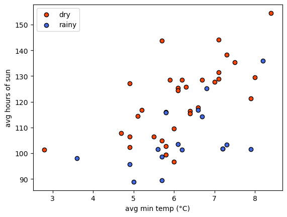
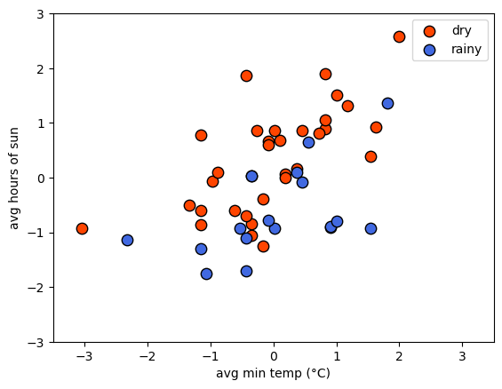
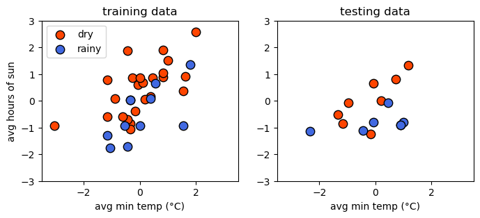
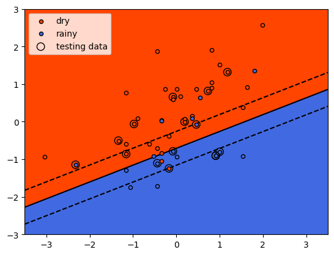
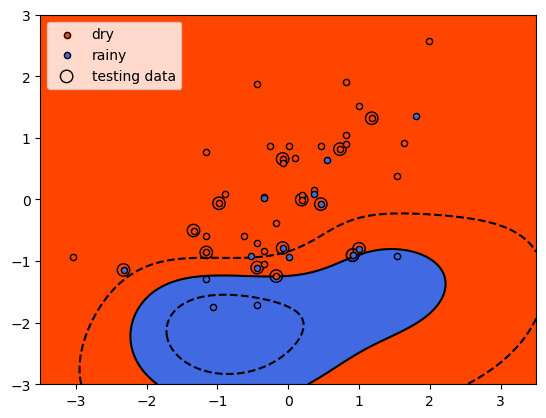
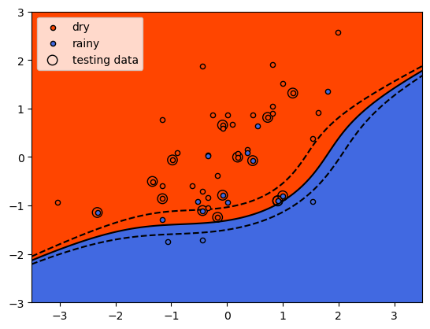
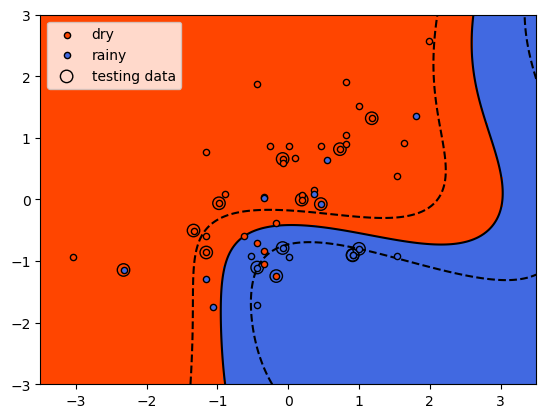

training, testing, and validation
===================================

.. note::

    This is a **non-interactive** version of the exercise. If you want to run through the steps yourself and see the
    outputs, you'll need to do one of the following:

    - follow the setup steps and work through the notebook on your own computer
    - open the workshop materials on `binder <https://mybinder.org/v2/gh/iamdonovan/ml-crash-course/HEAD>`__ and work
      through them online

In this exercise, we’ll have a look at some more fundamental concepts of
machine learning, including:

-  standarization (similar to normalization seen previously)
-  splitting a dataset into training and testing (+validation)
   partitions
-  overfitting/underfitting + generalization
-  kernel functions and the “kernel trick”

We’ll look at all of this while also introducing **support vector
machine** (SVM) classification, a type of learning model that seeks to
classify data into one of two (or sometimes more) categories.

data
----

The goal for this exercise will be to see if we can determine whether a
location is rainier or drier than average, based on other meteorological
parameters: namely, the average daily minimum temperature (``tmin``),
and the average monthly hours of sunshine (``sun``).

We’ll do this using a combination of historic meteorological
observations from the `UK Met
Office <https://www.metoffice.gov.uk/research/climate/maps-and-data/historic-station-data>`__,
combined with climated averages from between 1971-2000 obtained from
`Met
Éireann <https://data.gov.ie/dataset/met-eireann-1971-2000-climate-averages>`__.

importing libraries
-------------------

Before getting started, we will import the libraries (packages) that we
will use in the exercise:

-  `sklearn <https://scikit-learn.org/>`__, for preprocessing our data
   and doing the SVM classification;
-  `pandas <https://pandas.pydata.org/>`__, for reading the data from a
   file;
-  `numpy <https://numpy.org/>`__, for working with arrays;
-  `matplotlib <https://matplotlib.org/>`__, for making plots.

Remember that to do this, we use the ``import`` statement, followed by
the name of the package. We can also use ``from`` to import part of a
package, and we can *alias* the package name using ``as``:

.. code:: ipython3

    %matplotlib inline
    import pandas as pd
    import numpy as np
    from sklearn import linear_model, model_selection, preprocessing, svm
    from sklearn.inspection import DecisionBoundaryDisplay
    import matplotlib.pyplot as plt
    from matplotlib.colors import ListedColormap

Next, we use ``pd.read_csv()`` to read the CSV file of the data:

.. code:: ipython3

    data = pd.read_csv('data/annual_values.csv')

Next, let’s have a look at the data using ``.head()``:

.. code:: ipython3

    data.head() # show the first 5 rows of data

Here, each row corresponds to a station, with features including:

-  ``tmax``: average daily maximum temperature in °C;
-  ``tmin``: average daily minimum temperature in °C;
-  ``air_frost``: average annual days of air frost (only for UK
   stations);
-  ``rain``: average monthly precipitation in mm;
-  ``sun``: average monthly hours of sun;
-  ``classification``: whether the station gets more (``rainy``) or less
   (``dry``) precipitation than average.

Before jumping into the machine learning part of the exercise, we’ll
first use ``matplotlib`` to make a plot showing ``sun`` vs ``tmin``,
colored by \`classification. This can help show us whether or not we
actually *can* separate rainy/dry locations using these two features:

.. code:: ipython3

    fig, ax = plt.subplots(1, 1) # create a figure object with a single axis

    colors = {'dry': 'orangered', 'rainy': 'royalblue'} # create a dict of color

    # for each value of classification, plot sun vs tmin using the colors defined above
    for name, group in data.groupby('classification'):
        ax.scatter(group.tmin, group.sun, edgecolor='k', c=colors[name], label=name)

    # set the axis labels
    ax.set_xlabel('avg min temp (°C)')
    ax.set_ylabel('avg hours of sun')

    # add a legend
    ax.legend()

|br| From the plot, we can see that it might be possible to draw a line
separating the two groups, but it’s made more difficult by noise: the
two groups are not nicely separated. That’s okay, because we will
discuss a few techniques to help deal with noise in our input data.

preparing the data: standardizing
---------------------------------

Have a look at the values of ``sun`` on the y axis (90 to 150 hours), vs
the values of ``tmin`` on the x axis (3 to 8 °C). Like we saw in the
previous exercise, having features with vastly different values can be a
problem for many machine learning algorithms. In particular, if the
variance of one feature is much larger than others, it may dominate the
objective function and cause the model to be unable to learn correctly
from the other features - similar to what we saw with the linear
regression example.

For SVM models, we want to make sure that the data are *centered* (i.e.,
the mean value is 0), with a unit variance (i.e., the variance is equal
to one). This helps ensure that the model is able to use all of the
features to learn from evenly.

First, we’ll create an *array* of feature values by indexing ``tmin``
and ``sun`` from the **DataFrame**, then using ``.to_numpy()``
(`documentation <https://pandas.pydata.org/pandas-docs/stable/reference/api/pandas.DataFrame.to_numpy.html>`__)
to return an :math:`N\times 2` array of values:

.. code:: ipython3

    features = data[['tmin', 'sun']].to_numpy() # create the feature values

SVM, like most machine learning algorithms, requires that our labels are
*numeric* - that is, we can’t use text like *dry* and *rainy* as labels,
we need to convert these to numbers. We’ll cover more sophisticated ways
to encode text features when we cover feature engineering in the next
exercise. For now, we can use ``.map()``
(`documentation <https://pandas.pydata.org/pandas-docs/stable/reference/api/pandas.Series.map.html>`__)
along with a **dict** to replace ``'dry'`` with a value of ``-1`` and
``'rainy'`` with a value of ``1``, then use ``.to_numpy()`` to convert
this to a ``numpy`` array:

.. code:: ipython3

    labels = data['classification'].map({'dry': -1, 'rainy': 1}).to_numpy() # create a vector of numeric labels

In order to *standardize* the features, we first create a
**StandardScaler** object
(`documentation <https://scikit-learn.org/stable/modules/generated/sklearn.preprocessing.StandardScaler.html>`__),
then use ``.fit()``
(`documentation <https://scikit-learn.org/stable/modules/generated/sklearn.preprocessing.StandardScaler.html#sklearn.preprocessing.StandardScaler.fit>`__)
to compute the mean and standard deviation to use for scaling.

Then, we use ``.transform()``
(`documentation <https://scikit-learn.org/stable/modules/generated/sklearn.preprocessing.StandardScaler.html#sklearn.preprocessing.StandardScaler.transform>`__)
to actually standardize, using the calculated mean and standard
deviation:

.. code:: ipython3

    scaler = preprocessing.StandardScaler().fit(features) # calculate the mean and standard deviation using fit
    scaled_features = scaler.transform(features) # apply the standardization to the feature values

Now, we should see that the mean of each vector is (very nearly) zero,
using ``.mean()``
(`documentation <https://numpy.org/doc/stable/reference/generated/numpy.mean.html>`__):

.. code:: ipython3

    scaled_features.mean(axis=0) # mean should be very nearly zero

And, we can use ``.var()``
(`documentation <https://numpy.org/doc/stable/reference/generated/numpy.var.html>`__)
to check that the variance of each vector is equal to 1:

.. code:: ipython3

    scaled_features.var(axis=0) # variance should be nearly equal to one

Now we can plot the scaled values of ``tmin`` and ``sun``, colored by
the numeric labels, to see that the data should still look the same -
just scaled differently:

.. code:: ipython3

    fig, ax = plt.subplots(1, 1)

    ax.scatter(scaled_features[labels == -1, 0], scaled_features[labels == -1, 1], s=80, c='orangered', edgecolors='k', label='dry')
    ax.scatter(scaled_features[labels == 1, 0], scaled_features[labels == 1, 1], s=80, c='royalblue', edgecolors='k', label='rainy')

    ax.legend()

    ax.set_xlabel('avg min temp (°C)')
    ax.set_ylabel('avg hours of sun')

    ax.set(xlim=(-3.5, 3.5), ylim=(-3, 3))

preparing the data: splitting/partitioning
------------------------------------------

Now that we’ve standardized our features and converted our text labels
into numbers, we are nearly ready to train the classifier. I say nearly
ready, because there’s one last important step: **partitioning** our
data into training, testing, and valdiation datasets.

The reason that we do this is that we want to be able to evaluate how
well the model has learned. We want to avoid having the model only do
well at predicting labels for examples it has already seen - we want to
make sure that the model **generalizes** to previously unseen data, so
that we know it isn’t simply regurgitating the answers to questions it
has memorized.

In practice, we use the **training** dataset to actually build the model
- this is the data that the model “learns” the parameters for. The
**validation** dataset is what we use to help determine which learning
algorithm to use, and to find the best values of model hyperparameters,
and the **testing** dataset is how we assess the model performance once
we are sure we have found the optimal model hyperparameters. The
training dataset is typically the largest of the three, while the
testing and validation datasets are typically the same size. How big
each partition is depends on the size of the dataset - a common rule of
thumb is to use 70% of the data for training and 15% each for testing
and validation; with extremely large datasets, the split might be more
extreme.

We can use ``model_selection.train_test_split()``
(`documentation <https://scikit-learn.org/stable/modules/generated/sklearn.model_selection.train_test_split.html>`__)
to actually do the split - note that in order to get three partitions
(training, testing, and validation), we need to run this split twice -
first to get the training partition, then again to get the testing and
validation partitions:

.. code:: python

   # use 70% of the data for training, 15% for testing, 15% for validation
   X_train, X_, y_train, y_ = model_selection.train_test_split(scaled_features, labels, test_size=0.3)
   X_test, X_val, y_test, y_val = model_selection.train_test_split(X_, y_, test_size=0.5)

Because we have a small dataset (:math:`n=49`), we’re only going to
split into training and testing partitions, because we want to make sure
that we have enough observations in our dataset to get a good picture of
the model performance.

.. code:: ipython3

    # use 70% of the data for training, 15% for testing, 15% for validation
    X_train, X_test, y_train, y_test = model_selection.train_test_split(scaled_features, labels, test_size=0.3, random_state=42)

Note that by specifying the ``random_state`` argument, we ensure that
the split will be the same each time we run this (even on other
computers). In practice, we may want to have a truly random split each
time we run the data - in this case, we would omit this argument.

Now, we can plot the two datasets side-by-side to compare them.
Hopefully, they should look fairly similar - if not, we may have a more
challenging time training and evaluating our model:

.. code:: ipython3

    fig, axs = plt.subplots(1, 2, figsize=(8, 3))

    for ind, XY in enumerate(zip([X_train, X_test], [y_train, y_test])):
        X_, y_ = XY
        axs[ind].scatter(X_[y_ == -1, 0], X_[y_ == -1, 1], s=80, c='orangered', edgecolors='k', label='dry')
        axs[ind].scatter(X_[y_ == 1, 0], X_[y_ == 1, 1], s=80, c='royalblue', edgecolors='k', label='rainy')

        axs[ind].set_xlabel('avg min temp (°C)')

    axs[0].set_ylabel('avg hours of sun')
    axs[0].set_title('training data')

    axs[0].legend()

    axs[1].set_title('testing data')

    for ax in axs:
        ax.set(xlim=(-3.5, 3.5), ylim=(-3, 3))

support vector machine
----------------------

Now that we have partitioned our dataset, we’re ready to train our
model. In this exercise, we’ll explore using support vector machine
(SVM) classification. In its basic form, SVM is trying to find
parameters :math:`\mathbf{w}` and :math:`b` such that:

.. math::  \mathbf{wx}_i - b \geq 1, y_i = 1

.. math::  \mathbf{wx}_i - b \leq -1, y_i = -1

where :math:`\mathbf{w}` and :math:`\mathbf{x}_i` are vectors with
dimension equal to the number of features in our dataset, and
:math:`y_i` is the label for the feature vector :math:`\mathbf{x}_i`.

Alternatively, we can write the constraints like this:

.. math::  y_i (\mathbf{wx}_i - b) \geq 1

Another way of saying all of this is that we’re trying to find a
**hyperplane**, also called the **decision boundary**, that separates
two classes in feature space by the largest **margin** (distance between
the closest examples of each class) possible. To do this, we need to
minimize the **Euclidean norm** of :math:`\mathbf{w}`,
:math:`\lVert\mathbf{w}\rVert`:

.. math::  \lVert\mathbf{w}\rVert = \sqrt{\sum_j w_j^2}

Because the distance between the two hyperplanes defined by
:math:`\mathbf{wx}_i - b = \pm 1` is :math:`2 / \lVert\mathbf{w}\rVert`,
by minimizing :math:`\lVert\mathbf{w}\rVert`, we get the maximum
distance between the two planes. We’ll stick to two dimensions for now
because it’s easier to visualize - in this case, what we’re trying to
find is a line that separates the two classes.

hinge loss
~~~~~~~~~~

As we can see above, there is no line that will cleanly separate these
two classes - in this case, we use something called the **hinge loss**
function:

.. math::  \max(0, 1 - y_i (\mathbf{wx}_i - b))

Values that are on the “correct” side of the decision boundary have a
loss of 0; values that are on the “wrong” side have a loss that is
proportional to the distance from the decision boundary. In this case,
the cost function looks like:

.. math::  C \lVert\mathbf{w}\rVert^2 + \frac{1}{N}\sum_i \max(0, 1 - y_i (\mathbf{wx}_i - b))

where :math:`C` is a *positive* hyperparameter that determines the
tradeoff between increasing the size of the decision boundary and
ensuring that each feature :math:`\mathbf{x}_i` is on the correct side
of the decision boundary. Increasing the value of :math:`C` means that
we place less emphasis on misclassification; decreasing the value of
:math:`C` means that we have a smaller margin size. We will come back to
this more in later exercises, when we talk about something called
**regularization**.

using scikit-learn
~~~~~~~~~~~~~~~~~~

To do this using ``scikit-learn``, we need to first create an object of
the **class** corresponding to our machine learning algorithm - in this
case, we’re using support vector classification, so we use ``svm.SVC``
(`documentation <https://scikit-learn.org/stable/modules/generated/sklearn.svm.SVC.html>`__).
In the documentation, you can see that one of the input arguments to
``svm.SVC()`` is ``C`` - the “regularization parameter” discussed in the
previous paragraphs. For now, we will stick with the default value of
``1.0``, but in later exercises we will experiment with changing this.

As we will explore more later, we can also specify what kind of
``kernel`` to use for the classifier - to start, we’ll use the “classic”
version, where the decision boundary is linear:

.. code:: ipython3

    linear_clf = svm.SVC(kernel='linear') # create an SVC object with a linear kernel

Just like with ``LinearRegression()``, we use the ``.fit()`` method
(`documentation <https://scikit-learn.org/stable/modules/generated/sklearn.svm.SVC.html>`__)
to train the model using our training data:

.. code:: ipython3

    linear_clf.fit(X_train, y_train) # train the classifier using the training data

And that’s it. To view the decision boundary, we can write the following
function, which uses ``.decision_function()``
(`documentation <https://scikit-learn.org/stable/modules/generated/sklearn.svm.SVC.html#sklearn.svm.SVC.decision_function>`__)
along with a grid of feature values to create a mesh that displays the
location of the decision boundary:

.. code:: ipython3

    def plot_decision_surface(X, y, X_test, clf):
        cmap = ListedColormap(["orangered","royalblue"], name='from_list', N=None)

        fig, ax = plt.subplots(1, 1)

        # plot the input data
        ax.scatter(X[y == -1, 0], X[y == -1, 1], c='orangered', zorder=10, edgecolor='k', s=20, label='dry')
        ax.scatter(X[y == 1, 0], X[y == 1, 1], c='royalblue', zorder=10, edgecolor='k', s=20, label='rainy')

        ax.scatter(X_test[:, 0], X_test[:, 1], c='none', zorder=8, edgecolor='k', s=80, label='testing data')
        # create a grid of feature value points to show the decision boundary
        XX, YY = np.mgrid[-3.5:3.5:200j, -3:3:200j]
        Z = clf.decision_function(np.c_[XX.ravel(), YY.ravel()])
        Z = Z.reshape(XX.shape)

        # show the decision boundary
        ax.pcolormesh(XX, YY, Z > 0, cmap=cmap)

        # show the contours
        ax.contour(XX, YY, Z, colors=['k', 'k', 'k'], linestyles=['--', '-', '--'], levels=[-0.5, 0, 0.5])

        ax.set(xlim=(-3.5, 3.5), ylim=(-3, 3))

        ax.legend(loc='upper left')

        return fig, ax

When we run this function, we can see how the classifier has done:

.. code:: ipython3

    fig, ax = plot_decision_surface(scaled_features, labels, X_test, linear_clf)

|br| As we identified when we first plotted the data, it is difficult to
fully separate these two classes by a straight line - there’s some
overlap between them. What we do see with the training data (small
individual circles) is that the majority of the points lie on the
correct side of the line, even if there are a number of “rainy” points
that would be classified as dry using the classifier, and a few “dry”
points that would be classified as rainy.

checking the results
--------------------

We’ll cover formal ways to assess model performance more in the next
exercise, but for now we can look at the **mean accuracy** using
``.score()``
(`documentation <https://scikit-learn.org/stable/modules/generated/sklearn.svm.SVC.html#sklearn.svm.SVC.score>`__)
- this is the proportion of labels that the model correctly predicted.
For our training data, we can see that the proportion is fairly high,
though not perfect - around 83%:

.. code:: ipython3

    linear_clf.score(X_train, y_train) # get the mean accuracy for the training data

We can also test the score using our test data - here, we can see that
it’s a bit lower at 80%:

.. code:: ipython3

    linear_clf.score(X_test, y_test) # get the mean accuracy for the testing data

generalization
--------------

Ideally, we would like to see our model perform about the same on both
the training data and the testing/validation data. When this is the
case, as it is here, it’s a good indication that our model
**generalizes** well - that it’s not simply regurgitating “answers” that
it memorized during the training process.

In machine learning, we are ultimately more interested in minimizing the
loss on unseen or new data than we are in minimizing the loss on our
training data, because it’s the unseen data that our model will be used
to help classify. If our model fails to generalize, it will be far less
useful in practice.

This leads us to two other concepts: **underfitting** and
**overfitting**. A model that **underfits** doesn’t do a very good job
predicting the labels of the training data. This can happen for a
variety of reasons, but the most common are that the model is too simple
for the data, or the features that we are using are poor predictors for
our labels. In the first case, we might need to consider a more
complicated model; in the second case, we may need to add features that
have a more meaningful relationship (“higher predictive power”) with the
label.

A model that **overfits** typically does a very good job of predicting
using the training data, but a very poor job when it sees data that it
has not been trained on. As with underfitting, this can happen for a
variety of reasons. The most common reasons are that the model is too
complex for the data, or that we have too many features and not enough
training examples. In the first case, we would need to consider a
simpler model; in the second, we need to reduce the number of features,
or increase the number of training examples that we have.

As we continue through the rest of this workshop, I will try to
highlight examples of problems where the model is overfit or underfit,
and illustrate potential solutions to these problems.

the “kernel trick”
------------------

Very often with real datasets, we will be unable to find a “clean” split
between classes - we will either have **noise** in our input data, or we
will have some kind of inherent non-linearity in our data. We have
already seen an example of how SVM can be used in the first case, by
introducing a tradeoff between the margin size and the “cost” of
misclassification. This doesn’t normally suffice when we have inherent
non-linearity in our data, but there is an alternative solution: very
often, we can transform our original space into a higher-dimensional
space where there is a “nice” linear separation between classes.

The problem with this is that it can be very costly to find an
appropriate transformation - we don’t know what this transformation
looks like beforehand, which means we would need to try many such
transformations and train our classifier in each of them.

Fortunately, we don’t actually have to do this in practice - instead, we
can use something known as the **kernel trick**. By using something
known as a **kernel function** (or just a **kernel**), we can
efficiently and implicitly transform our input features into a
higher-dimensional space.

We will not go into the mathematical details of how this all works here
- instead, we will look at some examples of different **kernel
functions**, and see how this impacts the classifier training.

radial basis function kernel
~~~~~~~~~~~~~~~~~~~~~~~~~~~~

One of the most common kernel functions in practice is the **radial
basis function** (**RBF**) kernel - indeed, this is actually the default
kernel for ``svm.SVC``. The RBF kernel has the form:

.. math::  k(\mathbf{x}_1, \mathbf{x}_2) = \exp(-\gamma\cdot \lVert\mathbf{x}_1 - \mathbf{x}_2\rVert^2)

where :math:`\lVert\mathbf{x}_1 - \mathbf{x}_2\rVert^2` is the squared
**Euclidean distance** between two vectors :math:`\mathbf{x}_1` and
:math:`\mathbf{x}_2`. Varying the value of the hyperparameter
:math:`\gamma` (``gamma``) helps determine whether the decision boundary
in the original space is curved or smooth by changing the influence of
each training sample on the decision boundary.

In the example below, we first use ``svm.SVC`` to create a new
classifier object, using the ``kernel`` argument to specify an RBF
kernel. We’ll use the default value of ``gamma='scale'``, which means
that the value of ``gamma`` is calculated as :math:`1 / N\sigma_X`,
where :math:`N` is the number of features and :math:`\sigma_X` is the
variance of the input features:

.. code:: ipython3

    rbf_clf = svm.SVC(kernel='rbf') # create a new classifier object with an RBF kernel

As before, we train the classifier using ``.fit()`` and our training
dataset:

.. code:: ipython3

    rbf_clf.fit(X_train, y_train) # train the classifier with the training data

And now, we can use ``plot_decision_surface()`` to show the decision
boundary along with the training and testing data:

.. code:: ipython3

    fig, ax = plot_decision_surface(scaled_features, labels, X_test, rbf_clf)

|br| Here, we see that the shape of the decision boundary is very different
to the linear model. We can also see that while the results look fairly
good for the training data, there are more testing data that are on the
“wrong” side of the decision boundary.

To check this, we can look at the mean accuracy of the training data
using ``.score()``:

.. code:: ipython3

    rbf_clf.score(X_train, y_train)

and for the testing data:

.. code:: ipython3

    rbf_clf.score(X_test, y_test)

So, we have a small improvement in the mean accuracy for the training
data (0.833 vs 0.829), but it has come with a large decrease in the mean
accuracy for the testing data: 0.533 vs 0.8. This is strong indication
that our model has **overfit** the training data: the performance on
“new” data (the testing data) is much worse than what we saw in
training, indicating that the model has learned the peculiarities of the
training data.

With additional training data, we might be able to improve performance
in both training and testing; for now, though, we’ll leave this and look
at a different kernel example.

polynomial kernels
~~~~~~~~~~~~~~~~~~

The next kernel we will look at is the **polynomial kernel**, which has
the form:

.. math::  k(\mathbf{x}_1, \mathbf{x}_2) = (\gamma\cdot\mathbf{x}_1^\top\mathbf{x}_2 + r)^d

where :math:`d` is the degree (``degree``) of the polynomial,
:math:`\gamma` (``gamma``) controls how much each training sample
influences the shape of the decision boundary and :math:`r` is the bias
term (``coef0``) that shifts the value of the polynomial up or down. By
default with ``svm.SVC``, ``gamma`` is calculated as
:math:`1 / N\sigma_X`; ``degree`` equals 3 (i.e., a cubic polynomial);
and ``coef0`` equals 0.

As before, we’ll use the default values to begin, but feel free to vary
the different hyperparameters to see if you are able to improve the
model performance.

.. code:: ipython3

    poly_clf = svm.SVC(kernel='poly') # create a new classifier object with a third-degree polynomial kernel

As before, we train the classifier using ``.fit()`` and our training
dataset:

.. code:: ipython3

    poly_clf.fit(X_train, y_train) # train the classifier with the training data

And now, we can use ``plot_decision_surface()`` to show the decision
boundary along with the training and testing data:

.. code:: ipython3

    fig, ax = plot_decision_surface(scaled_features, labels, X_test, poly_clf)

|br| Here, we see that the shape of the decision boundary is more similar to
the linear model than what we saw with the RBF kernel. We can also see
that while the results look fairly good for the training data, there are
a lot more testing data that are on the “wrong” side of the decision
boundary.

Now, let’s look at the mean accuracy of the training data using
``.score()``:

.. code:: ipython3

    poly_clf.score(X_train, y_train) # calculate the mean accuracy of the training data

The results here are slightly worse than the accuracy we obtained with
both the linear and RBF kernels, though not by much. The testing data:

.. code:: ipython3

    poly_clf.score(X_test, y_test) # calculate the mean accuracy of the testing data

show a similar result as the RBF kernel - the model has overfit the
training data, and as a result, the accuracy using the testing data is
quite poor.

the sigmoid kernel
~~~~~~~~~~~~~~~~~~

The final kernel function that we will look at is the **sigmoid** kernel
function, which has the form:

.. math::  k(\mathbf{x}_1, \mathbf{x}_2) = \tanh(\gamma\cdot\mathbf{x}_1^\top\mathbf{x}_2 + r)

where :math:`\tanh` is the `hyperbolic tangent
function <https://en.wikipedia.org/wiki/Hyperbolic_functions#Definitions>`__.
As with the polynomial kernel, :math:`\gamma` (``gamma``) controls how
much each training sample influences the shape of the decision boundary
and :math:`r` is the bias term (``coef0``) that shifts the data up or
down.

As before, we will use the default values of ``gamma`` and ``coef0``,
but feel free to experiment with different values later on:

.. code:: ipython3

    sig_clf = svm.SVC(kernel='sigmoid') # create a new classifier object with a sigmoid kernel

Next, train the classifier using ``.fit()``:

.. code:: ipython3

    sig_clf.fit(X_train, y_train) # train the classifier with the training data

and use ``plot_decision_surface()`` to show the shape of the decision
boundary along with the training and testing data:

.. code:: ipython3

    fig, ax = plot_decision_surface(scaled_features, labels, X_test, sig_clf)

|br| With the ``sigmoid`` kernel, it looks like we have a number of points on
the “wrong” side of the decision boundary for both classes, indicating
that the training score will likely be lower than the other examples. We
can verify this using ``.score()`` and the training data:

.. code:: ipython3

    sig_clf.score(X_train, y_train) # calculate the mean accuracy of the training data

and for the testing data:

.. code:: ipython3

    sig_clf.score(X_test, y_test) # calculate the mean accuracy of the testing data

Here we see something interesting - the model had a higher mean accuracy
on the testing data than the training data, indicating that it
generalized better than the other models, even if the training results
were noticeably worse than the other models (i.e., it **underfit** the
training data). After all of this, we can see that the original SVM
formulation, with a linear decision boundary, has performed the best
with our data, both in terms of training and testing. It turns out that
despite their simplicity, linear models can be a very good choice for
generalizing - especially when we don’t have a strong reason to assume
that our model needs to be more complex.

next steps
----------

That’s all for this exercise. For additional practice, try at least one
of the suggestions below

-  Try varying the different hyperparameters for at least one of the
   kernel functions (``rbf``, ``poly``, or ``sigmoid``) introduced
   above. Are you able to improve the training accuracy, as well as the
   testing accuracy?
-  Instead of using ``tmax`` as an input feature, try using ``tmax`` -
   does this improve, or worsen, the results? Why do you think this
   might be?
-  Try adding dimensionality by using ``tmin``, ``tmax``, and ``sun`` as
   input features. How does this change the results? Does it depend on
   the kernel function used?
-  Try different combinations of ``tmax`` and ``tmin`` (e.g., ``tmax`` -
   ``tmin``, ``tmax`` + ``tmin``, etc.). Are there kernel functions for
   which this is better or worse?

