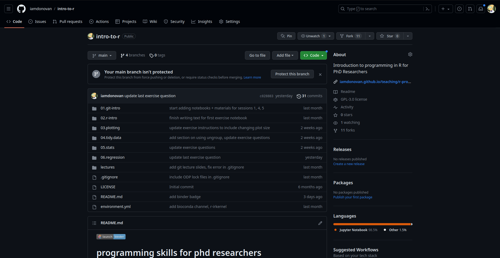
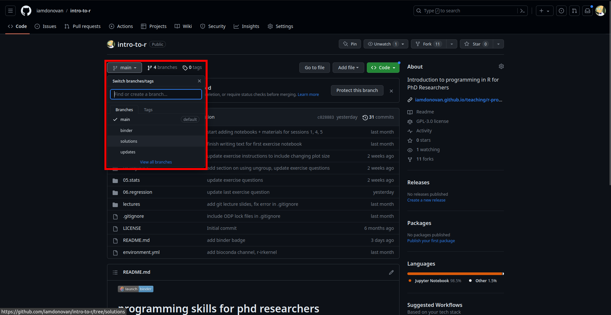
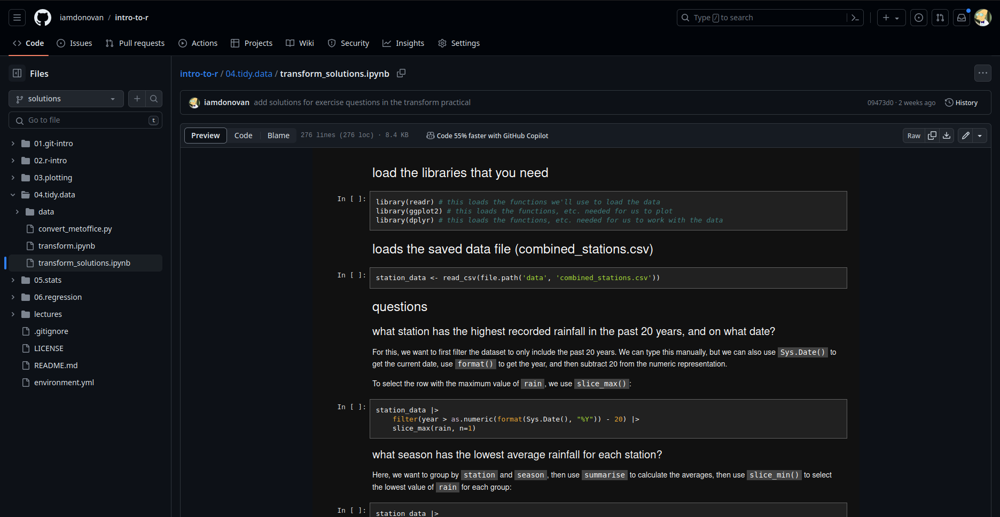

a crash course in machine learning (using python) -- under development
=======================================================================

.. note::

    If you are unable to install all of the software on your own machine, you can still work through the exercises
    online by clicking the badge below:

    .. image:: https://mybinder.org/badge_logo.svg
        :target: https://mybinder.org/v2/gh/iamdonovan/ml-crash-course/HEAD

    |br| This will (eventually) open an online interactive version of the material that you will be able to run from
    within your web browser.

.. toctree::
   :glob:
   :hidden:
   :maxdepth: 1

   setup
   lectures
   exercises/index
   resources

The goal of this course is to provide PhD Researchers with a brief introduction to practical machine learning using
python. The topics covered include (but are not limited to):

- types of machine learning (unsupervised, supervised, reinforced)
- training, testing, and validation
- decision trees and random forest
- measuring performance
- support vector machine
- neural networks
- ethics in machine learning/artificial intelligence
- deep learning

Before moving on to the :doc:`practicals<exercises/index>` below, be sure to visit the
:doc:`setup<setup>` page to make sure that you have the software and materials set up in order to get started.

+---------+-------------------------+--------------------------------+
| session | theme                   | exercise topic(s)              |
+---------+-------------------------+--------------------------------+

exercise solutions
-------------------

At the end of each of the exercises, I have provided a list of additional exercises for you to practice the skills and
concepts covered in each session. On the `GitHub <https://github.com/iamdonovan/ml-crash-course>`__ page for the class,
you can find some example solutions that I have provided on the ``solutions`` branch. To get there, click the link
above, which should take you here:

|br| Next, click the button that says ``main`` to show a list of branches, then select ``solutions``:

|br| This will show you the files included on the ``solutions`` branch - inside each folder, you should find script or
notebook file that contains example solutions for each of the exercise questions:

|br| Remember that as we have discussed in the workshop, these solutions are not the only possible solutions to the
questions - there are potentially many different ways to answer the questions!

