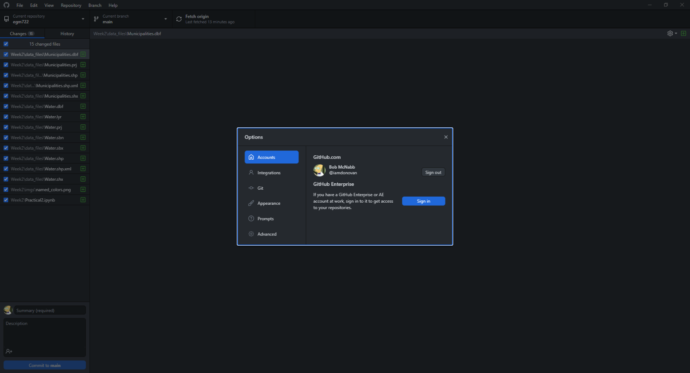

installing github desktop
==========================

In addition to the command-line interface, we can also install a graphical user interface to work with both **git** and
**GitHub**. You can download **GitHub Desktop** for Windows or macOS from the link `here <https://desktop.github.com/>`__.

Follow the installer instructions, and then open **GitHub Desktop** once it finishes installing.

From **File** > **Options**, click **Accounts**:

|br| Here, you can log in to your **GitHub** account, which will enable you to **push**
(upload) and **pull** (download) changes to/from remote repositories. You will need to sign into your **GitHub**
account in your browser window, then authorize **GitHub Desktop** to access your account.

Once this is done, you can move on to :doc:`forking the repository<fork>`.
