plotting data using seaborn
============================

.. note::

    This is a **non-interactive** version of the exercise. If you want to run through the steps yourself and see the
    outputs, you'll need to do one of the following:

    - follow the setup steps and work through the notebook on your own computer
    - open the workshop materials on `binder <https://mybinder.org/v2/gh/iamdonovan/intro-to-python/>`__ and work
      through them online
    - open a python console, copy the lines of code here, and paste them into the console to run them

In this exercsise, we’re going to investigate how temperature has
changed over time, using monthly observations from the Armagh
Observatory. By the end of this exercise, you will:

-  load data from a file
-  add variables to a table
-  create date objects from character strings
-  recode values in a table
-  select data from a table using logical expressions
-  create scatter plots (with smoothing lines)
-  create histograms (+ smoothed histograms)
-  save plots to a file

data
----

The data used in this exercise are the historic meteorological
observations from the `Armagh
Observatory <https://www.metoffice.gov.uk/weather/learn-about/how-forecasts-are-made/observations/recording-observations-for-over-100-years>`__,
downloaded from the `UK Met
Office <https://www.metoffice.gov.uk/research/climate/maps-and-data/historic-station-data>`__.

To make the data slightly easier to work with, I have done the
following: - Removed the header on lines 1-5 - Replaced multiple spaces
with a single space, and replaced single spaces with a comma (``,``) -
Removed ``---`` to indicate no data, leaving these fields blank -
Removed ``*`` indicating provisional/estimated values - Removed the 2023
data - Renamed the file ``armaghdata.csv``.

If you wish to use your own data (and there are loads of stations
available!), please feel free. I have also included a script,
``convert_metoffice.py`` (in the ``scripts/`` folder), that will do
these steps automatically. All you need to do is run the following from
a terminal:

::

       convert_metoffice.py {station}data.txt

This will create a new file, ``{station}data.csv``, that has converted +
cleaned the data into a CSV format that can easily be read by
``pandas``.

importing libraries
-------------------

Before getting started, we will import the libraries (packages) that we
will use in the exercise:

-  `pandas <https://pandas.pydata.org/>`__, for reading the data from a
   file;
-  `seaborn <https://seaborn.pydata.org/>`__, for plotting the data

To do this, we use the ``import`` statement, followed by the name of the
package. Remember that we can also *alias* the package name using
``as``:

.. code:: ipython3

    import pandas as pd # import pandas, but alias it as pd
    import seaborn as sns # import seaborn, but alias it as sns

loading the data
----------------

Now, we’re ready to load the data file, using ``pd.read_csv()``
(`documentation <https://pandas.pydata.org/pandas-docs/stable/reference/api/pandas.read_csv.html>`__):

.. code:: ipython3

    armagh = pd.read_csv('data/armaghdata.csv')

``pandas`` has a number of functions for reading data from files,
depending on the format - another common one you might use is
``pd.read_excel()``
(`documentation <https://pandas.pydata.org/pandas-docs/stable/reference/api/pandas.read_excel.html>`__).
Note that in order to read Excel files, you will need to install
**openpyxl** (`link <https://openpyxl.readthedocs.io/>`__) using
**conda**.

To view a summary of the **DataFrame**, we can use the ``.head()``
method
(`documentation <https://pandas.pydata.org/pandas-docs/stable/reference/api/pandas.DataFrame.head.html>`__):

.. code:: ipython3

    armagh.head(n=10) # show the first 10 rows of the dataframe

We can also see that only the ``rain`` variable has values back to 1853
- missing values are indicated by ``NaN``, which means “Not a Number” -
i.e., missing.

adding variables to the table
-----------------------------

Before moving on, we’ll see how we can add additional variables to the
table, starting with the date. This will make it easier for us to plot
and analyze the time series of observations.

We want this column to be represented as a **datetime** object so that
it displays properly when we plot it, and because we may want to do
calculations using the date/time. When working with **DataFrame**
objects, the easiest way to do this is using ``pd.to_datetime()``
(`documentation <https://pandas.pydata.org/pandas-docs/stable/reference/api/pandas.to_datetime.html>`__).
The argument that we will use for this function is a **dict** object,
with key/value pairs corresponding to **year**, **month**, and **day**.
Because we don’t have a **day** column in the **DataFrame**, we will
just default to a value of 1:

.. code:: ipython3

    pd.to_datetime({'year': armagh['yyyy'], 'month': armagh['mm'], 'day': 1}) # format datetime objects using the yyyy and mm columns

Now, we can add this to the **DataFrame** as a column called ``date``:

.. code:: ipython3

    armagh['date'] = pd.to_datetime({'year': armagh['yyyy'], 'month': armagh['mm'], 'day': 1}) # add the datetime series to the dataframe with the name 'date'

    armagh.head(n=10) # show the first 10 rows of the table

we can also check the data type of the new column - we should see that
it is ``datetime64[ns]``, corresponding to a 64-bit **datetime** object
with units of nanoseconds:

.. code:: ipython3

    armagh.dtypes # see the data type of each column

calculating a new column
------------------------

One thing we might be interested in doing is aggregating our
observations by meteorological season, rather than just by month or
year. To help us with this, we can calculate a new variable, ``season``,
and assign it values based on whether the month is part of the
meteorological spring (March, April, May), summer (June, July, August),
autumn (September, October, November), or winter (December, January,
February).

Another way to look at this is by thinking of these as
``if ... then ... else`` statements:

-  **if** month is 1, 2, or 12, **then** ``season`` is “winter”
-  **if** month is 3, 4, or 5, **then** ``season`` is “spring”
-  **if** month is 6, 7, or 8, **then** ``season`` is “summer”
-  **if** month is 9, 10, or 11, **then** ``season`` is “autumn”

First, let’s remember how we can select rows from a table using a
**conditional** statement. For example, if we want to select all rows
where the value in the ``mm`` column is 1, 2, or 12, we could write:

.. code:: ipython3

    armagh.loc[(armagh['mm'] < 3) | (armagh['mm'] == 12)] # select rows where month is < 3 or == 12

As you can see, this selects a total of 510 rows from the table,
wherever the value in the ``mm`` column is 1 or 2 (``< 3``), or 12.

Here, we’ve used the ``|`` (“pipe” or “logical or”) operator to combine
two conditional statements: it returns ``True`` wherever
``armagh['mm'] < 3`` **or** wherever ``armagh['mm'] == 12``.

However, we can also use the ``in`` operator to write this a bit more
compactly, using the ``.isin()`` method
(`documentation <https://pandas.pydata.org/pandas-docs/stable/reference/api/pandas.Series.isin.html>`__)
and a **list** (or other sequence) of the values to compare:

.. code:: ipython3

    armagh.loc[armagh['mm'].isin([1, 2, 12])] # select from the table based on whether values are in [1, 2, 12]

We can then write 4 separate statements to assign these values to the
**DataFrame**:

.. code:: ipython3

    armagh['season'] = '' # initialize an empty string column
    armagh.loc[armagh['mm'].isin([1, 2, 12]), 'season'] = 'winter' # if month is 1, 2, or 12, set season to winter
    armagh.loc[armagh['mm'].isin(range(3, 6)), 'season'] = 'spring' # if month is 3, 4, or 5, set season to spring
    armagh.loc[armagh['mm'].isin(range(6, 9)), 'season'] = 'summer' # if month is 6, 7, or 8, set season to summer
    armagh.loc[armagh['mm'].isin(range(9, 12)), 'season'] = 'autumn' # if month is 9, 10, or 11, set season to autumn

    armagh.head(n=12) # show the first year of data, to check that we have set the values properly

plotting data
-------------

To plot data, we’ll use ``seaborn``, a popular package for plotting data
that integrates well with ``pandas`` **DataFrame** objects.

example: scatter plot
~~~~~~~~~~~~~~~~~~~~~

In this exercise, we will look at a number of different example plots
using our data, starting with a simple scatter plot using
``sns.scatterplot()``
(`documentation <https://seaborn.pydata.org/generated/seaborn.scatterplot.html>`__).

We can pass our **DataFrame** to ``sns.scatterplot()`` using the
``data`` argument, and specify which columns from the **DataFrame** to
plot along the ``x`` and ``y`` axes. The following will plot ``tmax``
(monthly maximum temperature) vs ``date`` - in other words, a time
series of monthly maximum temperature:

.. code:: ipython3

    sns.scatterplot(data=armagh, x="date", y="tmax") # create a simple scatter plot of tmax vs date, using the armagh dataframe

.. parsed-literal::

    <Axes: xlabel='date', ylabel='tmax'>

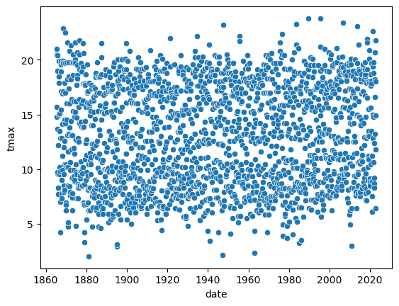

over the rest of this exercise, we’ll look at how we can continue to
customize plots, by adding colors, customizing labels, changing font
sizes, and so on.

example: basic histogram
~~~~~~~~~~~~~~~~~~~~~~~~

Now, let’s look at another type of plot: a histogram. To create a
histogram using ``sns.histplot()``
(`documentation <https://seaborn.pydata.org/generated/seaborn.histplot.html>`__),
we need to specify the ``x`` variable. We’ll continue using ``tmax``, so
this will be a histogram of the values of ``tmax``:

.. code:: ipython3

    sns.histplot(data=armagh, x='tmax') # plot a histogram of tmax, using the armagh dataframe

.. parsed-literal::

    <Axes: xlabel='tmax', ylabel='Count'>

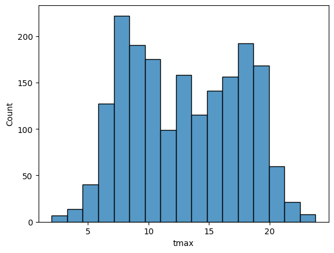

By default, ``seaborn`` calculates the bin width (and therefore number
of bins) based on the sample size and variance of the variable. We can
also specify the number of bins to use (using the ``bins`` argument),
the width of the bins to use (using the ``binwidth`` argument), or even
the edges of the bins (by passing a sequence of bin edges using the
``bins`` argument).

Here’, let’s see how the plot changes by specifying using 30 bins:

.. code:: ipython3

    sns.histplot(data=armagh, x='tmax', bins=30) # plot a histogram of tmax, using the armagh dataframe and 30 bins

.. parsed-literal::

    <Axes: xlabel='tmax', ylabel='Count'>

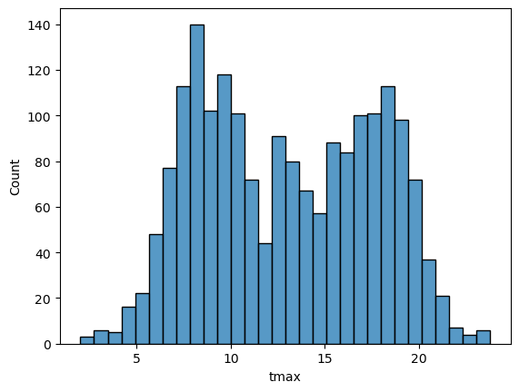

In the plot above, you can see how ``tmax`` is distributed, with several
apparent peaks around 8°C, 14°C, and 18°C. Presumably, these would be
peaks that roughly correspond to winter, spring/autumn, and summer,
respectively - let’s change the plot slightly so that we can see if this
is correct.

To do this, we can use the ``hue`` keyword argument to
``sns.histplot()``, which will group the values based on the variable
passed (in this case, ``season``):

.. code:: ipython3

    sns.histplot(data=armagh, x="tmax", hue="season", bins=30) # show the distribution of tmax, broken down by season

.. parsed-literal::

    <Axes: xlabel='tmax', ylabel='Count'>

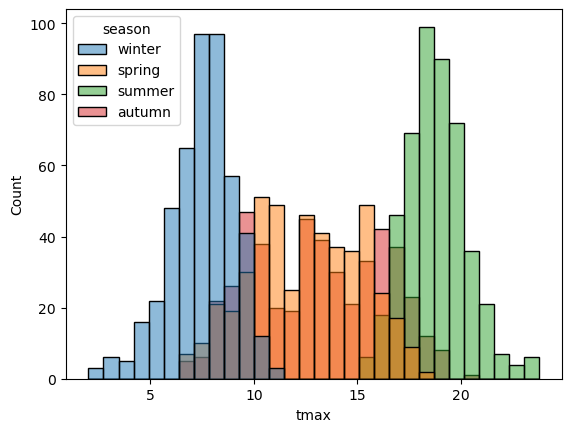

With this plot, we can see how the total distribution of the dataset is
made up of each group - as we had suspected, the peaks on either side
primarily correspond to winter (blue) and summer (green), while the peak
in the middle is a combination of spring (orange) and autumn (red).

With different groups, we can also specify how to display the groups
using the ``multiple`` keyword argument. The value of ``multiple`` must
be one of the following:

-  ``'layer'`` - the default, which plots each bin in place using
   transparency
-  ``'dodge'`` - shifts and narrows each bin so that they don’t overlap
-  ``'stack'`` - stacks bins on top of each other
-  ``'fill'`` - stacks bins on top of each other, with each category/bin
   adding up to 1.

In the cell below, add an argument to ``histplot`` to show the
histograms stacked on top of each other:

.. code:: ipython3

    sns.histplot(data=armagh, x="tmax", hue="season", bins=30) # remember to add the right keyword argument!

.. parsed-literal::

    <Axes: xlabel='tmax', ylabel='Count'>

.. image:: plotting_files/plotting_27_1.png

example: density plot
~~~~~~~~~~~~~~~~~~~~~

We can also plot the density distribution of the data, a smoothed
version of the histogram, using ``sns.kdeplot()``
(`documentation <https://seaborn.pydata.org/generated/seaborn.kdeplot.html>`__):

.. code:: ipython3

    sns.kdeplot(data=armagh, x='tmax', hue='season', fill=True) # plot the density distribution of the data, colored by season, filled in

.. parsed-literal::

    <Axes: xlabel='tmax', ylabel='Density'>

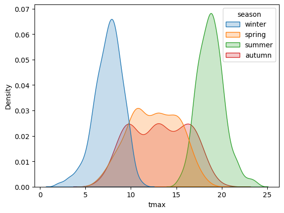

example: box plots
~~~~~~~~~~~~~~~~~~

To make a box plot, we can use ``sns.boxplot()``
(`documentation <https://seaborn.pydata.org/generated/seaborn.boxplot.html>`__):

.. code:: ipython3

    sns.boxplot(data=armagh, x='season', y='rain') # create a vertical box plot of rain, grouped by season

.. parsed-literal::

    <Axes: xlabel='season', ylabel='rain'>

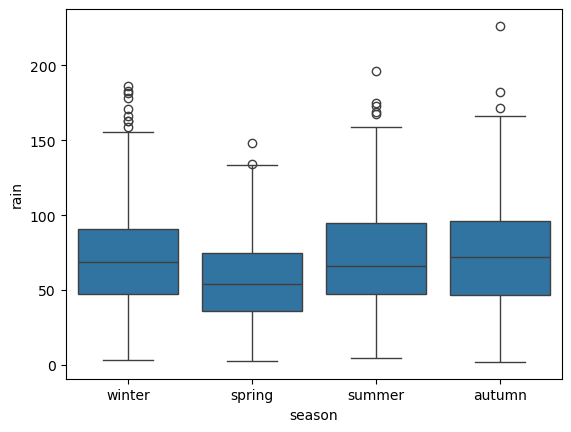

To swap the orientation of the boxes, we can change the ``x`` and ``y``
mapping:

.. code:: ipython3

    sns.boxplot(data=armagh, x='rain', y='season') # create a horizontal box plot of rain, grouped by season

.. parsed-literal::

    <Axes: xlabel='rain', ylabel='season'>

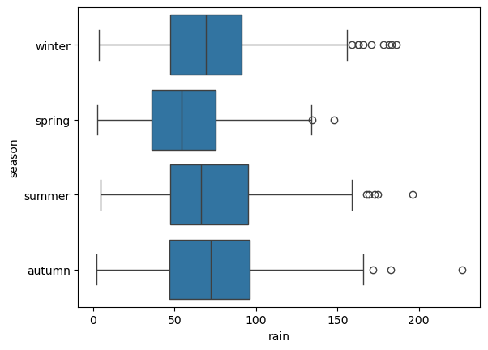

facet wrapping
--------------

We might also want to plot our data using different subplots, or
**facets**. For example, let’s look at a scatter plot of ``tmax`` vs
``rain``, colored by season:

.. code:: ipython3

    sns.scatterplot(data=armagh, x='rain', y='tmax', hue='season', style='season')

.. parsed-literal::

    <Axes: xlabel='rain', ylabel='tmax'>

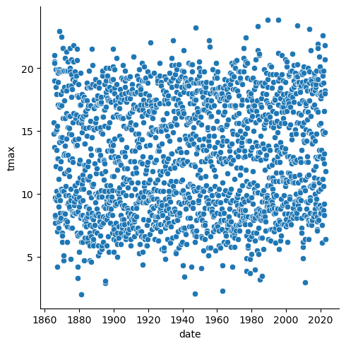

But, this makes it difficult to see the scatter for each season. To
split this into a single subplot for each season, we use
``sns.FaceGrid()``
(`documentation <https://seaborn.pydata.org/generated/seaborn.FacetGrid.html>`__)
to create a **FacetGrid** object, with each panel of the grid
corresponding to a different season.

We can then use ``.map_dataframe()``
(`documentation <https://seaborn.pydata.org/generated/seaborn.FacetGrid.map_dataframe.html>`__)
to *map* a plotting function (in this case, ``sns.scatterplot()``) to
each panel, specifying the ``x`` and ``y`` data:

.. code:: ipython3

    g = sns.FacetGrid(data=armagh, col='season', col_wrap=2) # create a 2x2 grid of panels, one for each value of season
    g.map_dataframe(sns.scatterplot, x='rain', y='tmax') # create a scatter plot of tmax vs rain in each panel

.. parsed-literal::

    <seaborn.axisgrid.FacetGrid at 0x7f1222fbea50>

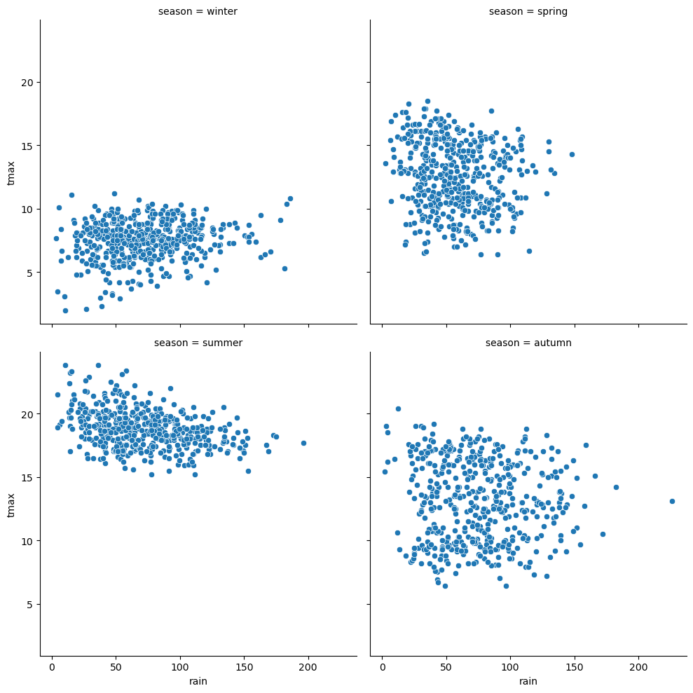

cleaning up and saving the plot to a file
-----------------------------------------

In the final example, we’ll make a plot showing the relationship between
``rain`` and ``tmax``, colored by the ``season``, and plot regression
lines for each season.

We’ll also see how we can change the axes labels, and increase font
sizes, to help make our plot ready for including in a manuscript or
presentation.

Because we want to see the linear relationship between ``rain`` and
``tmax`` for each season, we can use ``sns.lmplot()``
(`documentation <https://seaborn.pydata.org/generated/seaborn.lmplot.html>`__)-
this will plot the scatter plot, plus the regression lines:

.. code:: ipython3

    sns.lmplot(data=armagh, x='rain', y='tmax', hue='season')

.. parsed-literal::

    <seaborn.axisgrid.FacetGrid at 0x7f122041b6d0>

Up to now, we’ve just been showing the output of the different plotting
calls directly by running each cell. In a script, however, this wouldn’t
work - we want to assign the output to a new **object**, which we can
then use in the script (including, ultimately, by saving the plot to a
file).

We do this exactly the same way as we have previously, using the ``=``
operator:

.. code:: ipython3

    rain_tmax_plot = sns.lmplot(data=armagh, x='rain', y='tmax', hue='season')

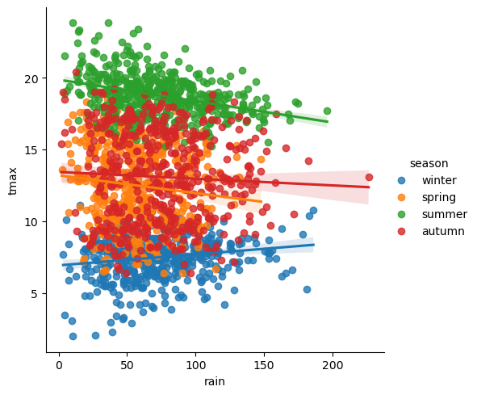

Now, we can use this object to change the properties of the axes.
``seaborn`` is built on top of another package,
`matplotlib <https://matplotlib.org/stable/users/index>`__, and many of
the objects created by ``seaborn`` either are ``matplotlib`` objects, or
they inherit a number of attributes from the ``matplotlib`` classes they
are built on.

For example, the ``rain_tmax_plot`` object we have created is a
**seaborn.axisgrid.FacetGrid**:

.. code:: ipython3

    type(rain_tmax_plot) # show the type of rain_tmax_plot

This **class** has an attribute, ``ax``, which is a
**matplotlib.axes.Axes**
(`documentation <https://matplotlib.org/stable/api/_as_gen/matplotlib.axes.Axes.html>`__):

.. code:: ipython3

    type(rain_tmax_plot.ax) # show the type of rain_tmax_plot.ax

To change the properties of the axes, then, we can use the relevant
**Axes** methods. For example, ``.set_xlabel()``
(`documentation <https://matplotlib.org/stable/api/_as_gen/matplotlib.axes.Axes.set_xlabel.html>`__)
and ``.set_ylabel()``
(`documentation <https://matplotlib.org/stable/api/_as_gen/matplotlib.axes.Axes.set_ylabel.html>`__)
will change the text and properties of the x and y axis labels,
respectively, and we can use the ``fontsize`` argument to set the size
of the text:

.. code:: ipython3

    rain_tmax_plot.ax.set_xlabel('monthly rainfall (mm)', fontsize=14) # set the x axis label
    rain_tmax_plot.ax.set_ylabel('monthly maximum temperature (°C)', fontsize=14) # set the y axis label

    rain_tmax_plot.fig # show the figure again

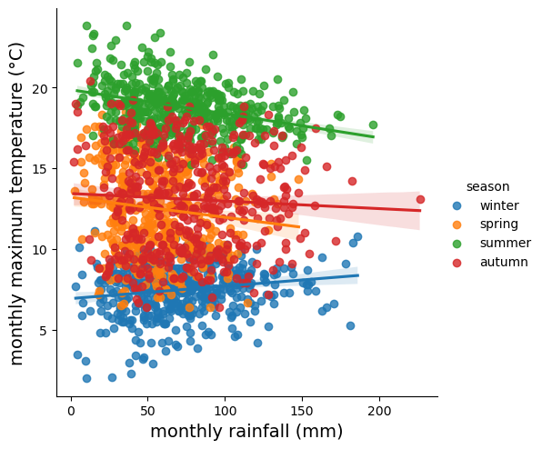

We can also use ``.set_xticks()``
(`documentation <https://matplotlib.org/stable/api/_as_gen/matplotlib.axes.Axes.set_xticks.html>`__)
and ``.set_yticks()``
(`documentation <https://matplotlib.org/stable/api/_as_gen/matplotlib.axes.Axes.set_yticks.html>`__)
to change the location, text, and properties of the ticks on the x and y
axis, respectively:

.. code:: ipython3

    rain_tmax_plot.ax.set_xticks(range(0, 250, 50), labels=range(0, 250, 50), fontsize=12) # change the xtick label font size
    rain_tmax_plot.ax.set_yticks(range(5, 25, 5), labels=range(5, 25, 5), fontsize=12) # change the xtick label font size

    rain_tmax_plot.fig # show the figure again

As you can see from the previous few cells, we have been using
``rain_tmax_plot.fig`` to show the updates to the figure. As you might
have guessed, this is a **matplotlib.figure.Figure** object
(`documentation <https://matplotlib.org/stable/api/figure_api.html#matplotlib.figure.Figure>`__)
- effectively, the canvas where ``seaborn`` draws the plot:

.. code:: ipython3

    type(rain_tmax_plot.fig) # show the type of rain_tmax_plot.fig

To save our figure to a file, we can use ``.savefig()``
(`documentation <https://matplotlib.org/stable/api/figure_api.html#matplotlib.figure.Figure.savefig>`__)
as an SVG (scalable vector graphics) file:

.. code:: ipython3

    rain_tmax_plot.fig.savefig('rain_tmax_plot.svg', bbox_inches='tight') # save the figure cropped close to the axes

exercise and next steps
-----------------------

That’s all for this exercise. To practice your skills, create a script
that does the following:

-  loads the packages that you will need at the beginning of the script
-  adds a season variable
-  adds a variable to divide the data into three 50 year periods:
   1871-1920, 1921-1970, and 1971-2020
-  selects only those observations between 1871 and 2020 (inclusive)
-  creates a figure to plot the density distribution of tmin for each
   period in its own panel, colored by season (using both color and
   fill)
-  creates a figure to plot the density distribution of tmin for each
   period in the same panel, colored by the period (using both color and
   fill)
-  sets appropriate labels and font sizes for the axis text
-  saves each plot to its own file. For the three-panel figure, make
   sure to change the width and height of the plot so that the plot is
   more rectangular, and each panel is approximately square