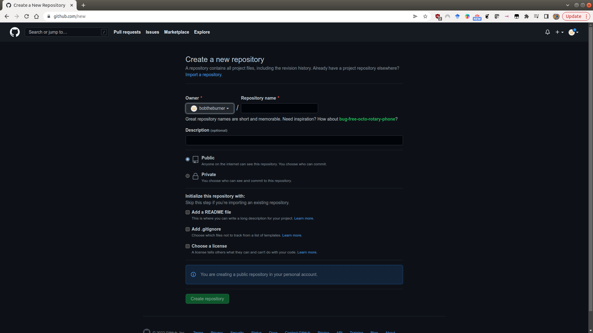
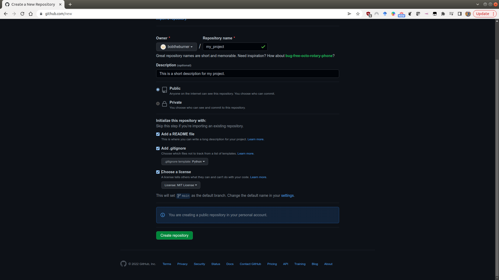
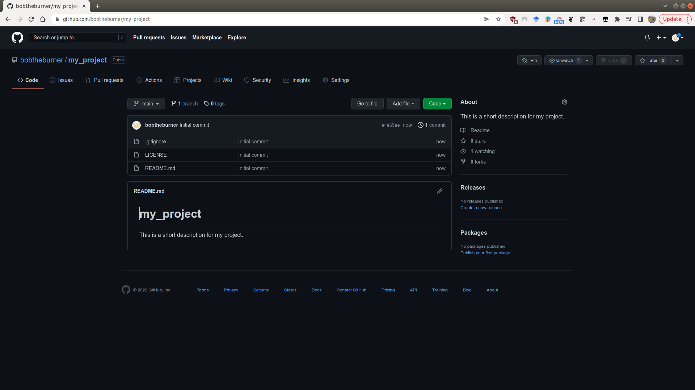
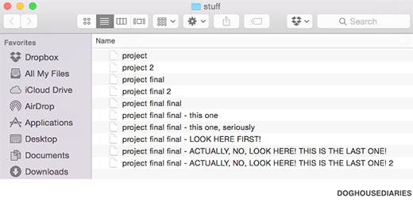

starting a new project
=======================

For this exercise, we're going to create a GitHub repository for use with your BYOD project work later in the workshop.
This will help you keep track of your files, including your data files, scripts or notebooks, and any figures you
create. Once you have created your GitHub repository, we'll clone the repository to your computer, and begin adding
files to the repository.

creating a github repository
-----------------------------

The easiest way to create a new GitHub repository is to point your browser to https://github.com/new. You'll
need to be logged in to do this, but you should see the following screen:

|br| Here, you can fill out the basic information about the repository: the **name**, a short **description**, and
choose whether it should be **Public** or **Private**.

.. warning::

    If you make your repository **Public**, it can be seen by *anyone*. If you are working with sensitive data, you
    **absolutely should not** store this in a public repository!

You will also see that you have the option to initialize some of the required files in the repository - namely,
the README, .gitignore, and LICENSE files. We will discuss these in a bit more detail below, but it is usually
easier to add these now at the start, rather than forgetting and having to add them later.

Once you've filled out the basic information:

|br| click on **Create repository**, and your new repository will appear:

README.md
----------

The README file is what shows on the front page of your GitHub repository - it provides a (brief)
introduction to the repository - what it is, how to get started with it, and so on.

GitHub initializes this as a *Markdown* file (**.md**). When you add text to the README file, you can
add formatting such as **bold**, or *italic* font, hyperlinks, and even lists and tables.

For more information about how to format the README using markdown, check out this
helpful `cheat sheet <https://www.markdownguide.org/cheat-sheet/>`__ (or just search 'markdown cheat sheet'
on your search engine of choice).

.gitignore
-----------

Remember that this file is used to tell **git** what files to ignore. The easiest way to create this is to either
use the suggested template for **Python** when initializing the repository, or to visit a site like
https://gitignore.io, which helps you add software-specific files to ignore (for example, those created by IDEs like
PyCharm, VS Code, or RStudio).

For more information about how to add files or folders to the .gitignore file, see this
`helpful guide <https://docs.github.com/en/get-started/getting-started-with-git/ignoring-files>`__.

license
--------

When you initialize the repository, you should also remember to include a LICENSE file. GitHub provides a number of
templates for this, which differ depending on the terms of the license.

In general, safe bets for a new project are going to be options like the **MIT License** or the **GPL v3.0**. GitHub
also provides a helpful website, https://choosealicense.com/, to help you choose a license for your repository
based on your needs.

cloning the repository
------------------------

Once you've set up the repository on GitHub, you can **clone** it to your computer:

.. code-block:: sh

    git clone https://github.com/<your_username>/<your_project>.git

From there, you can start working on your scripts, add to the README file, and so on.

organizing your project
-------------------------

Once you have cloned the repository to your computer, you can start to add files to it. Before dumping everything in,
however, it might be worth thinking about how you want to organize your project.

Everyone's preferences are different, but what works best for me is having a folder for scripts, a folder for data
files, a folder for figures that I generate, and so on.

Whatever way you go, remember to keep clear, consistent filenames. Remember that within your git repository, you don't
need to resort to the nightmare fuel method of naming files:

|br| git keeps track of your changes, which means you don't have to add "versions" to the filename itself\ [1]_.

In a :doc:`future exercise <pandas>`, we will see how using consistent filenames also makes it easier to write
code that loads and uses the data that we need for analysis - in the long run, it's less work required to find things
and use them when you need them. And remember, one of the main motivations for programming is laziness. :)

notebooks vs scripts
---------------------

In this workshop, we'll see two different ways of working with python code: *notebooks*, in the form of Jupyter Notebook
(``.ipynb``) files, and *scripts*, in the form of ``.py`` files.

In general, *notebooks* are very useful for exploratory analysis, analysis where you want to see intermediate steps, or
analysis where you might also want to include annotations.

*Scripts* are better for analysis that you want to repeat or automate - you don't need to do any interacting with the
interpreter while the script runs, you just want to look at the outputs.

What you end up using is ultimately a matter of taste, but when you're first starting it out it might be easier for you
to do your initial analysis in a notebook format, and move the code to a script once you've got things running
smoothly.

If you are working with notebooks, however, it's usually a good idea to **clear the outputs** before committing the file
using git (remember: these outputs are automatically generated, which means there's not much point in keeping
track of them!).

This helps avoid potential merge conflicts, and it cuts down on the file size if you have a lot of plots or other
embedded images/files in your notebook.

notes
------

.. [1] not only that, but between OneDrive and the built-in version control of Office, you usually don't even need to
    do this with Word documents. Please stop.
