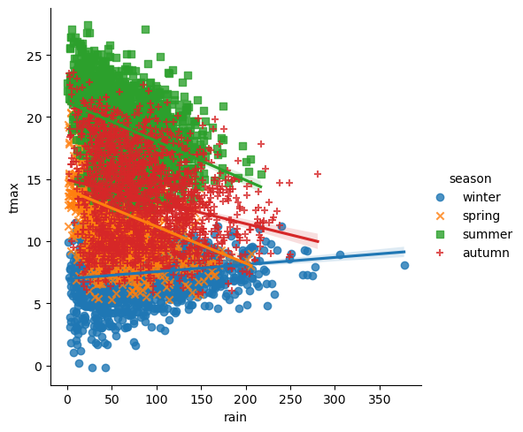

linear regression using python
===============================

.. note::

    This is a **non-interactive** version of the exercise. If you want to run through the steps yourself and see the
    outputs, you'll need to do one of the following:

    - follow the setup steps and work through the notebook on your own computer
    - open the workshop materials on `binder <https://mybinder.org/v2/gh/iamdonovan/intro-to-python/>`__ and work
      through them online
    - open a python console, copy the lines of code here, and paste them into the console to run them

In this exercise, we’ll see how we can use python for both simple and
linear regression. We’ll also see how we can calculate the correlation
between two variables, and get some additional practice working with
grouped data.

data
----

The data used in this exercise are the historic meteorological
observations from the `Armagh
Observatory <https://www.metoffice.gov.uk/weather/learn-about/how-forecasts-are-made/observations/recording-observations-for-over-100-years>`__
(1853-present), the Oxford Observatory (1853-present), the Southampton
Observatory (1855-2000), and Stornoway Airport (1873-present),
downloaded from the `UK Met
Office <https://www.metoffice.gov.uk/research/climate/maps-and-data/historic-station-data>`__
that we used in previous exercises.

getting started
---------------

First, we’ll import the various packages that we will be using here:

-  `pandas <https://pandas.pydata.org/>`__, for reading the data from a
   file;
-  `seaborn <https://seaborn.pydata.org/>`__, for plotting the data;
-  `scipy.stats <https://docs.scipy.org/doc/scipy/reference/stats.html>`__,
   for calculating correlation coefficients;
-  `statsmodels.api <https://www.statsmodels.org/dev/index.html>`__, for
   linear regression;
-  `pathlib <https://docs.python.org/3/library/pathlib.html>`__, for
   working with filesystem paths.

.. code:: ipython3

    import pandas as pd
    import seaborn as sns
    from scipy import stats
    import statsmodels.api as sm
    from pathlib import Path

Next, we’ll use ``pd.read_csv()`` to load the combined station data:

.. code:: ipython3

    station_data = pd.read_csv(Path('data', 'combined_stations.csv'), parse_dates=['date']) # load the combined station data

plotting relationships
----------------------

Before jumping into correlation and regreesion, let’s have a look at the
data we’re investigating. In the cell below, write some lines of code to
create a scatter plot of ``tmax`` vs ``rain``, with different colors,
shapes, and a regression line for each season. Be sure to assign the
plot to an object called ``rain_tmax_plot``:

.. code:: ipython3

    rain_tmax_plot # show the plot

What kind of relationship is there between ``tmax`` and ``rain``? Does
it depend on the season? How strong is the relationship, and what does
this mean for the slope of each regression line?

calculating correlation
-----------------------

The next thing we’ll look at is how to calculate the *correlation*
between two variables, using a few different methods. We’ll start by
calculating the covariance for all values of a variable in a
**DataFrame**, then we’ll have a look at calculating correlation using
``scipy.stats``
(`documentation <https://docs.scipy.org/doc/scipy/reference/stats.html>`__).

using pandas .corr()
~~~~~~~~~~~~~~~~~~~~

The basic use of ``corr()``
(`documentation <https://pandas.pydata.org/pandas-docs/stable/reference/api/pandas.DataFrame.corr.html>`__)
calculates Pearson’s correlation coefficient between each column in the
table, pairwise. With the ``method`` argument, we can also calculate
Spearman’s rho (``method='spearman'``) and Kendall’s tau
(``method='kendall'``).

Because we have non-numeric variables in the table, we’ll use the
``numeric_only`` argument to avoid a ``ValueError`` being raised.
Helpfully, ``.corr()`` ignores any ``NaN`` values for us, so we don’t
have to

.. code:: ipython3

    station_data.corr(numeric_only=True) # calculate the correlation between all numeric variables in the table

Out of all of the variables in the table, which have the strongest
correlation (ignoring the values on the diagonal)? Does this make sense?

by groups
~~~~~~~~~

We’re more interested in calculating the correlation for different
groups - as you can see from the plot above, the relationship between
``rain`` and ``tmax`` is not the same in each season - even though the
overall correlation is slightly negative, the correlation in winter is
clearly positive.

We’ve already seen all of the different parts we need here. To calculate
the correlation based on ``season``, we can use ``.groupby()`` to group
the dataset before calling ``.corr()``:

.. code:: ipython3

    station_data.groupby('season')[['rain', 'tmax']].corr() # calculate pearson's r for rain and tmax, grouped by season

using scipy.stats
~~~~~~~~~~~~~~~~~

From the outputs above, you can see that ``pandas.DataFrame.corr()``
outputs the full covariance matrix, not just the correlation value we’re
interested in. In the cells below, we’ll see how we can use some of what
we have learned previously, along with ``scipy.stats``, to create a
**DataFrame** with just the correlation values between ``rain`` and
``tmax``.

In the cell below, we’ll use a ``for`` loop to calculate correlation
coefficients (Pearson’s r, Spearman’s rho, and Kendall’s tau) for
``rain`` and ``tmax`` based on data from each season. We’ll build a
nested list of the correlation coefficients for each season by first
creating an empty list, then using ``list.append()`` to add the
coefficients for each season in turn.

Before running the cell, be sure to create an object, ``seasons``, that
contains the names of each season. You can write this explicitly, but
you might want to practice getting this output from the data directly.

.. code:: ipython3

    # get a list of season names - remember that there's more than one way to do this!
    corr_data = [] # initalize an empty list

    for season in seasons:
        season_data = station_data.loc[station_data['season'] == season].dropna(subset=['rain', 'tmax']) # select the data for this season, drop nan values from rain and tmax
        this_corr = [stats.pearsonr(season_data['rain'], season_data['tmax']).statistic, # calculate pearson's r between rain and tmax
                     stats.spearmanr(season_data['rain'], season_data['tmax']).statistic, # calculate spearman's rho between rain and tmax
                     stats.kendalltau(season_data['rain'], season_data['tmax']).statistic] # calculate kendall's tau between rain and tmax
        corr_data.append(this_corr) # add these values to the list

    corr_data # show the nested list of correlation values

Now that we have created the nested list (effectively, an array of
values), we can create a new **DataFrame** object by specifying the
``data``, ``index``, and ``columns`` arguments:

.. code:: ipython3

    corr_df = pd.DataFrame(data=corr_data, index=seasons, columns=['pearson', 'spearman', 'kendall']) # create a dataframe with the correlation data
    corr_df # show the correlation dataframe

Note that calculating the correlation coefficient using ``scipy.stats``
has an additional benefit - unlike with ``pandas.DataFrame.corr()``,
``scipy.stats`` will also provide a significance value for the
calculated correlation:

.. code:: ipython3

    corr = stats.pearsonr(station_data.dropna(subset=['rain', 'tmax'])['rain'],
                          station_data.dropna(subset=['rain', 'tmax'])['tmax'])

    print(f"calculated value of r: {corr.statistic:.3f}")
    print(f"calculated p-value of r: {corr.pvalue}")

simple linear regression
------------------------

We’ll start by fitting a linear model for spring. To prepare the data,
write a line of code below that selects only the spring observations,
and assigns the output to an object called ``spring``:

.. code:: ipython3

    # select only spring observations

Remember that a linear model with a single variable has the form:

.. math::  y = \beta + \alpha x,

where :math:`\beta` is the intercept and :math:`\alpha` is the slope of
the line. To fit a linear model using ordinary least squares, we can
first use ``sm.OLS()``
(`documentation <https://www.statsmodels.org/dev/generated/statsmodels.regression.linear_model.OLS.html>`__)
to create an **OLS** object, then use the ``.fit()`` method
(`documentation <https://www.statsmodels.org/dev/generated/statsmodels.regression.linear_model.OLS.fit.html>`__)
of that object.

When we create the **OLS** object, we pass the observations of the
*response* (*dependent*) variable with the first argument, and the
observations of the *explanatory* (*independent*) variable(s) in the
second argument. Note that by default, **OLS** will not fit a constant,
but we can use ``sm.add_constant()``
(`documentation <https://www.statsmodels.org/dev/generated/statsmodels.tools.tools.add_constant.html>`__)
to add a column of ones to the array.

So, the process to fit a linear relationship between ``tmax`` and
``rain`` would look like this:

.. code:: ipython3

    xdata = station_data.dropna(subset=['rain', 'tmax'])['rain'] # select the rain variable, after dropping NaN values
    ydata = station_data.dropna(subset=['rain', 'tmax'])['tmax'] # select the tmax variable, after dropping NaN values

    xdata = sm.add_constant(xdata) # add a constant to xdata - otherwise, we're only fitting the slope

    lin_model = sm.OLS(ydata, xdata) # initialize the OLS object
    lm_results = lin_model.fit() # fit the model to the data

The ``params`` attribute has the estimated values for the intercept
(``const``) and slope (``rain``):

.. code:: ipython3

    lm_results.params # see the regression parameters: const is the intercept, rain is the coefficient for 'rain'

Other useful attributes include:

-  ``bse``, the estimates of the standard error for the parameters;
-  ``pvalues``, the two-tailed *p*-values for the *t*-statistics of the
   parameter estimates;
-  ``resid``, the model residuals;
-  ``rsquared`` and ``rsquared_adj``, the R-squared and adjusted
   R-squared values for the model.

Note that each of these attributes are **pandas.Series**:

.. code:: ipython3

    type(lm_results.bse) # show the type of lm_results.bse

This means that we can easily combine these into a **DataFrame** using
``pd.concat()``:

.. code:: ipython3

    res_df = pd.concat([lm_results.params, lm_results.bse, lm_results.tvalues, lm_results.pvalues, lm_results.conf_int()], axis=1) # join params, bse, tvalues, pvalues, confidence intervals along the column axis
    res_df.columns = ['coef', 'std err', 't-value', 'p-value', 'ci_low', 'ci_up'] # set the column names

    res_df # show the dataframe

To get the full summary of the regression results, use ``.summary()``
(`documentation <https://www.statsmodels.org/dev/generated/statsmodels.regression.linear_model.RegressionResults.summary.html>`__):

.. code:: ipython3

    lm_results.summary() # show the summary of the results

multiple linear regression
--------------------------

Now, let’s try to fit a linear model of ``tmax`` with two variables:
``rain`` and ``sun``. Remember that multiple linear regression tries to
fit a model with the form:

.. math::  y = \beta + \alpha_1 x_1 + \cdots + \alpha_n x_n

With only two variables, this would look like:

.. math::  y = \beta + \alpha_1 x_1 + \alpha_2 x_2

The code to fit this model using ``statsmodels`` looks like this:

.. code:: ipython3

    xdata = station_data.dropna(subset=['rain', 'tmax', 'sun'])[['rain', 'sun']] # select the rain and sun variables, after dropping NaN values
    ydata = station_data.dropna(subset=['rain', 'tmax', 'sun'])['tmax'] # select the tmax variable, after dropping NaN values

    xdata = sm.add_constant(xdata) # add a constant to xdata - otherwise, we're only fitting the slope

    ml_model = sm.OLS(ydata, xdata) # initialize the OLS object
    mlm_results = ml_model.fit() # fit the model to the data

    mlm_results.params # see the regression parameters: const is the intercept, rain is the coefficient for 'rain'

Just as with the simple linear regression case, we can look at the
summary of the regression results:

.. code:: ipython3

    mlm_results.summary() # show the summary of the results

bonus: linear regression with groups
------------------------------------

As a final exercise, let’s see how we can combine some of the tools
we’ve used in the workshop so far, along with a few new ones, to fit
linear models for each season.

For the most part, the structure of this is the same as the correlation
example previously. We loop over each season name, and add the result to
some variable - in this case, a **dict**, where the keys are the names
of each season:

.. code:: ipython3

    results = dict() # initialize an empty dictionary

    for season in seasons:
        season_data = station_data.loc[station_data['season'] == season].dropna(subset=['rain', 'tmax']) # select the data for this season, drop nan values from rain and tmax

        xdata = season_data['rain'] # select the rain variable
        ydata = season_data['tmax'] # select the tmax variable

        xdata = sm.add_constant(xdata) # add a constant to xdata - otherwise, we're only fitting the slope

        model = sm.OLS(ydata, xdata) # initialize the OLS object
        results[season] = model.fit() # add the result to the results dict, with season as the key

Now, we can view the model summary for each season by using the season
name as follows:

.. code:: ipython3

    results['spring'].summary() # view the summary for spring

Next, let’s see how we can combine these results into a single
**DataFrame**. First, we’ll write a **function** to create the
**DataFrame** for a single model result - as we have discussed, it is
often preferable to write functions for repeated lines of code, as it
can make the code more readable, it helps avoid mistakes, and also
because programmers are often lazy.

Run the next cell to define the function - the only new bits of code
here are the use of ``.reset_index()``
(`documentation <https://pandas.pydata.org/pandas-docs/stable/reference/api/pandas.DataFrame.reset_index.html>`__),
which will turn the current index parameter names into a column,
``index``, and the use of ``.rename()`` to rename this column from
``index`` to ``parameter``. The reason for doing this will be clear in a
moment.

.. code:: ipython3

    def get_results_df(res):
        res_df = pd.concat([res.params, res.bse, res.tvalues, res.pvalues, res.conf_int()], axis=1) # join params, bse, tvalues, pvalues, confidence intervals along the column axis
        res_df.columns = ['coef', 'std err', 't-value', 'p-value', 'ci_low', 'ci_up'] # set the column names
        res_df.reset_index(inplace=True) # unset the index in-place

        return res_df.rename(columns={'index': 'parameter'}) # return the dataframe with 'index' renamed to 'parameter'

Now, we can loop over the season names to get the parameter table for
each season, then use ``pd.concat()`` to combine these results into a
single **DataFrame**:

.. code:: ipython3

    all_results = []

    for season in seasons:
        this_df = get_results_df(results[season]) # get a dataframe for this season
        this_df['season'] = season
        all_results.append(this_df)

    all_results = pd.concat(all_results) # combine the list of dataframes into a single dataframe

Finally, we’ll use ``.set_index()``
(`documentation <https://pandas.pydata.org/pandas-docs/stable/reference/api/pandas.DataFrame.set_index.html>`__)
to set the index of the **DataFrame** using the ``season`` and
``parameter`` columns:

.. code:: ipython3

    all_results.set_index(['season', 'parameter'], inplace=True) # set a multi-level index with season and parameter values
    all_results # show the dataframe

Now, in the final **DataFrame**, we can use the season name with
``.loc`` to get the parameter results:

.. code:: ipython3

    all_results.loc['spring'] # show the rows of the dataframe corresponding to spring

and, save the table of regression parameter results to a file, using
``pd.to_csv()``:

.. code:: ipython3

    all_results.to_csv(Path('data', 'regression_results.csv')) # save the results to a CSV file

exercise and next steps
-----------------------

That’s all for this exercise, and for the exercises of this workshop.
The next sessions are BYOD (“bring your own data”) sessions where you
can start building your **git** project repository by applying the
different concepts and skills that we have covered in the workshop.
Before then, if you would like to practice these skills further, try at
least one of the following suggestions:

-  Investigate the relationship between ``tmax`` and ``sun`` overall,
   and by individual seasons, using ``pandas.DataFrame.corr()``. What
   kind of relationship do these variables appear to have?
-  What is the relationship between ``tmin`` and ``sun``? does it change
   by season?
-  Set up and fit a multiple linear regression model for ``air_frost``
   as a function of ``tmax``, ``tmin``, ``sun``, and ``rain`` in the
   winter. Which of these variables has the strongest effect on
   ``air_frost`` (hint: )?
