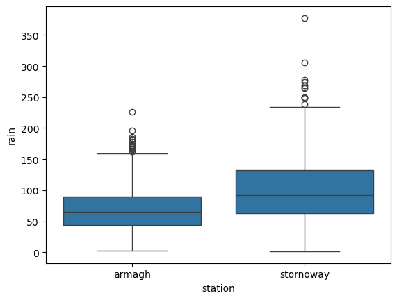
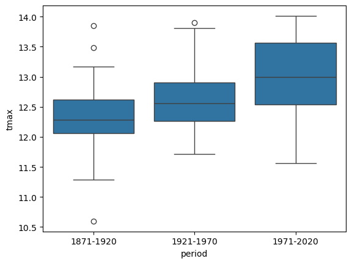

basic statistical analysis using python
========================================

.. note::

    This is a **non-interactive** version of the exercise. If you want to run through the steps yourself and see the
    outputs, you'll need to do one of the following:

    - follow the setup steps and work through the notebook on your own computer
    - open the workshop materials on `binder <https://mybinder.org/v2/gh/iamdonovan/intro-to-python/HEAD>`__ and work
      through them online
    - open a python console, copy the lines of code here, and paste them into the console to run them

In this exercise, we’ll take a look at some basic statistical analysis
with python - starting with using python and ``pandas`` to calculate
descriptive statistics for our datasets, before moving on to look at a
few common examples of hypothesis tests using ``pingouin``.

data
----

The data used in this exercise are the historic meteorological
observations from the `Armagh
Observatory <https://www.metoffice.gov.uk/weather/learn-about/how-forecasts-are-made/observations/recording-observations-for-over-100-years>`__
(1853-present), the Oxford Observatory (1853-present), the Southampton
Observatory (1855-2000), and Stornoway Airport (1873-present),
downloaded from the `UK Met
Office <https://www.metoffice.gov.uk/research/climate/maps-and-data/historic-station-data>`__
that we used in previous exercises. I have copied the
**combined_stations.csv** data into this folder - this is the same file
that you created in the process of working through the “pandas”
exercise.

loading libraries
-----------------

First, we’ll import the various packages that we will be using here:

-  `pandas <https://pandas.pydata.org/>`__, for reading the data from a
   file;
-  `seaborn <https://seaborn.pydata.org/>`__, for plotting the data;
-  `pingouin <https://pingouin-stats.org/>`__, for the statistical tests
   that we’ll use;
-  `pathlib <https://docs.python.org/3/library/pathlib.html>`__, for
   working with filesystem paths.

.. code:: ipython3

    import pandas as pd
    import seaborn as sns
    import pingouin as pg
    from pathlib import Path

Next, we’ll use ``pd.read_csv()`` to load the combined station data.
We’ll also use the ``parse_dates`` argument to tell ``pandas`` to read
the ``date`` column as a date:

.. code:: ipython3

    station_data = pd.read_csv(Path('data', 'combined_stations.csv'), parse_dates=['date'])

descriptive statistics
----------------------

Before diving into statistical tests, we’ll spend a little bit of time
expanding on calculating *descriptive* statistics using ``pandas``. We
have seen a little bit of this already, using ``.groupby()`` and
``.mean()`` to calculate the mean value of ``rain`` for each station.

describing variables using .describe()
~~~~~~~~~~~~~~~~~~~~~~~~~~~~~~~~~~~~~~

First, we’ll have a look at ``.describe()``
(`documentation <https://pandas.pydata.org/pandas-docs/stable/reference/api/pandas.DataFrame.describe.html>`__),
which provides a summary of each of the (numeric) columns in the table:

.. code:: ipython3

    station_data.describe()

In the output above, we can see the count (**count**) minimum (**min**),
1st quartile (**25%**), median (**50%**), mean (**mean**), 3rd quartile
(**75%**), maximum (**max**), and standard deviation (**std**) values of
each numeric variable.

With this, we can quickly see where we might have errors in our data -
for example, if we have non-physical or nonsense values in our
variables. When first getting started with a dataset, it can be a good
idea to check over the dataset using ``.describe()``.

using .describe() to summarize groups
~~~~~~~~~~~~~~~~~~~~~~~~~~~~~~~~~~~~~

What if we wanted to get a summary based on some grouping - for example,
for each station? We could use ``filter()`` to create an object for each
value of ``station``, then call ``summary()`` on each of these objects
in turn.

Not surprisingly, however, there is an easier way, using ``split()``
(`documentation <https://rdrr.io/r/base/split.html>`__) and ``map()``
(`documentation <https://purrr.tidyverse.org/reference/map.html>`__).
First, ``split()`` divides the table into separate tables based on some
grouping:

.. code:: ipython3

    station_data.groupby('station').describe()

On its own, this output isn’t all that readable - the summary statistics
are put into individual columns, which means that the table is very
wide. Let’s see how we can re-arrange this so that we have a ``dict()``
of **DataFrames**, one for each station. First, we’ll assign the output
of ``.describe()`` to a variable, ``group_summary``:

.. code:: ipython3

    group_summary = station_data.groupby('station').describe()

Next, we’ll iterate over the stations to work with each row of the table
in turn. First, though, let’s look at how the column names are
organized:

.. code:: ipython3

    group_summary.columns # show the column names

This is an example of a **MultiIndex**
(`documentation <https://pandas.pydata.org/docs/reference/api/pandas.MultiIndex.html>`__)
- a multi-level index object, similar to what we have seen previously
for rows. Before beginning the ``for`` loop below, we use
``columns.unique()``
(`documentation <https://pandas.pydata.org/docs/reference/api/pandas.Index.unique.html>`__)
to get the unique first-level names from the columns (i.e., the variable
names from the original **DataFrame**).

Inside of the ``for`` loop, we first select the row corresponding to
each station using ``.loc``. Have a look at this line:

.. code:: python

   reshaped = pd.concat([this_summary[ind] for ind in columns], axis=1)

This uses something called `list comprehension <https://docs.python.org/3/tutorial/datastructures.html#list-comprehensions>`__
to quickly create a list of objects. It is effectively the same as
writing something like:

.. code:: python

   out_list = []
   for ind in columns:
       out_list.append(this_summary[ind])

   reshaped = pd.concat(out_list, axis=1)

Using list comprehension helps make the code more concise and readable -
it’s a very handy tool for creating lists with iteration. In addition to
list comprehension, python also has `dict
comprehension <https://docs.python.org/3/tutorial/datastructures.html#dictionaries>`__
- we won’t use this here, but it works in a very similar way to list
comprehension.

Once we have reshaped the row (the **Series**) into a **DataFrame**, we
assign the column names, before using ``.append()`` to add the reshaped
table to a **list**:

.. code:: ipython3

    stations = group_summary.index.unique() # get the unique values of station from the table
    columns = group_summary.columns.unique(level=0) # get the unique names of the columns from the first level (level 0)

    combined_stats = [] # initialize an empty list

    for station in stations:
        this_summary = group_summary.loc[station] # get the row corresponding to this station

        reshaped = pd.concat([this_summary[ind] for ind in columns], axis=1) # use list comprehension to reshape the table
        reshaped.columns = columns # set the column names
        combined_stats.append(reshaped) # add the reshaped table to the list

Finally, we’ll use the built-in function ``zip()`` to get pairs of
station names (from ``station``) and **DataFrame**\ s (from
``combined_stats``), then pass this to ``dict()`` to create a dictionary
of station name/**DataFrame** key/value pairs:

.. code:: ipython3

    summary_dict = dict(zip(stations, combined_stats)) # create a dict of station name, dataframe pairs

To check that this worked, let’s look at the summary data for Oxford:

.. code:: ipython3

    summary_dict['oxford'] # show the summary data for oxford

using built-in functions for descriptive statistics
~~~~~~~~~~~~~~~~~~~~~~~~~~~~~~~~~~~~~~~~~~~~~~~~~~~

This is helpful, but sometimes we want to calculate other descriptive
statistics, or use the values of descriptive statistics in our code.
``pandas`` has a number of built-in functions for this - we have already
seen ``.mean()``
(`documentation <https://pandas.pydata.org/pandas-docs/stable/reference/api/pandas.DataFrame.mean.html>`__),
for calculating the arithmetic mean of each column of a **DataFrame**:

.. code:: ipython3

    station_data.mean(numeric_only=True) # calculate the mean for each numeric column

**Series** objects (columns/rows) also have ``.mean()``
(`documentation <https://pandas.pydata.org/pandas-docs/stable/reference/api/pandas.Series.mean.html>`__):

.. code:: ipython3

    station_data['rain'].mean() # calculate the mean of the rain column

We can calculate the median of the columns of a **DataFrame** (or a
**Series**) using ``.median()``
(`documentation <https://pandas.pydata.org/pandas-docs/stable/reference/api/pandas.DataFrame.median.html>`__):

.. code:: ipython3

    station_data.median(numeric_only=True) # calculate the median of each numeric column

To calculate the variance of the columns of a **DataFrame** (or a
**Series**), use ``.var()``
(`documentation <https://pandas.pydata.org/pandas-docs/stable/reference/api/pandas.DataFrame.var.html>`__):

.. code:: ipython3

    station_data.var(numeric_only=True)

and for the standard deviation, ``.std()``
(`documentation <https://pandas.pydata.org/pandas-docs/stable/reference/api/pandas.DataFrame.std.html>`__):

.. code:: ipython3

    station_data.std(numeric_only=True)

``pandas`` doesn’t have a built-in function for the inter-quartile range
(IQR), but we can easily calculate it ourselves using ``.quantile()``
(`documentation <https://pandas.pydata.org/docs/reference/api/pandas.DataFrame.quantile.html>`__)
to calculte the 3rd quantile and the 1st quantile and subtracting the
outputs:

.. code:: ipython3

    station_data.quantile(0.75, numeric_only=True) - station_data.quantile(0.25, numeric_only=True)

Finally, we can also calculate the sum of each column of a **DataFrame**
(or a **Series**) using ``.sum()``
(`documentation <https://pandas.pydata.org/docs/reference/api/pandas.DataFrame.sum.html>`__):

.. code:: ipython3

    station_data.sum(numeric_only=True)

These are far from the only methods available, but they are some of the
most common. For a full list, check the ``pandas``
`documentation <https://pandas.pydata.org/docs/reference/api/pandas.DataFrame.html>`__
under **Methods**.

with .groupby()
~~~~~~~~~~~~~~~

As we have seen, the output of ``.groupby()`` is a special type of
**DataFrame**, and it inherits almost all of the methods for calculating
summary statistics:

.. code:: ipython3

    station_data.groupby('station').mean(numeric_only=True)

statistical tests
-----------------

In addition to descriptive statistics, we can use python for
*inferential statistics* - for example, for hypothesis testing. In the
remainder of the exercise, we’ll look at a few examples of some common
statistical tests and how to perform these in python, using
``statsmodels``. Please note that these examples are far from exhaustive
- if you’re looking for a specific hypothesis test, there’s a good
chance someone has programmed it into python, either as part of the
``statsmodels`` package
(`documentation <https://www.statsmodels.org/stable/index.html>`__), or
as part of ``scipy.stats``
(`documentation <https://docs.scipy.org/doc/scipy/reference/stats.html>`__),
or as part of an additional package that you can install. You should be
able to find what you need with a quick internet search.

independent samples student’s *t*-test
~~~~~~~~~~~~~~~~~~~~~~~~~~~~~~~~~~~~~~

For a start, let’s test the hypothesis that Stornoway Airport gets more
rain than Armagh. If we first have a look at a box plot:

.. code:: ipython3

    selected = station_data.loc[station_data['station'].isin(['stornoway', 'armagh'])] # select stornoway airport and armagh data

    sns.boxplot(data=selected, x='station', y='rain')

It does look like Stornoway Airport does get more rain, on average, than
Armagh.

To run Student’s *t*-test using ``pingouin``, we use ``pg.ttest()``
(`documentation <https://pingouin-stats.org/build/html/generated/pingouin.ttest.html>`__):

.. code:: ipython3

    armagh_rain = selected.loc[selected['station'] == 'armagh', 'rain'].dropna().sample(n=30) # take a sample of 30 rain observations from armagh
    stornoway_rain = selected.loc[selected['station'] == 'stornoway', 'rain'].dropna().sample(n=30) # take a sample of 30 rain observations from stornoway

    # test whether stornoway_rain.mean() > armagh_rain.mean() at the 99% confidence level
    rain_comp = pg.ttest(stornoway_rain, armagh_rain, alternative='greater', confidence=0.99)

    rain_comp # show the results dataframe

The output of ``pg.ttest()`` is a **DataFrame** that gives us the
following:

-  ``T``: the value of the *t*-statistic;
-  ``dof``: the degrees of freedom;
-  ``alternative``: the hypothesis that was used;
-  ``p-val``: the *p*-value of the *t*-statistic;
-  ``CI{confidence}%``: the confidence interval for the chosen
   significance level;
-  ``cohen-d``: Cohen’s d effect size;
-  ``BF10``: the Bayes Factor of the alternative hypothesis;
-  ``power``: the achieved power of the test

Now, let’s look at an example of a one-sample *t*-test, to see if we can
determine whether the mean of a small sample of summer temperatures
provides a good estimate of the mean of all summer temperatures measured
at Oxford.

First, we’ll select all of the summer values of ``tmax`` recorded at
Oxford, then calculate the mean value of these temperatures:

.. code:: ipython3

    oxford_summer_tmax = station_data.query('station == "oxford" & season == "summer"')['tmax']

    print(f"Oxford Mean Summer Tmax: {oxford_summer_tmax.mean():.1f}")

So the mean summer temperature measured in Oxford between 1853-2022 is
21.1°C - now, let’s take a random sample of 30 temperatures using
``.sample()``:

.. code:: ipython3

    sample_tmax = oxford_summer_tmax.sample(n=30) # select a random sample of 30 values

Once again, we use ``pg.ttest()`` to conduct the test. Because
``oxford_summer_tmax`` is a single value, the function knows that this
is a one-sample test:

.. code:: ipython3

    # test whether sample_tmax.mean() is not equal to oxford_summer_tmax at the 95% confidence level
    tmax_comp = pg.ttest(sample_tmax, oxford_summer_tmax, alternative='two-sided', confidence=0.95)

    tmax_comp # show the results dataframe

Based on this, we can’t conclude that our sample mean is significantly
different from the mean of all of the summer values of ``tmax`` recorded
at Oxford.

non-parametric tests
~~~~~~~~~~~~~~~~~~~~

We can also conduct non-parametric hypothesis tests using ``pingouin``.
The example we will look at is the one- or two-sample Wilcoxon tests,
using ``pg.wilcoxon()``
(`documentation <https://pingouin-stats.org/build/html/generated/pingouin.wilcoxon.html>`__).
Let’s start by looking at the Wilcoxon Rank Sum test, which is analogous
to the independent sample *t*-test. For this, we’ll use the same data
that we did before, again testing whether Stornoway Airport gets more
rainfall, on average, than Armagh:

.. code:: ipython3

    # test whether mean(stornoway.rain) > mean(armagh.rain)
    pg.wilcoxon(stornoway_rain, armagh_rain, alternative='greater')

The output table has the following columns:

-  ``W-val``: the W-statistic of the test;
-  ``alternative``: the alternative hypothesis uesd;
-  ``p-val``: the *p*-value of the W-statistic;
-  ``RBC``: the matched pairs rank-biserial correlation (i.e., the
   effect size);
-  ``CLES``: the common language effect size.

From this, we can again conclude that Stornoway Airport does get more
rainfall, on average, than Armagh.

analysis of variance
~~~~~~~~~~~~~~~~~~~~

Finally, we’ll see how we can set up and interpret an analysis of
variance test. In this example, we’ll only look at data from Armagh,
Oxford, and Stornoway Airport, because the Southampton time series ends
in 1999. We’ll first calculate the annually-averaged values of the
meteorological variables, using ``.groupby()`` and ``.mean()``:

.. code:: ipython3

    annual_average = station_data.loc[station_data['station'].isin(['armagh', 'oxford', 'stornoway'])] \
        .groupby('year') \
        .mean(numeric_only=True)

Then, we’ll add a new variable, ``period``, to divide the observations
into three different 50-year periods: 1871-1920, 1921-1970, and
1971-2020. To do this, we’ll use ``pd.cut()`` (`documentation
<https://pandas.pydata.org/pandas-docs/stable/reference/api/pandas.cut.html>`__). To
do this, we first have to define the labels (``periods``) and category
boundaries (``bins``). Then, we use ``.dropna()`` to remove any rows
where ``period`` has a ``NaN`` value (i.e., is outside of the range
1871-2020):

.. code:: ipython3

    periods = ['1871-1920', '1921-1970', '1971-2020'] # make a list of period names
    bins = [1870, 1920, 1970, 2020] # make a list of period boundaries - must be 1 longer than the names

    annual_average['period'] = pd.cut(annual_average.index, bins, labels=periods) # assign a value to period, using the boundaries and labels above

    annual_average.dropna(subset=['period'], inplace=True) # drop any rows where period is NaN

    annual_average # show the dataframe

Before running the test, let’s make a box plot that shows the
distribution of ``tmax`` values among the three periods:

.. code:: ipython3

    sns.boxplot(data=annual_average, x='period', y='tmax') # make a box plot of tmax, grouped by period

From this, it certainly appears as though there is a difference in the
mean value of ``tmax`` between the three periods. To formally test this,
we’ll use ``aov()``
(`documentation <https://rdrr.io/r/stats/aov.html>`__).

To run the one-way ANOVA test, we use ``pg.anova()``
(`documentation <https://pingouin-stats.org/build/html/generated/pingouin.anova.html>`__).
Using this, we can pass our ``annual_average`` **DataFrame** using the
``data`` argument, and specify ``tmax`` as the dependent variable
(``dv``), and ``period`` as the grouping variable (``between``). We’ll
also look at the detailed test output (``detailed=True``):

.. code:: ipython3

    aov = pg.anova(dv='tmax', between='period', data=annual_average, detailed=True) # run one-way anova for differences of tmax between periods

    aov.round(3) # round the output to 3 decimal places

The table output has the following columns across two rows:

-  ``Source``: the factor names;
-  ``SS``: the sums of squares;
-  ``DF``: the degrees of freedom;
-  ``MS``: the mean squares;
-  ``F``: the value of the *F*-statistic;
-  ``p-unc``: the uncorrected *p*-values;
-  ``np2``: the partial eta-square effect sizes

From the table, we can see that there are significant differences
between the groups at the 99.9% significance level.

This doesn’t tell us which pairs of groups are different - for this, we
would need to run an additional test. As one example, we can use
``pg.pairwise_tukey()``
(`documentation <https://pingouin-stats.org/build/html/generated/pingouin.pairwise_tukey.html>`__)
to compute “Tukey’s Honest Significant Difference” between each pair of
groups:

.. code:: ipython3

    tmax_mc = pg.pairwise_tukey(dv='tmax', between='period', data=annual_average) # run the pairwise tukey HSD post-hoc test

    tmax_mc.round(3) # round the output to 3 decimal places

From this, we can see the estimated difference in the means for each
pair of groups (shown in ``A`` and ``B``); the estimated mean of each
group; the estimated difference between the mean of each group
(``diff``); the standard error of the estimate (``se``); the
*t*-statistic of the estimated difference (``T``); the corrected
*p*-value of the *t*-statistic (``p-tukey``), and the effect size (by
default, Hedges).

Using this, we can clude that, at the 99% significance level, there is a
significant difference in ``tmax`` between the periods 1971-2020 and
1871-2020, and between the periods 1971-2020 and 1921-1970.

exercise and next steps
-----------------------

That’s all for this exercise. To help practice your skills, try at least
one of the following:

-  Set up and run an AOV test to compare annual total rainfall at all
   four stations, using data from all avaialable years. Are there
   significant differences between the stations? Use
   ``pg.pairwise_tukey()`` or ``pg.pairwise_tests()``
   (`documentation <https://pingouin-stats.org/build/html/generated/pingouin.pairwise_tests.html>`__)
   to investigate further.
-  Using only observations from Armagh, set up and run a test to see if
   there are significant differences in rainfall based on the season.
-  Using only observations from Oxford, is there a significant
   difference between the values of ``tmax`` in the spring and the
   autumn at the 99.9% confidence level?
-  Using only observations from Stornoway Airport, is the value of
   ``tmin`` significantly lower in the winter, compared to the autumn?
