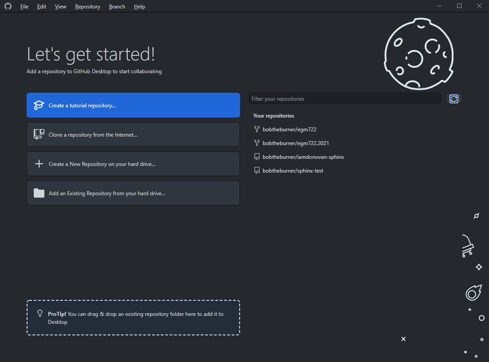
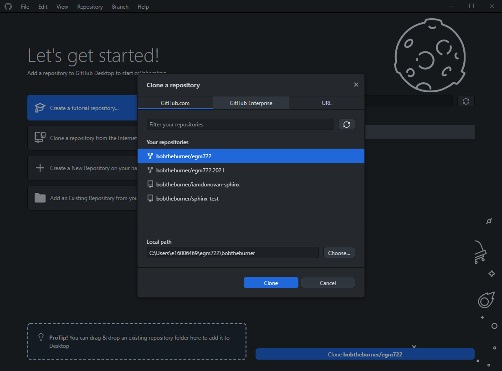
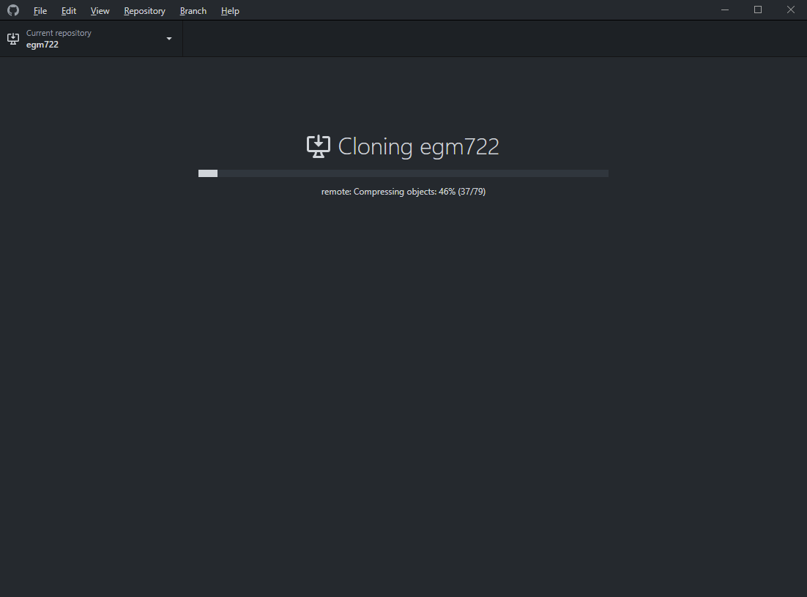
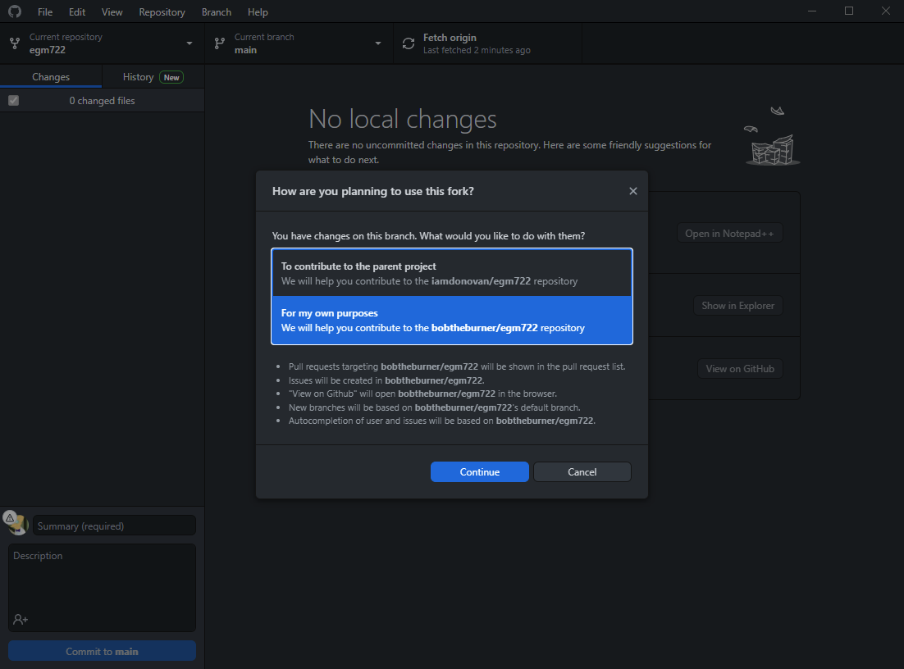

cloning the repository
=======================

.. note::

    On this page, there are instructions for two ways to clone the repository: using the **git** command-line interface,
    and using **GitHub Desktop**.

    Choose **ONE** of the two ways to clone the repository - you do not need to clone it twice.

git command-line interface
---------------------------

Open a **Command Prompt**, then navigate to the folder where you want to clone the repository using ``cd``:

.. code-block:: text

    cd c:\Users\bob\projects

Now, enter the following command:

.. code-block:: text

    git clone https://github.com/your_username/intro-to-python.git

.. warning::

    Remember to replace ``your_username`` with your GitHub username!

You should see something like the following output on the screen:

.. image:: img/cli_clone.png
    :width: 720
    :align: center
    :alt: the repository being cloned to the local computer in the command prompt

|br| Now that you've cloned the repository, you can move on to the next step: :doc:`setting up conda<conda>`

github desktop
---------------

Once you have :doc:`forked<fork>` the repository, you can **clone** (download) your fork to your computer. This will
take a copy of the repository that's saved on **GitHub**, and create a local version on your computer.

To do this, first open **GitHub Desktop** if it isn't open already. You should see something like this (if you haven't,
you may need to login to your **GitHub** account - see :doc:`here<desktop>` for instructions):

|br| You should also see your repository listed under **Your repositories**. Click on
**Clone a repository from the Internet**, and you should see your forked version of the **intro-to-python** repository
(it will be listed as :samp:`<{your_github_username}>/intro-to-python`):

|br| Select a local path to save the repository to, and make a note of the location (you'll need it for all of the
practicals in the module!).

Select **Clone**, and you should see the following:

|br| Finally, you'll see the following:

|br| This is asking you what your purpose is with the repository - whether you want to develop your own version, or if
you plan to contribute to the **upstream** fork. For this module, you won't be contributing to the **upstream** fork
(at least, not regularly), so choose **For my own purposes**, then continue.

Now that you've cloned the repository, you can move on to the next step: :doc:`setting up conda<conda>`

