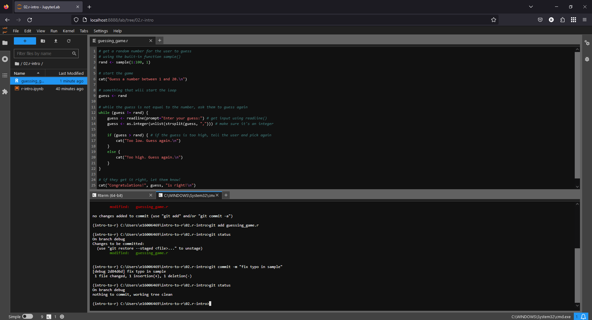

debugging code
==================

In this exercise, we'll get some practice running a "buggy" script and interpreting/fixing the errors that we find. We
will also continue using **git** to keep track of and save our fixes.

getting started
---------------

To begin, open an **Anaconda Command Prompt** with your ``intro-to-r`` environment active, then launch **JupyterLab**.

In the file browser along the left-hand side of the window, navigate to the guessing game script (in the **02.r-intro**
folder). Open the script (**guessing_game.r**) by double-clicking it in the file browser:

|br| Next, open a **Terminal** from the **Launcher**. If you click on the tab, you can drag it to re-arrange the
panels - place it in the lower half of the window, so that it looks like this:

creating a new branch
----------------------

Now, open a second terminal next to the first by clicking the **+** button, then selecting **Terminal** from the
**Launcher**.

Before we start editing the script, we're going to create a new **branch** in our repository. This allows us to make
changes to the repository without affecting other versions of the code - that way, if we somehow make a mistake, we
don't cause any damage to the existing, working code. Once we have finished making our changes, and we're happy that
things are working as they should be, we can **merge** the branch back into the **main** branch.

In the terminal, type the following command:

.. code-block:: text

    git checkout -b debug

This uses **git checkout** to create a new **branch** (the ``-b`` flag) called ``debug``. As we fix the errors in the
script, we will commit the changes to this branch.

running the script
--------------------

In the first terminal window that you opened, launch **R** by typing ``R`` at the prompt and pressing **Enter**:

.. image:: img/debug/r_open.png
    :width: 720
    :align: center
    :alt: the guessing game script opened, with two terminal panels opened on the lower half of the window

|br| In the previous exercise, you got some experience running **R** commands through a jupyter notebook, where each
cell contains snippets of code for the **R** interpreter to *execute* (run).

The **R** terminal that you have opened works in much the same way - you can type individual commands or lines of code,
and the interpreter will execute them.

This is not necessarily the ideal way to run code, however - for one thing, it would be a lot of typing every time we
wanted to do any analysis. It's also a lot less reproducible - by having to enter each command individually each time,
we greatly increase the chances that we'll make a mistake.

A *script* is a collection of commands that the interpreter runs sequentially (a *program*). This means that we can
write down our commands in one place, and repeatedly run them in exactly the same way.

From inside the **R** interpreter, we can run a script using the ``source()`` function
(`documentation <https://www.rdocumentation.org/packages/base/versions/3.6.2/topics/source>`__). The first argument to
the function is ``file``, the pathname or URL for the file to read from.

To run the guessing game script, enter the following at the **R** prompt:

.. code-block:: R

    source('guessing_game.r')

error messages
----------------

When you run the script, you should see the following:

.. image:: img/debug/first_error.png
    :width: 720
    :align: center
    :alt: the R terminal with an error message after running the script

|br| The error message says:

.. code-block:: text

    Error in smaple(1:100, 1) : could not find function "smaple"

This is an example of a **syntax error** - an error in the "grammar" (*syntax*) of the programming language that the
interpreter doesn't understand. The error in this case is that there is a typo in ``sample()`` - when the interpreter
executes this statement, it looks for a function called ``smaple()`` - when it doesn't find any such function, it
returns an error message.

We can easily fix this error by correcting the spelling of the function name. Later, we'll see some examples of error
messages that aren't necessarily so easily corrected.

using git diff to view changes
-------------------------------

Now that you have corrected the error at line 3, **save** the file (**CTRL** + **S**) to update the file on the disk.
We also want to use **git** to keep track of this fix. To do this, open the other terminal tab, then enter the
following:

.. code-block:: text

    git status

This command shows us what files have been changed - you should see that only a single file has been changed
(**guessing_game.r**).

We can also use **git diff** to see what changes have been made since the last commit. By itself, **git diff** will
tell us the changes for *all* files in the repository; we can also choose a single file:

.. code-block:: text

    git diff guessing_game.r

This should show you that a single line has changed. First, the line:

.. code-block:: R

    rand <- smaple(1:100, 1)

has been deleted, and the line:

.. code-block:: R

    rand <- sample(1:100, 1)

has been added in its place. Later, we'll also see how we can use **git diff** to compare versions of a file across
two different branches, to see what changes (if any) have been made.

committing changes
--------------------

For now, though, we want to **commit** these changes so that **git** saves a snapshot of our progress. To do this,
remember that we first have to **add** to "stage" it, then **commit** the file to take the snapshot. In the terminal,
type:

.. code-block:: text

    git add guessing_game.r

If you type **git status**, you should see that the files that have been staged show up as green:

|br| To actually commit this change, we use **git commit**. By default, if you type **git commit**, **git** will open
your default text editor so that you can write a more detailed commit message. Most of the time, though, we can
use the **-m** (for **message**) flag to write a short message. Enter the following command at the terminal to commit
the change:

.. code-block:: text

    git commit -m "fix typo in sample"

**git** provides a brief summary of the commit (1 file changed, 1 insertion, 1 deletion), as well as a short version of
the *commit hash* (the unique identifier for the commit; in the screenshot below, it is ``2d84d6d``).

When you type **git status** in the terminal, you should now see that there are no changes to commit:

semantic errors
----------------

Now that you have fixed the first error, return to the **R** terminal, then re-run the script. You should see that the
script now runs with no errors:

|br| This does not mean that the script has run correctly, however. Right away, we can see at least one problem: the
script asks us to guess a number between 1 and 20, but the "correct" answer is 71 - way outside of the range we're
meant to guess!

Not only this, but we don't even have a chance to guess - as soon as the script starts running, it tells us the correct
answer and finishes.

These are examples of *semantic* errors - no error message is produced by the interpreter, but the program still doesn't
do what you expected. Unfortunately, these are the hardest errors to fix, because they fail in subtle ways.

Let's start with fixing the first obvious error - when we generate a random sample at line 3, we choose a number
between 1 and 100:

.. code-block:: R

    rand <- sample(1:100, 1)

This is why the number to guess was well outside of the range of 1 to 20. To fix this, we can change ``1:100`` to
``1:20``.

Once you have fixed this error, remember to **add** the change, then **commit** it with an appropriate error message.

The next error, the one that causes the program to completely skip the **while** loop, is a bit subtler. Note that at
line 9, we initialize the ``guess`` object by assigning the value of ``rand``. But, the condition for the **while**
loop at line 12 is that ``guess != rand`` - because ``guess`` has the value of ``rand``, this statement is ``FALSE``,
and so the **while** loop is skipped.

To fix this, assign a value to ``guess`` that is outside of the guessing range (for example, ``-1``), then **add**
and **commit** the change with an appropriate commit message.

When you run the script again, you should notice that you are able to enter a guess at the command line, but you should
also notice an additional pair of semantic errors. Once you have identified these and fixed them, test out the script -
does it work correctly? If so, move on to the next section.

merging branches
-----------------

Now that we have successfully squashed the bugs present in the script, we are ready to **merge** the fix into our
**main** branch.

In the **terminal** window where you've been working with **git**, enter the following command:

.. code-block:: text

    git checkout main

This will **checkout** the ``main`` branch - you may notice that the script changes. Don't panic! Remember that **git**
has saved all of the changes, even though the file on the disk has changed. Now that you are on the main branch, you
can use **git merge** (`documentation <https://git-scm.com/docs/git-merge>`__) to **merge** all of the changes on the
``debug`` branch into the ``main`` branch, with the following command:

.. code-block:: text

    git merge debug

You should see something like the following output:

.. image:: img/debug/merged.png
    :width: 720
    :align: center
    :alt: the corrected script, now merged back into the main branch

And that's it! If you like, you can now delete the ``debug`` branch using the following command:

.. code-block:: text

    git branch -d debug

You can also use **git push** to send these changes to your remote (GitHub) repository, which ensures that you have
backed up a copy to a remote location.

That's all for this exercise - in the next session, we'll take a look at how we can use **ggplot2** to display data.
