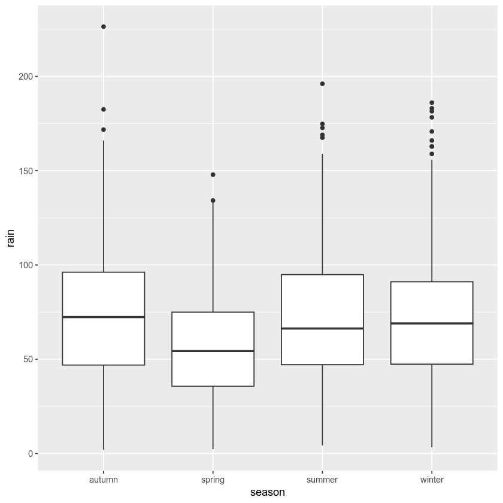
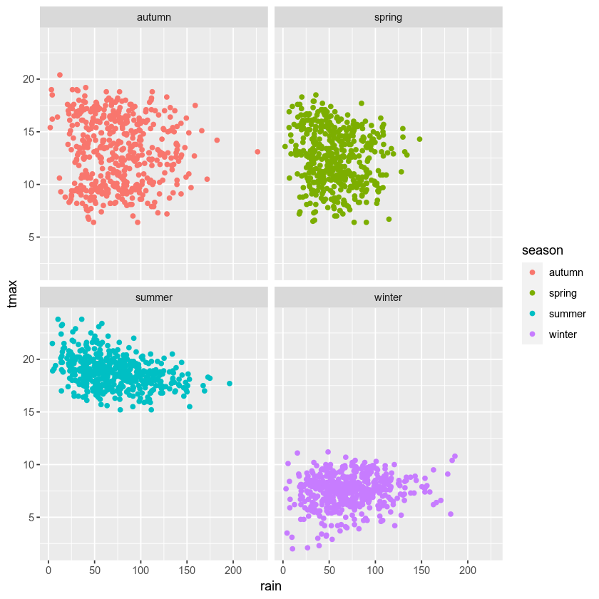
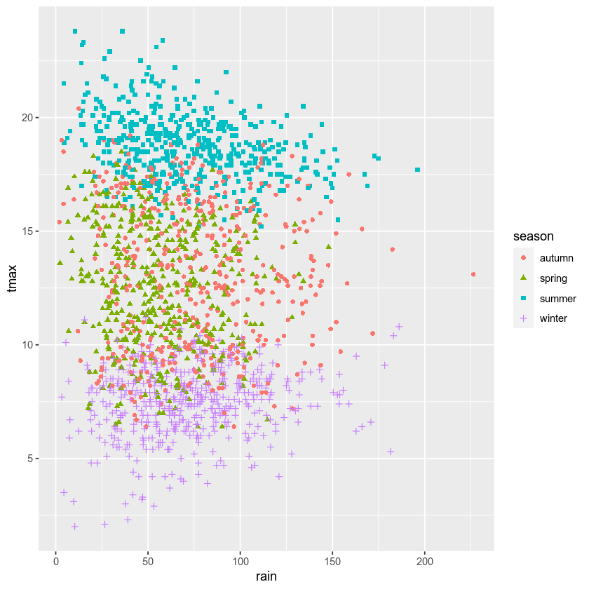

plotting data using ggplot2
=============================

.. note::

    This is a **non-interactive** version of the exercise. If you want to run through the steps yourself and see the
    outputs, you'll need to follow the setup steps and work through the notebook on your own computer.

In this exercsise, we’re going to investigate how temperature has
changed over time, using monthly observations from the Armagh
Observatory. By the end of this exercise, you will:

-  be able to load additional libraries in **R**
-  load data from a file
-  add variables to a table
-  create **date** objects from character strings
-  recode values in a table
-  select data from a table using logical expressions
-  create scatter plots (with smoothing lines)
-  create histograms (+ smoothed histograms)
-  save plots to a file

data
----

The data used in this exercise are the historic meteorological
observations from the `Armagh
Observatory <https://www.metoffice.gov.uk/weather/learn-about/how-forecasts-are-made/observations/recording-observations-for-over-100-years>`__,
downloaded from the `UK Met
Office <https://www.metoffice.gov.uk/research/climate/maps-and-data/historic-station-data>`__.

To make the data slightly easier to work with, I have done the
following:

- Removed the header on lines 1-5
- Replaced multiple spaces with a single space, and replaced single spaces with a comma (``,``)
- Removed ``---`` to indicate no data, leaving these fields blank
- Removed ``*`` indicating provisional/estimated values
- Removed the 2023 data
- Renamed the file ``armaghdata.csv``.

If you wish to use your own data (and there are loads of stations
available!), please feel free. For the best experience, you will likely
need to repeat the steps indicated above.

loading libraries
-----------------

Before getting started, we need to load the libraries we will use in the
exercise. We will be using three libraries:

- `readr <https://readr.tidyverse.org/>`__, for reading the data from a file;
- `ggplot2 <https://ggplot2.tidyverse.org/>`__, for plotting the data;
- and `dplyr <https://dplyr.tidyverse.org/>`__, for transforming/manipulating (read: “analyzing” or “working with”, not
  “fabricating”!) the data.

To do this, we use the ``library()`` function
(`documentation <https://devdocs.io/r/library/base/html/library>`__),
followed by the name of the package:

.. code:: r

    library(readr) # this loads the functions we'll use to load the data
    library(ggplot2) # this loads the functions, etc. needed for us to plot
    library(dplyr) # this loads the functions, etc. needed for us to work with the data

Note the message that pops up once you run this cell:

.. code:: r

   Attaching package: ‘dplyr’

   The following objects are masked from ‘package:stats’:

       filter, lag

   The following objects are masked from ‘package:base’:

       intersect, setdiff, setequal, union

When we load the ``dplyr`` package, a number of the functions provided
by that package have the same name as functions in other packages. This
means that when we call, for example, ``filter()``, it will use the
function provided by ``dplyr``, rather than the one provided by
``stats``. If we still want to use the function provided by ``stats``,
we have to explicitly tell **R** this, by using the full name,
``stats::filter()``.

loading the data
----------------

Now, we are finally ready to load the data file, using ``read_csv()``
(`documentation <https://readr.tidyverse.org/reference/read_delim.html>`__),
a function provided by the ``readr`` package:

.. code:: r

    armagh <- read_csv('data/armaghdata.csv')

When we load the file using ``read_csv()``, it shows us a summary of the
data: the number of rows and columns, the **delimiter** used (``,``,
since it’s a comma-separated variable file), and the type of each of the
columns, along with the column names.

To view a summary of the data, we’ll use the built-in ``print()``
function. Because this object is not actually a **data.frame**, it’s a
**tibble** (`documentation <https://tibble.tidyverse.org/>`__), we only
see the first 10 rows this way:

.. code:: r

    print(armagh)

From this, we can see that there are 7 columns (and 2040 rows) in the
**tibble**:

-  ``yyyy``, a **double** representing the year of the observation
-  ``mm``, a **double** representing the month of the observation
-  ``tmax``, a **double** representing the maximum observed temperature
   in the month (in °C)
-  ``tmax``, a **double** representing the minimum observed temperature
   in the month (in °C)
-  ``af``, a **double** representing the days of air frost in the month
-  ``rain``, a **double** representing the total precipitation in the
   month (in mm)
-  ``sun``, a **double** representing the total number of hours of
   sunlight in the month

We can also see that only the ``rain`` variable has values back to 1853
- missing values are indicated by ``NA``, which means “Not Available” -
i.e., missing.

adding variables to the table
-----------------------------

Before moving on, let’s see how we can add additional variables to the
table, starting with the date. This will make it easier for us to plot
and analyze the time series of observations.

combining strings
~~~~~~~~~~~~~~~~~

To do this, we can first use the ``paste()``
(`documentation <https://www.rdocumentation.org/packages/base/versions/3.6.2/topics/paste>`__)
function, which *concatenates* strings or characters together. We’ll use
``armagh$yyyy`` and ``armagh$mm`` for the year and month, respectively,
and we’ll arbitrarily choose the first of the month:

.. code:: r

       paste(armagh$yyyy, armagh$mm, "1", sep="/")

For the first row (yyyy=1853, mm=1), the string representation will be
``1853/1/1`` for 1 January 1853; the second row will be ``1853/2/1`` for
1 February 1853, and so on:

.. code:: r

    paste(armagh$yyyy, armagh$mm, "1", sep="/")

a note about dates
~~~~~~~~~~~~~~~~~~

But, we don’t actually want to represent these as strings. Instead, we
want them to be represented as a **date** object so that they display
properly when we plot them, and because we may want to do calculations
using the date/time.

For this, we use the built-in ``as.Date()``
(`documentation <https://devdocs.io/r/library/base/html/as.date>`__)
function. The arguments to this function that we will use are:

-  ``x``, the object that you want to convert to a date representative
-  ``format``, the way that the dates in the object are formatted (for
   more on this, see the
   `strptime <https://devdocs.io/r/library/base/html/strptime>`__
   function)

From above, our dates are formatted as follows:

-  year with century (represented as ``%Y``)
-  month as decimal number (represented as ``%m``)
-  day as decimal number (represented as ``%d``)

We used ``/`` to separate the year, month, and day, which means that the
format we have is ``%Y/%m/%d``. To add this to the table, we can assign
the output of ``as.Date`` to a new column, ``date``, using
``armagh$date``:

.. code:: r

    # assign the output of as.Date to a new column, date, in the armagh object:
    armagh$date <- as.Date(paste(armagh$yyyy, armagh$mm, "1", sep="/"), format="%Y/%m/%d")

    print(armagh) # show the output

From the output above, you can see that we have added a new column to
the table (``date``), which has the type **date**.

calculating a new variable
--------------------------

One thing we might be interested in doing is aggregating our
observations by meteorological season, rather than just by month or
year. To help us with this, we can calculate a new variable, ``season``,
and assign it values based on whether the month is part of the
meteorological spring (March, April, May), summer (June, July, August),
autumn (September, October, November), or winter (December, January,
February).

Another way to look at this is by thinking of these as
``if ... then ... else`` statements:

-  **if** month is 1, 2, or 12, **then** ``season`` is “winter”
-  **if** month is 3, 4, or 5, **then** ``season`` is “spring”
-  **if** month is 6, 7, or 8, **then** ``season`` is “summer”
-  **if** month is 9, 10, or 11, **then** ``season`` is “autumn”

First, let’s remember how we can select rows from a table using a
**conditional** statement. For example, if we want to select all rows
where the value in the ``mm`` column is 1, 2, or 12, we could write:

.. code:: r

    armagh[armagh$mm < 3 | armagh$mm == 12, ]

As you can see, this selects a total of 510 rows from the table,
wherever the value in the ``mm`` column is 1 or 2 (``< 3``), or 12.

Here, we’ve used the ``|`` (“pipe” or “logical or”) operator to combine
two conditional statements: it returns ``TRUE`` wherever
``armagh$mm < 3`` **OR** wherever ``armagh$mm == 12``. However, we can
also use the ``%in%`` operator to write this a bit more compactly, by
first creating a **vector** with the values that we want. We then use
the ``%in%`` operator, which returns ``TRUE`` anywhere a value of
``armagh$mm`` is equal to a value in the comparison **vector**:

.. code:: r

    armagh[armagh$mm %in% c(1, 2, 12), ] # select from the table based on whether values are in the vector c(1, 2, 12)

We could then write 4 separate statements to assign values in the table:

.. code:: r

       armagh[armagh$mm %in% c(1, 2, 12), 'season'] <- 'winter'
       armagh[armagh$mm %in% 3:5, 'season'] <- 'spring'

… and so on.

Instead, we’ll look at an easier way to accomplish the same thing, using
``case_when()``
(`documentation <https://dplyr.tidyverse.org/reference/case_when.html>`__).
This allows us to combine the multiple ``if...else`` statements into a
single function call:

.. code:: r

    armagh$season <- case_when(
        armagh$mm %in% c(1, 2, 12) ~ 'winter', # if month is 1, 2, or 12, set it to winter
        armagh$mm %in% 3:5 ~ 'spring', # if month is 3, 4, 5, set it to spring
        armagh$mm %in% 6:8 ~ 'summer', # if month is 6, 7, 8, set it to summer
        armagh$mm %in% 9:11 ~ 'autumn', # if month is 9, 10, 11, set it to autumn
    )

    print(armagh) # show the updated table

We’ll come back to selecting rows in the table later, when we want to
select a single season to look at. For now, we’ll move on to plotting
our data.

plotting data
-------------

To plot data, we’ll use ``ggplot2``, a popular and versatile system for
making graphics. It uses the **grammar of graphics** (the **gg** in
``ggplot2``), which is a single coherent system for building and
describing graphs.

example: scatter plot
~~~~~~~~~~~~~~~~~~~~~

In this exercise, we will look at a number of different example plots
using our data, starting with a simple scatter plot, and introducing the
different building blocks of ``ggplot2``.

We begin with the function ``ggplot()``
(`documentation <https://ggplot2.tidyverse.org/reference/ggplot.html>`__),
which creates a plot object. We want to use the ``armagh`` data that we
have worked with so far, so we can call ``ggplot`` like this:

.. code:: r

    ggplot(data=armagh)

.. image:: plotting_files/plotting_17_0.png
   :width: 420px
   :height: 420px

We have not yet told ``ggplot`` how to visualize the data, so the object
is currently a blank canvas. In order to visualize our data, we need to
add some **layers**.

To do this, we first need tell ``ggplot`` how these variables are
**mapped** to the visual properties (“**aesthetics**”) of the plot,
using the ``mapping`` argument, and the ``aes()`` function
(`documentation <https://ggplot2.tidyverse.org/reference/aes.html>`__).
Because we want the plot to show how the monthly mean maximum
temperature has changed over time, we want the ``date`` variable to
display on the ``x`` axis, and the ``tmax`` variable to display on the
``y`` axis:

.. code:: r

    ggplot(data=armagh,
           mapping=aes(x=date, y=tmax))

.. image:: plotting_files/plotting_19_0.png
   :width: 420px
   :height: 420px

When we add the mappings, you can see that the axes labels have been
added (**tmax** and **date**) and the axes limits have been set based on
the dataset, but we still haven’t displayed the data. This is because we
have to add a **geom** (geometry): the actual geometrical object that
plots the data.

Some examples of different **geom**\ s are:

-  ``geom_line()`` - for line plots
-  ``geom_point()`` - for scatter plots
-  ``geom_bar()`` - for bar charts
-  ``geom_boxplot()`` - for boxplots

… and so on. For a complete list of available **geom**\ s, check the
`reference list <https://ggplot2.tidyverse.org/reference/#layers>`__.

We’ll look at a few more of these examples later, but since we’re
starting with a scatter plot (``geom_point()``), we’ll add that to our
plot using the ``+`` operator:

.. code:: r

    ggplot(data=armagh,
           mapping=aes(x=date, y=tmax)) +
        geom_point()

And voilà! A (very) simple scatterplot, showing the value of ``tmax``
over time.

Over the rest of the exercise, we will see how we can continue to
customize this, by adding colors, customizing the labels, changing the
font sizes, and so on.

example: basic histogram
------------------------

Now, let’s look at another type of plot: a histogram.

Note that as far as **R** is concerned, this:

.. code:: r

       ggplot(data=armagh, mapping=aes(x=date, y=tmax))

Is the same as this:

.. code:: r

       ggplot(armagh, aes(x=date, y=tmax))

That is, the ``data`` and ``mapping`` arguments can be specified by
**keyword**, or by **position** (``data`` first, then ``mapping``). To
help keep this clear, we’ll continue using the keyword arguments for
``ggplot()``, but you will most likely see examples online (or even in
this workshop) where the positional arguments are used instead.

To create a histogram, we need to specify the ``x`` variable - we’re
still looking at ``tmax``, so we’ll specify that here. Because we’re
trying to plot a histogram, we add ``geom_histogram()`` to this:

.. code:: r

    ggplot(data=armagh, mapping=aes(x=tmax)) +
      geom_histogram()

Note the message displayed here:

::

       `stat_bin()` using `bins = 30`. Pick better value with `binwidth`.

When we add the histogram **geom**, we can also specify the
``binwidth``, which sets the size of the histogram bins in the same
units as the variable (in this case, °C), or the number of ``bins`` (the
default value is 30).

Go ahead and change the cell above so that the plot uses a ``binwidth``
of 1 - how much does this change the plot?

In the plot above, you can see how ``tmax`` is distributed, with several
apparent peaks around 8°C, 14°C, and 18°C. Presumably, these would be
peaks that roughly correspond to winter, spring/autumn, and summer,
respectively - let’s change the plot slightly so that we can see if this
is correct.

To do this, we can use the ``color`` keyword argument to ``aes()``. Note
that any of the aesthetic mappings that we include in the original
``ggplot()`` call (at the *global* level) will be passed down to the
**geom** layers in the plot. We can also use mappings at the *local*
level, defining them for each individual layer.

Note also that this argument only tells ``ggplot`` what variable to use
for grouping and coloring the data - we can’t use this to, say, change
all of the bars from gray to blue (for that, we use the ``fill`` keyword
argument to the **geom** we are using):

.. code:: r

    ggplot(data=armagh, mapping=aes(x=tmax, color=season)) + # define the color mapping at the global level
        geom_histogram(binwidth=1, linewidth=2, fill='white') # add a histogram with bins of width 1, thick lines, and white bars

With this plot, we can see how the total distribution of the dataset is
made up of each group - as we had suspected, the peaks on either side
primarily correspond to winter (the purple color) and summer (cyan),
while the peak in the middle is a combination of spring (green) and
autumn (salmon).

While this nicely shows us the breakdown for the distribution of the
entire dataset, and especially for summer and winter, it’s a little bit
harder to see the distribution for spring and autumn, since they’re
stacked on top of the other seasons. If we want to show each
distribution individually, we can use the ``position`` argument. By
default,this is set to ``'stack'``, but if we change it to
``'identity'``, the bars are overlapping (note also that I have used the
``alpha`` argument to make the bars transparent):

.. code:: r

    ggplot(data=armagh, mapping=aes(x=tmax, color=season, fill=season)) + # define the color and fill mapping at the global level
      geom_histogram(binwidth=1, linewidth=2, alpha=0.4, position='identity') # add a histogram with bins of width 1, thick lines, and white bars

.. image:: plotting_files/plotting_27_1.png
   :width: 420px
   :height: 420px

example: density plot
~~~~~~~~~~~~~~~~~~~~~

We can also plot the density distribution of the data, a smoothed
version of the histogram, using ``geom_density()``
(`documentation <https://ggplot2.tidyverse.org/reference/geom_density.html>`__):

.. code:: r

    ggplot(data=armagh, mapping=aes(x=tmax, color=season, fill=season)) + # create a plot with tmax on the x-axis, colored by season
      geom_density(alpha=0.4, linewidth=1) # add a density plot with transparency of 0.4 and lines of width 1

example: box plots
~~~~~~~~~~~~~~~~~~

To make a box plot, we use ``geom_boxplot()``:

.. code:: r

    ggplot(data=armagh, mapping=aes(x=season, y=rain)) +
      geom_boxplot()

facet wrapping
--------------

We might also want to plot our data using different subplots, or
**facets**. For example, we can create a scatter plot of ``tmax`` vs
``rain``, colored by season:

.. code:: r

    ggplot(data=armagh, mapping=aes(x=rain, y=tmax, color=season)) + # plot tmax vs rain, colored by season
        geom_point() # plot a point cloud

.. image:: plotting_files/plotting_33_1.png
   :width: 420px
   :height: 420px

But, this makes it difficult to see the scatter for each season. To
split this into a single subplot for each season, we use
``facet_wrap()``
(`documentation <https://ggplot2.tidyverse.org/reference/facet_wrap.html>`__):

.. code:: r

    ggplot(data=armagh, mapping=aes(x=rain, y=tmax, color=season)) + # plot tmax vs rain, colored by season
        geom_point() + # plot a point cloud
        facet_wrap(~season) # use facet_wrap to make a subplot for each season

cleaning up and saving the plot to a file
-----------------------------------------

In the final example, we’ll make a plot showing the relationship between
``rain`` and ``tmax``, colored by the ``season``. We’ll also see how we
can change the axes labels, and increase font sizes, to help make our
plot ready for including in a manuscript or presentation.

First, let’s make the initial scatter plot:

.. code:: r

    ggplot(data=armagh, mapping=aes(x=rain, y=tmax, color=season)) + # create a plot of tmax vs rain
        geom_point() # make a scatter plot

Most of the time, though, we don’t just want to rely on color for
differentiating between groups - different people perceive color
differently, or someone might view our plots printed onto
black-and-white paper. By using the ``shape`` argument to ``aes()``, as
well as ``color``, we can be more sure that our plot can be
understandable:

.. code:: r

    ggplot(data=armagh, mapping=aes(x=rain, y=tmax)) + # create a plot of tmax vs rain, with no color mapping at the global level
        geom_point(mapping=aes(color=season, shape=season)) # make a scatter plot with different colors and shapes

.. image:: plotting_files/plotting_39_1.png
   :width: 420px
   :height: 420px

Up to now, we’ve just been showing the output of ``ggplot()`` directly
by running each cell. In a script, however, this wouldn’t work - we want
to assign the output to a new **object**, which we can then use in the
script (including, ultimately, by saving the plot to a file).

We do this exactly the same way as we have previously, using the ``<-``
operator:

.. code:: r

    rain_tmax_plot <- ggplot(data=armagh, aes(x=rain, y=tmax)) + # create a plot of tmax vs rain
        geom_point(mapping=aes(color=season, shape=season)) # make a scatter plot with different colors and shapes
    rain_tmax_plot # show the plot

Now that we have saved the output as an **object**, ``annual_plot``, we
can add to this in exactly the same way as we have before. For example,
if we now want to add the linear fit, we can use ``geom_smooth()``
(`documentation <https://ggplot2.tidyverse.org/reference/geom_smooth.html>`__),
with ``method`` set to ``lm`` (for **l**\ inear **m**\ odel).

Here, we’re using the ``mapping`` argument at the *local* level to make
sure that we have one line for each season:

.. code:: r

    rain_tmax_plot <- rain_tmax_plot +
                    geom_smooth(mapping=aes(color=season), method = 'lm') # add a linear fit to the data
    rain_tmax_plot # show the plot again

Next, we can change the axes labels using ``xlab()`` (for the **x**
axis) and ``ylab()`` (for the **y** axis), respectively
(`documentation <https://ggplot2.tidyverse.org/reference/labs.html>`__):

.. code:: r

    rain_tmax_plot <- rain_tmax_plot +
                        xlab('total rainfall (mm)') +
                        ylab('mean monthly maximum temperature (°C)')
    rain_tmax_plot

.. image:: plotting_files/plotting_45_1.png
   :width: 420px
   :height: 420px

We’re almost there, but we have one more step - we need to change the
size of the text so that it’s more easily readable.

To modify this aspect of our plot, we use the ``theme()`` function
(`documentation <https://ggplot2.tidyverse.org/reference/theme.html>`__).
There are many different ways to customize our plots in this way - we
can have different colors for the x and y labels, we can change fonts,
we can use different font sizes for the tick labels and the axis labels,
and so on.

Rather than go too deep into the weeds, though, we’ll set the tick
labels (``axis.text``) and the axis labels (``axis.title``), and we’ll
set them to a font size of 18:

.. code:: r

    rain_tmax_plot <- rain_tmax_plot +
        theme(
            axis.text=element_text(size=18),
            axis.title=element_text(size=18)
        )

    rain_tmax_plot # show the plot again

Finally, we’ll use ``ggsave()``
(`documentation <https://ggplot2.tidyverse.org/reference/ggsave.html>`__)
to save the plot to a file:

.. code:: r

    ggsave('rain_tmax_plot.png', plot=rain_tmax_plot) # save the plot to a file

exercise and next steps
-----------------------

That’s all for this exercise. To practice your skills, create a script
that does the following:

-  loads the packages that you will need at the beginning of the script
-  adds a season variable
-  adds a variable to divide the data into three 50 year periods:
   1871-1920, 1921-1970, and 1971-2020
-  selects only those observations between 1871 and 2020 (inclusive)
-  creates a figure to plot the density distribution of tmin for each
   period in its own panel, colored by season (using both color and
   fill)
-  creates a figure to plot the density distribution of tmin for each
   period in the same panel, colored by the period (using both color and
   fill)
-  sets appropriate labels and font sizes for the axis text
-  saves each plot to its own file. For the three-panel figure, change
   the width and height of the plot so that the plot is more
   rectangular, and each panel is approximately square (check the
   `documentation <https://ggplot2.tidyverse.org/reference/ggsave.html>`__
   to see how)
