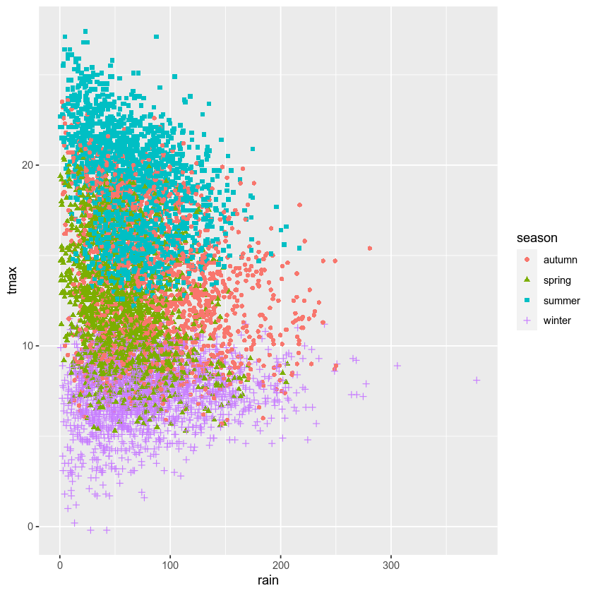
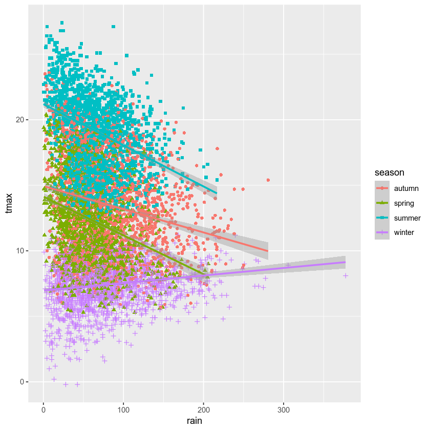

linear regression using **R**
==============================

.. note::

    This is a **non-interactive** version of the exercise. If you want to run through the steps yourself and see the
    outputs, you'll need to follow the setup steps and work through the notebook on your own computer.

In this exercise, we’ll see how we can use **R** for both simple and
linear regression. We’ll also see how we can calculate the correlation
between two variables, and get some additional practice working with
grouped data.

data
----

The data used in this exercise are the historic meteorological
observations from the `Armagh
Observatory <https://www.metoffice.gov.uk/weather/learn-about/how-forecasts-are-made/observations/recording-observations-for-over-100-years>`__
(1853-present), the Oxford Observatory (1853-present), the Southampton
Observatory (1855-2000), and Stornoway Airport (1873-present),
downloaded from the `UK Met
Office <https://www.metoffice.gov.uk/research/climate/maps-and-data/historic-station-data>`__
that we used in previous exercises.

getting started
---------------

First, we’ll use ``library()`` to load the ``tidyverse`` package:

.. code:: r

    library(tidyverse)

next, we’ll use ``read_csv()`` to load the combined station data:

.. code:: r

    station_data <- read_csv(file.path('data', 'combined_stations.csv'))

plotting relationships
----------------------

Before jumping into correlation and regreesion, let’s have a look at the
data we’re investigating. In the cell below, write some lines of code to
create a scatter plot of ``tmax`` vs ``rain``, with different colors and
shapes for each season. Be sure to assign the plot to an object called
``rain_tmax_plot``:

.. code:: r

    # create a plot of tmax vs rain
    # make a scatter plot with different colors and shapes, based on the season
    rain_tmax_plot # show the plot

Now, use ``geom_smooth()`` to add a linear regression line to each group
- you should end up with four lines, colored according to the season:

.. code:: r

    # now add a geom_smooth to plot regression lines for each season

What kind of relationship is there between ``tmax`` and ``rain``? Does
it depend on the season? How strong is the relationship, and what does
this mean for the slope of each regression line?

calculating correlation
-----------------------

The next thing we’ll look at is how to calculate the *correlation*
between two variables, using ``cor()``
(`documentation <https://rdrr.io/r/stats/cor.html>`__). We’ll start by
calculating the covariance for all values of a variable, then use some
of the tools we’ve seen previously to calculate the correlation based on
different grouping variables.

for an entire dataset
~~~~~~~~~~~~~~~~~~~~~

The basic use of ``cor()`` to calculate the correlation between two
variables ``x`` and ``y`` is ``cor(x, y)``. To calculate the correlation
between ``rain`` and ``tmax``, then, we can use the ``$`` operator to
select the ``rain`` and ``tmax`` variables. The ``use`` argument tells
**R** how to handle missing variables. In this case, we want to ignore
observations where *either* ``rain`` or ``tmax`` is missing - in other
words, we only want to use complete observations (``complete.obs``):

.. code:: r

    cor(station_data$rain, station_data$tmax, use='complete.obs') # calculate pearson's r for rain and tmax

by groups
~~~~~~~~~

We’re more interested in calculating the correlation for different
groups - as you can see from the plots above, the relationship between
``rain`` and ``tmax`` is not the same in each season - even though the
overall correlation is slightly negative, the correlation in winter is
clearly positive.

We’ve already seen all of the different parts we need here. To calculate
the correlation based on ``season``, we can use ``group_by()`` to group
the dataset, then use ``summarize()``, along with ``cor()``, to
calculate the desired correlation.

By default, ``cor()`` calculates Pearson’s correlation, but we can also
calculate Spearman’s rho and Kendall’s tau coefficient:

.. code:: r

    corr_table <- station_data |>
        group_by(season) |> # group by season
        summarize(
            pearson = cor(rain, tmax, use='complete.obs'), # calculate pearson's r for rain and tmax
            spearman = cor(rain, tmax, use='complete.obs', method='spearman'), # calculate spearman's rho for rain and tmax
            kendall = cor(rain, tmax, use='complete.obs', method='kendall') # calculate kendall's tau for rain and tmax
        )

    corr_table # show the table

simple linear regression
------------------------

We’ll start by fitting a linear model for spring. To prepare the data,
write a line of code below that selects only the spring observations,
and assigns the output to an object called ``spring``:

.. code:: r

    # select only spring observations

To fit a linear model, we use the ``lm()`` function
(`documentation <https://rdrr.io/r/stats/lm.html>`__). The first
argument for ``lm()`` is a **formula** representing the model to be fit.
Remember that a linear model with a single variable has the form:

.. math::  y = \beta + \alpha x,

where :math:`\beta` is the intercept and :math:`\alpha` is the slope of
the line. In **R**, the **formula** for this model is ``y ~ x`` -
remember that the *response* (*dependent*) variable is on the left side
of the ``~`` operator, and the *explanatory* (*dependent*) variable(s)
are on the right side of the operator. The coefficients :math:`\beta`
and :math:`\alpha` are implied in the form of the model, though we can
explicitly add an intercept (such as 0) to force the model to fit a
specific value.

So, the call to fit a linear relationship between ``tmax`` and ``rain``
would look like this:

.. code:: r

    lm(tmax ~ rain, data=spring) # fit a linear model for tmax and rain, using spring data

The basic output of the model shows us the intercept (14.13683), and the
slope for ``rain`` (-0.02961). We can also use ``summary()`` to print
more information, once we assign the output of ``lm()`` to an object:

.. code:: r

    spring_lm <- lm(tmax ~ rain, data=spring) # fit a linear model for tmax and rain, using spring data

    summary(spring_lm) # show the summary of the fit

The output of ``summary()`` shows quite a bit more information,
including the distribution of the residuals to the fit, the standard
error and *p*-value for the estimated coefficients, and the :math:`R^2`
value.

If we want to extract the coefficients from the summary, we can use the
``coef()`` (`documentation <https://rdrr.io/r/stats/coef.html>`__)
built-in function on the output of ``summary()``:

.. code:: r

    coef(summary(spring_lm)) # extract the coefficients from the model summary

In this example, the output of ``coef()`` is a **matrix**, which is
similar to a **data.frame**. If we want to access the elements of the
**matrix**, we can use the **extraction operators** (``[`` and ``]``),
along with the *row* and *column* name of element we want. For example,
the following shows how to extract the estimate of the intercept from
the **matrix**:

.. code:: r

    spring_lm_coefs <- coef(summary(spring_mlm))

    spring_lm_coefs["(Intercept)", "Estimate"] # get the estimate of the intercept

multiple linear regression
--------------------------

Now, let’s try to fit a linear model of ``tmax`` with two variables:
``rain`` and ``sun``. Remember that multiple linear regression tries to
fit a model with the form:

.. math::  y = \beta + \alpha_1 x_1 + \cdots + \alpha_n x_n

With only two variables, this would look like:

.. math::  y = \beta + \alpha_1 x_1 + \alpha_2 x_2

And the corresponding **formula** in **R** looks like ``y ~ x_1 + x_2``
(or ``tmax ~ rain + sun``, using our variable names):

.. code:: r

    spring_mlm <- lm(tmax ~ rain + sun, data=spring) # fit a linear model for tmax and rain, using spring data

    summary(spring_mlm) # show the summary of the fit

And we can extract the coefficients from the summary in the same way as
before:

.. code:: r

    spring_mlm_coefs <- coef(summary(spring_mlm))

    spring_mlm_coefs["rain", "Estimate"] # get the slope of the rain variable

bonus: linear regression with groups
------------------------------------

As a final exercise, let’s see how we can combine some of the tools
we’ve used in the workshop so far, along with a few new ones, to fit
linear models for each season without having to explicitly assign each
selection to an object.

For this, we will use ``nest_by()``
(`documentation <https://dplyr.tidyverse.org/reference/nest_by.html>`__),
rather than ``group_by()`` - the idea is the same (group the table based
on different variables), but the output is different. Here, the ouptut
is a table with two (or more) columns: one column, ``data``, which is a
*nested* table containing the data corresponding to the group, and
additional columns corresponding to the grouping variable(s).

Then, we can use ``mutate()`` create a column, ``model``, that contains
the output of ``lm()`` applied to the data in each group. Finally, we
use ``list()`` (`documentation <https://rdrr.io/r/base/list.html>`__) to
turn this output into a **list** so that it can be used in the table:

.. code:: r

    fits <- station_data |>
        nest_by(season) |> # create a nested table, grouped by season
        mutate(model = list(lm(tmax ~ rain, data = data))) # create a new variable, model, which is the output of the linear model

    names(fits) # show the names of the columns

Now that we have this, we can use ``pull()``
(`documentation <https://dplyr.tidyverse.org/reference/pull.html>`__) to
extract this column as a **list**:

.. code:: r

    models <- fits |> pull(model) # extract the model column into a separate list

    models # show the list

Note that each element of the **list** has a name that doesn’t tell us
any useful information (``[[1]]``, ``[[2]]``, etc.) - ideally, we would
like to index the list using the name of each season. To do this, we can
use ``names()`` (`documentation <https://rdrr.io/r/base/names.html>`__)
to assign the name of each season to the corresponding **list** element:

.. code:: r

    names(models) <- fits$season # assign the season name to each element of the list

    models # show the object

Now, we can access the linear model for each season using its name - for
example, to get the linear model for autumn:

.. code:: r

    models$autumn

And finally, we can use ``map()`` to apply the ``summary()`` function to
each element of the **list**, and assign the output of this to a new
object:

.. code:: r

    models |>
        map(summary) -> # use map to get the summary of each element of the list
        model_summary # assign the output to a new list object

    coef(model_summary$autumn) # get the coefficients of the autumn linear model

exercise and next steps
-----------------------

That’s all for this exercise, and for the exercises of this workshop.
The next sessions are BYOD (“bring your own data”) sessions where you
can start building your **git** project repository by applying the
different concepts and skills that we have covered in the workshop.
Before then, if you would like to practice these skills further, try at
least one of the following suggestions:

-  Investigate the relationship between ``tmax`` and ``sun`` overall,
   and by individual seasons, using ``cor()``. What kind of relationship
   do these variables appear to have? Remember to use ``drop_na()`` to
   remove missing values!
-  What is the relationship between ``tmin`` and ``sun``? does it change
   by season?
-  Set up and fit a multiple linear regression model for ``tmin`` as a
   function of ``air_frost``, ``sun``, and ``rain`` in the winter. Which
   of these variables has the strongest effect on ``tmin``?
