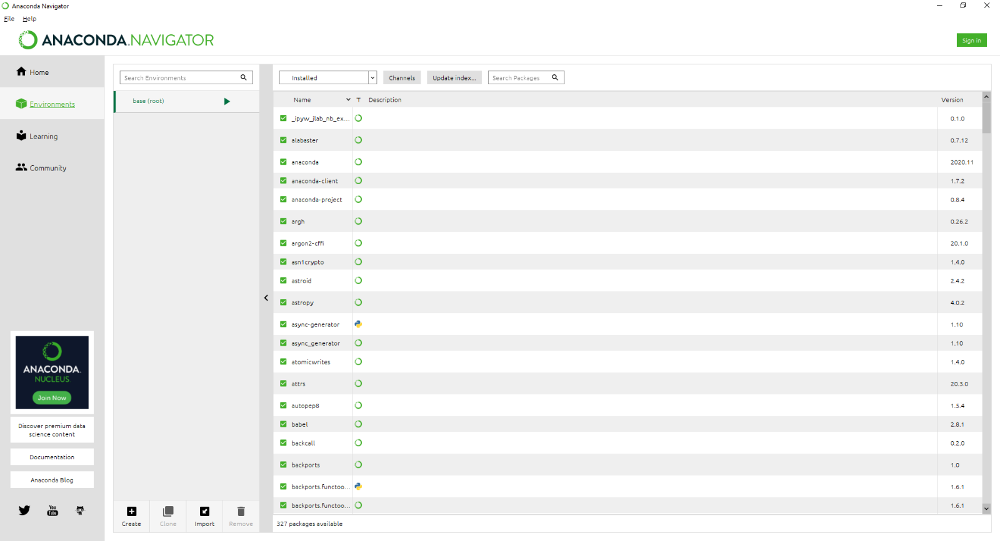
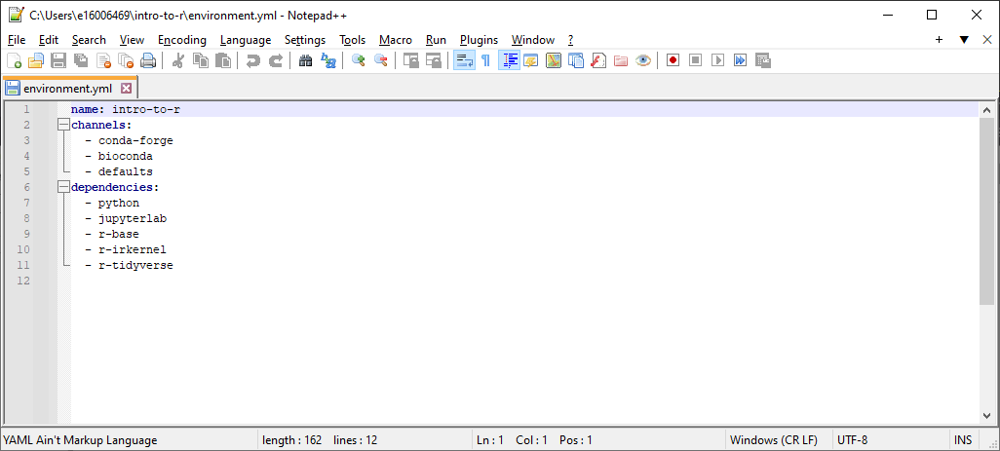
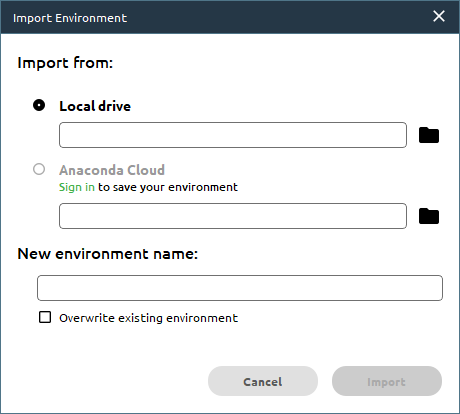
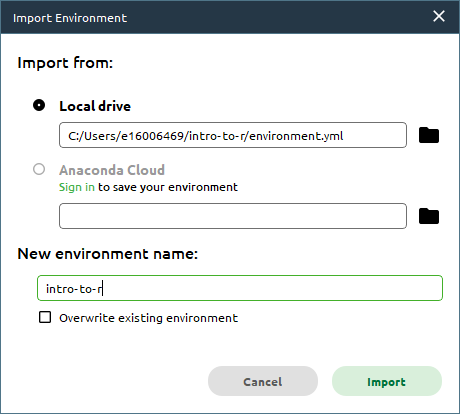
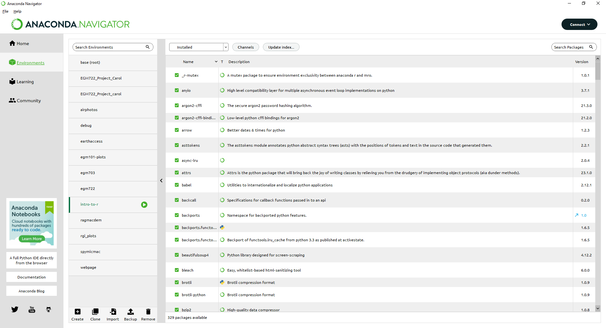
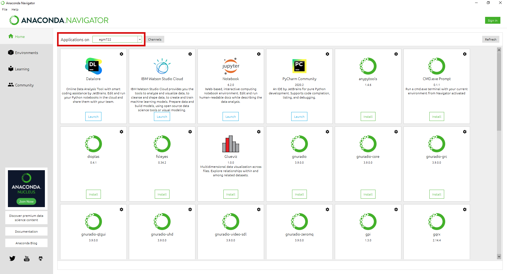
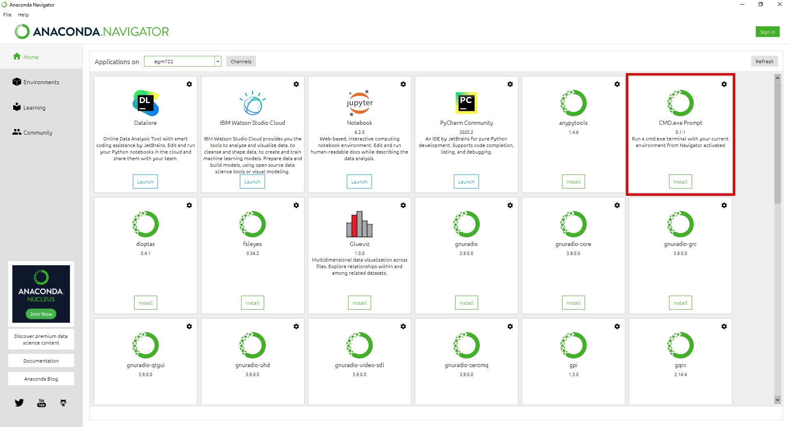
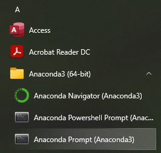
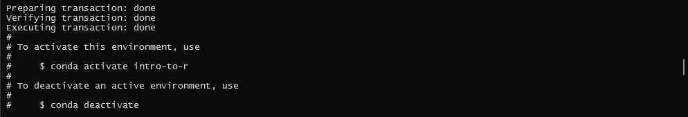

setting up a conda environment
===============================

.. note::

    This page provides instructions for creating a new **conda** environment using **Anaconda Navigator**, or using the
    **Anaconda Command Prompt**.

    You only need to choose **ONE** of these methods for setting up the environment.

.. danger::

    You should have already opened a :doc:`GitHub<github>` account, installed :doc:`git<git>` and
    :doc:`GitHub Desktop<desktop>`, :doc:`forked<fork>` the workshop repository, :doc:`cloned<clone>` the repository to
    your computer, and installed :doc:`Anaconda Navigator<conda>`.

    If you haven’t done all of these steps, please do so now before continuing.

anaconda navigator
---------------------------

creating an environment
.........................

From the **Start** menu, open **Anaconda Navigator**. When it opens, click on the **Environments** tab on the left-hand
side of the screen. You should see the following:

|br| As mentioned above, **conda** is a package management system. We can use **conda** to create different programming
environments, which will enable us to keep track of and manage the specific versions of python packages that we use for
this module. It also enables us to easily share our environment specifications across different computers, so that we
can be sure that any processing steps that we do are consistent and reproducible.

We will be creating a new environment using the **environment.yml** file provided in the git repository. A **.yml**
file is one of the ways that we can easily duplicate environments using **conda** or other package management
systems – it provides a list of the packages for the package management system to find and install.

Open the **environment.yml** file in a text editor
(**NB – this means NotePad, Notepad++ or something similar, NOT MS Word!**).

It should look something like this (the exact list of dependencies may differ somewhat):

|br| Here, you can see the name of the environment (**intro-to-r**), the ``channels`` to install packages from, listed in
order of preference, and the ``dependencies``, or required packages.

From the **Anaconda Navigator** window, click on the **Import** button at the bottom of the **Environments** tab. An
import window will open:

|br| Click the folder icon to navigate to the **environment.yml** file on the **Local drive**, select it and click
**Open**. The window should now look like this:

|br| The **Name** field should be automatically populated based on the **.yml** file, but if it isn't make sure to
change the name to **intro-to-r**.

Click **Import** to start setting up the environment. Depending on your connection speed and computer’s specifications,
this may take some time. When it finishes, you should see the following screen:

|br| Note how many packages were actually installed – 329, from the 5 shown in the original **.yml** file. By

This is because each of those 5 packages have additional dependencies which have to be installed as well. Fortunately,
all of this is done automatically by **conda** – we don’t have to worry about tracking down and installing each
individual dependency on our own.

changing environments
.......................

The next thing to do is to switch to the **Home** tab in **Anaconda Navigator**:

|br| You should see that you have two different environments when you open the dropdown menu next to **Applications on**.
Whenever you want to switch environments in **Anaconda Navigator**, you can select the environment from this menu.

You should see that when you change between the ``base`` and ``intro-to-r`` environments, the list of installed
applications changes – this is because we have not installed the same applications in the different environments.

.. _phd conda prompt:

setting up the command prompt
...............................

The final step covered in this manual is to install the **CMD.exe Prompt** for this environment:

|br| While not strictly required, this will enable you to directly launch a **Windows Command Prompt** with your
**intro-to-r** environment already loaded.

If you run the **Anaconda Prompt** from the **Start Menu**, it will automatically load the default (``base``)
environment, and you will need to switch environments using the ``conda activate`` command when you want to use your
**intro-to-r** environment.

Once you have the conda environment set up, you are ready to move on to configuring **jupyter**.

anaconda command prompt
---------------------------

From the **Start** menu, open the **Anaconda Command Prompt**:

|br| When you open the command prompt, you should see ``(base)`` next to the prompt:

.. code-block:: text

    (base) C:\Users\bob>

.. warning::

    The **Anaconda Command Prompt** automatically loads **conda** so that you can use it; if you don't see ``(base)``,
    it likely means that you have opened the normal **Command Prompt**, and so you will see the following error when
    you try to run a command with **conda**:

    .. image:: ../../../img/egm722/setup/environment/conda_not_found.png
        :width: 600
        :align: center
        :alt: an error stating that conda is not recognized as a command

Next, navigate to where you have cloned the repository using ``cd``:

.. code-block:: text

    cd c:\Users\bob\intro-to-r

If you're in the right place, you should see all of the files from the repository when you enter the ``dir`` command.

Now, enter the following command:

.. code-block:: text

    conda env create -f environment.yml

This tells **conda** to create a new environment, using the "recipe" provided in ``environment.yml``.

This step may take some time\ [1]_, but if all goes well, you will eventually see the following message:

|br| And that's it. Once you have done this, you may want to open **Anaconda Navigator** and set up a new command
prompt link for your environment, following the instructions in :ref:`phd conda prompt`.

Once you have the conda environment set up, you are ready to move on to configuring **JupyterLab**.

notes and references
----------------------

.. [1] Conda can be notoriously slow, which is why there has been an effort to increase the speed/efficiency of the
    package "solver": `mamba <https://mamba.readthedocs.io/en/latest/>`__. I am happy to help you get set up with
    mamba, but I am unsure about how well this works with **Anaconda Navigator**.
