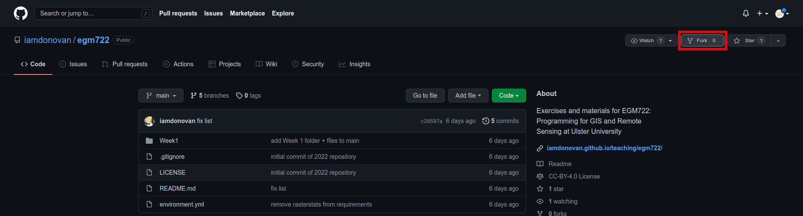
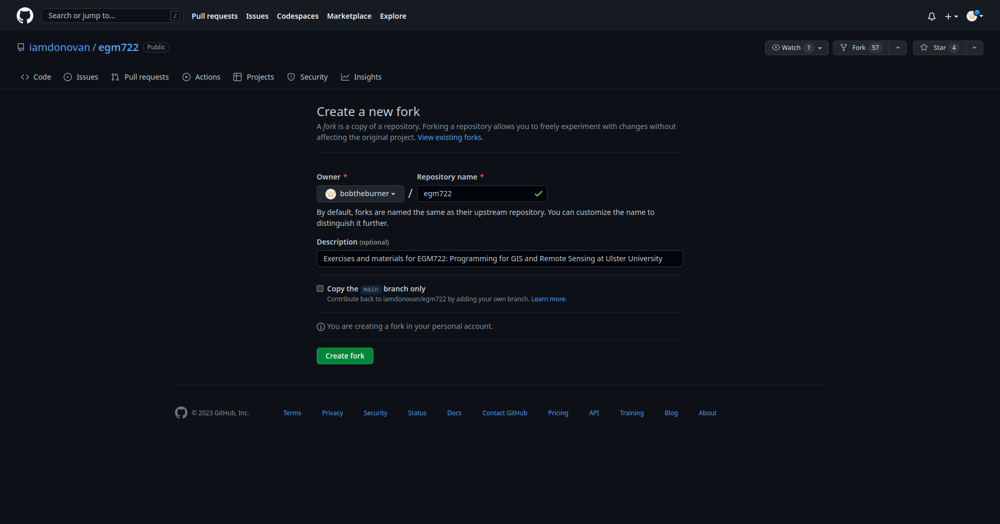
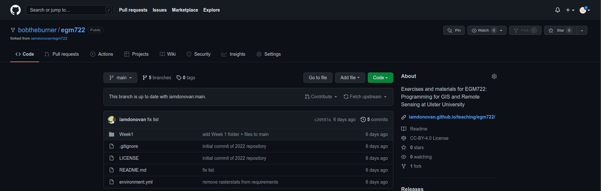

forking the repository
========================

Head to https://github.com/iamdonovan/intro-to-r, which is the remote repository location for the materials for this
workshop. If you are not currently logged in, do so now.

Click the **Fork** button in the upper right-hand corner of the window:

|br| This will create a *fork* of the repository – it will copy the entire repository over to your account. On this page,
make sure that you uncheck **Copy the main branch only** before clicking **Create fork**:

|br|

.. warning::

    If you do not uncheck this button, **don't panic**. You will still be able to use the other branches, but you will
    have to check out each branch from the **upstream** repository, rather than your own remote repository.

After a minute, you should see the following:

|br| Congratulations! You have created your first fork! Make a note of the repository URL (for the example above,
it is https://github.com/bobtheburner/intro-to-r).
