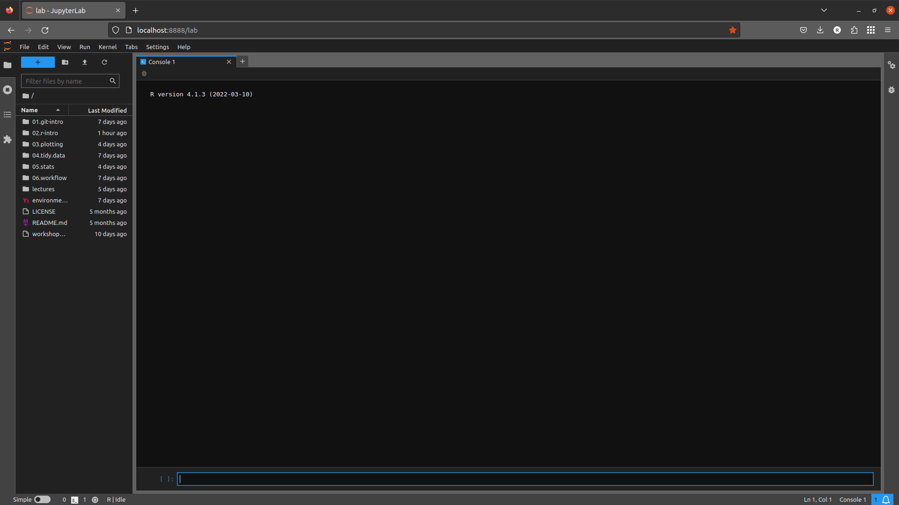

configuring jupyterlab
=======================

To be able to run **R** from JupyterLab, we may have one final piece of configuration to do.

To begin, launch JupyterLab from the **Anaconda Command Prompt**, making sure that your ``intro-to-r`` environment is
activated:

.. code-block:: text

    jupyter-lab

You should see a browser window like this open up:

.. image:: img/jupyterlab_open.png
    :width: 720
    :align: center
    :alt: jupyterlab open in a browser window

|br|

.. note::

    If you don't see this exactly, don't worry. Click the blue **+** button in the upper left-hand corner of the window
    to open the **Launcher**.

Next, click on **R** under the **Console** heading (second one down), to open the **R Console**:

|br|

If you see ``R | Idle`` in the lower left-hand corner, as in the screenshot above, congratulations! You don't need to
do anything further.

If, however, you don't see this, go ahead and shut down JupyterLab (**File** > **Shutdown**). In your **Command Prompt**
window, open the **R** terminal by typing ``R`` at the prompt and pressing **Enter**.

Finally, copy and paste (or type) the following into the console, which will tell Jupyter about the **R** kernel:

.. code-block:: r

    IRkernel::installspec()

When this finishes, type ``q()`` and press enter to quit **R**.

To check that this has worked, re-launch JupyterLab and open the **R** console - you should now see that **R** is
connected to JupyterLab, as in the screenshot above.
